# IDENT Dental CRM

Hệ thống CRM nha khoa đa chi nhánh, xây bằng Laravel 12 + Filament 4 + Livewire 3, tập trung vào vận hành phòng khám thực tế:

- Frontdesk và Sales pipeline (Lead, Customer, Appointment, CSKH)
- Clinical workflow (Exam, Treatment Plan, Treatment Session, Prescription)
- Finance workflow (Invoice, Payment, Receipts/Expense, Installment, Insurance)
- Governance cho production (RBAC, Audit log, Data lineage, Release gates)
- EMR sync một chiều: `CRM -> EMR`

## 1) Bài toán sản phẩm

CRM này giải quyết các điểm khó phổ biến của phòng khám nha khoa:

- Quản lý vòng đời bệnh nhân xuyên suốt từ lead đến tái khám.
- Đồng bộ dữ liệu đa chi nhánh nhưng vẫn giữ branch isolation nghiêm ngặt.
- Tránh thất thoát doanh thu bằng state machine + policy tài chính + audit trail.
- Hạn chế lỗi vận hành bằng automation, checklist release và gate kỹ thuật.

## 2) Vai trò người dùng chính

- `Lễ tân / Frontdesk`: tạo lead, tạo lịch, check-in, điều phối flow hồ sơ.
- `CSKH`: chăm sóc sau khám, recall/re-care, no-show recovery, follow-up.
- `Bác sĩ`: khám, chẩn đoán, lập kế hoạch điều trị, điều trị theo phiên, kê đơn.
- `Tư vấn điều trị / Manager`: duyệt kế hoạch, theo dõi acceptance, công nợ.
- `Admin`: cấu hình hệ thống, phân quyền, giám sát vận hành và release.

## 3) Kiến trúc domain

### CRM domain

- Lead / Customer
- Booking / Appointment
- Patient profile và timeline vận hành
- Care tickets, automation, KPI vận hành

### EMR domain (trong cùng codebase, tách logic nghiệp vụ)

- Patient medical record
- Encounter / Exam session
- Clinical note / orders / results
- Prescription
- Revision, encryption, dedicated EMR audit log

### Shared core

- Auth, User, Role/Permission (Spatie)
- Branch/organization context
- Audit logging framework
- Runtime settings / integrations

## 4) Flow nghiệp vụ chuẩn

Flow chuẩn hệ thống đang bám:

1. Lead -> Booking
2. Booking -> Visit episode (`scheduled/arrived/in-chair/completed`)
3. Exam -> Diagnosis -> Treatment plan approval
4. Treatment sessions -> Materials usage -> Prescription
5. Invoice -> Payment / Installment / Insurance claim
6. Recall / re-care / follow-up -> Loyalty / reactivation

Edge flow đã có:

- `no-show`, `late-arrival`, `walk-in`, `emergency`
- overbooking theo policy chi nhánh
- payment reversal/refund với audit
- idempotency cho các API ghi nhận nhạy cảm

## 4.1) State machine các thành phần chính

Nguồn sự thật là các model/service hiện tại trong `app/Models` và action trong Filament resources.  
Các sơ đồ dưới đây mô tả lifecycle chuẩn để team PM/QA/dev thống nhất khi review regression.

### A. Customer (Lead lifecycle, trạng thái có thể cấu hình)

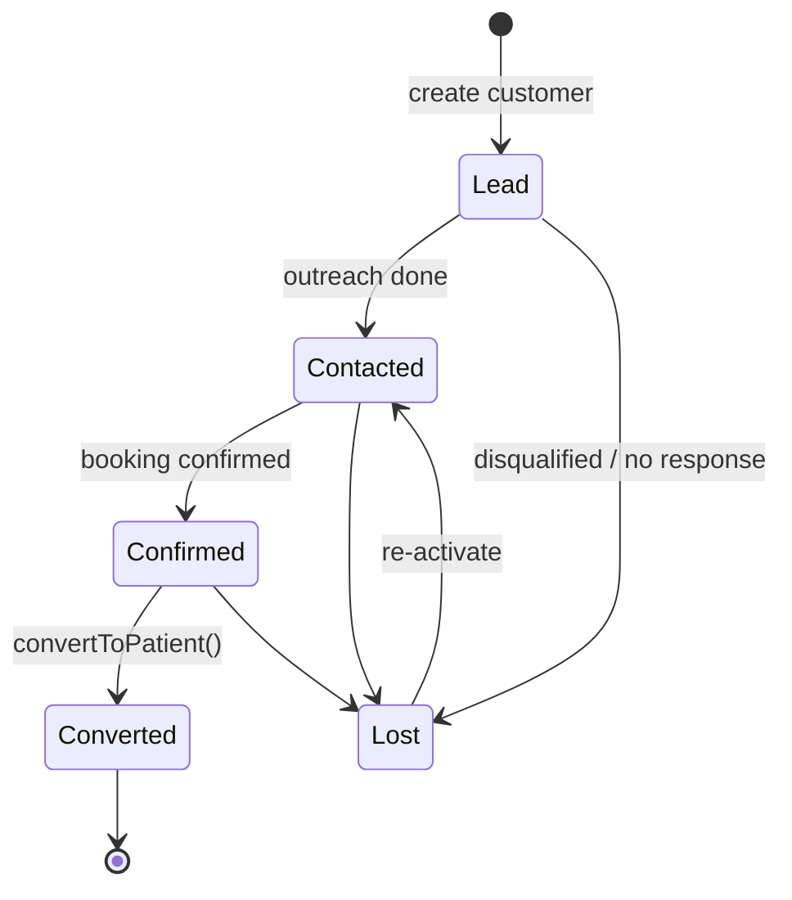

Default labels hiện tại: `lead`, `contacted`, `confirmed`, `converted`, `lost` (configurable qua catalog settings).

### B. Appointment (booking operational state)

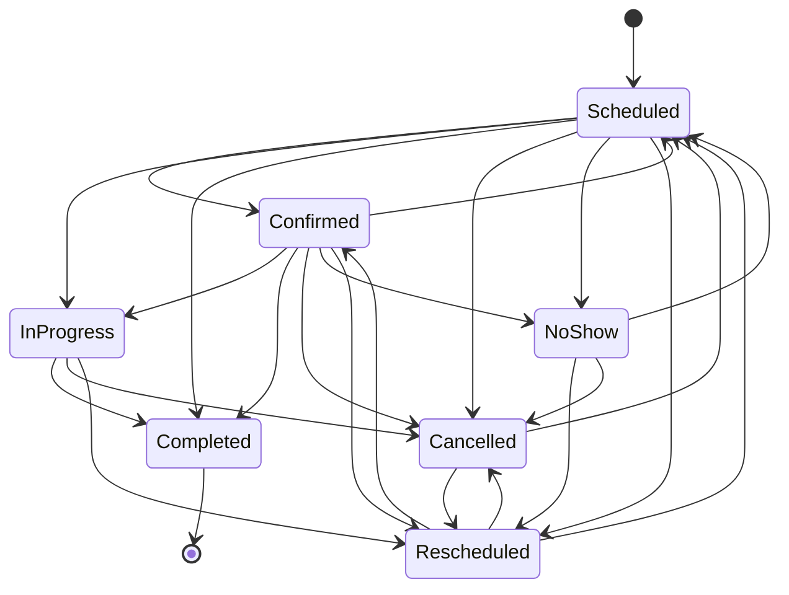

### C. Visit episode (chair-time lifecycle)

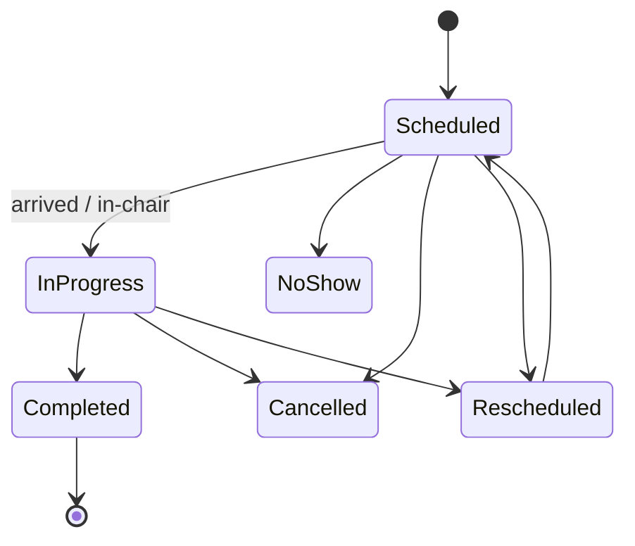

### D. Exam session (clinical form lifecycle)

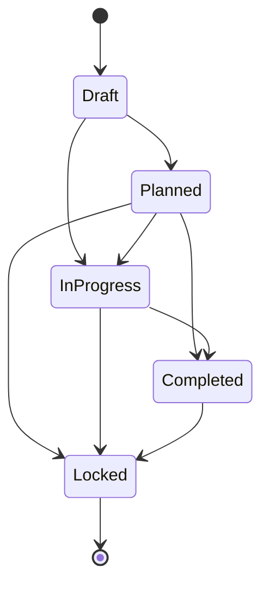

### E. Treatment plan + plan item

Treatment plan:

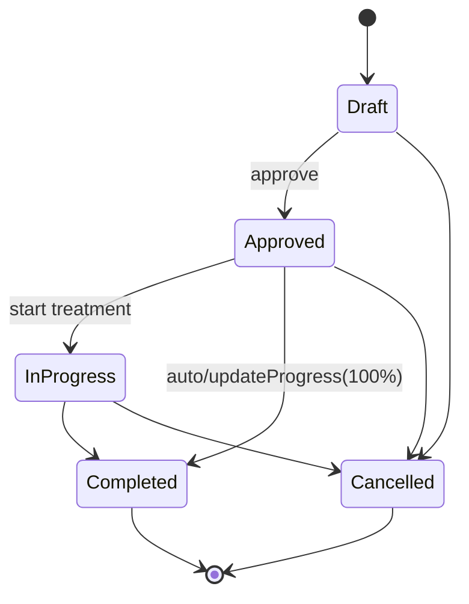

Plan item approval:

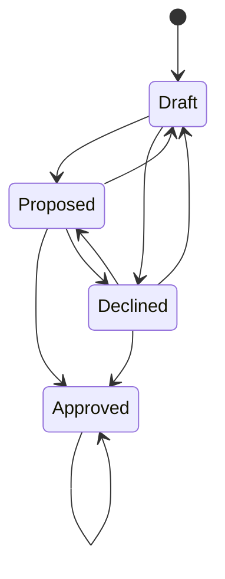

Plan item execution (chỉ được chạy khi `approval_status = approved`):

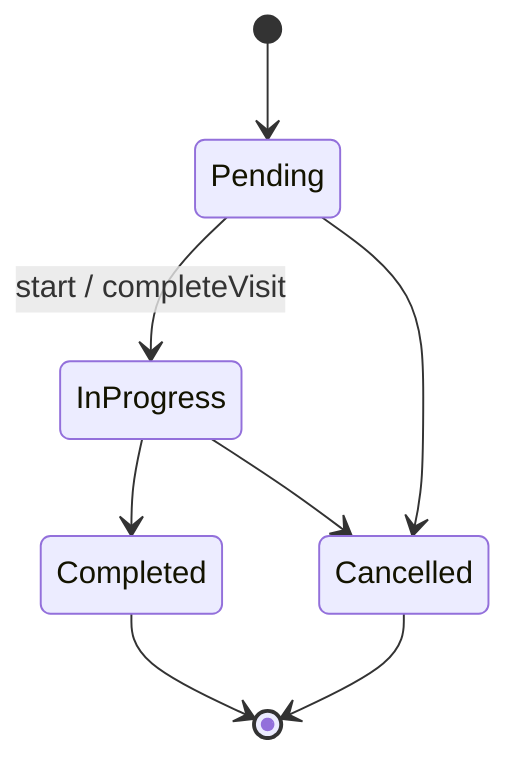

### F. Clinical orders/results

Clinical order:

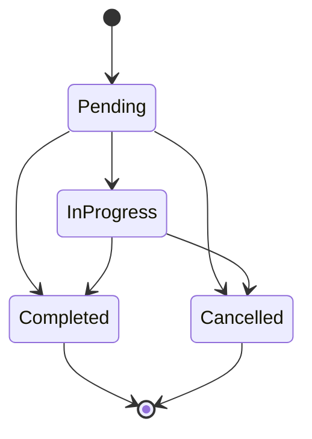

Clinical result:

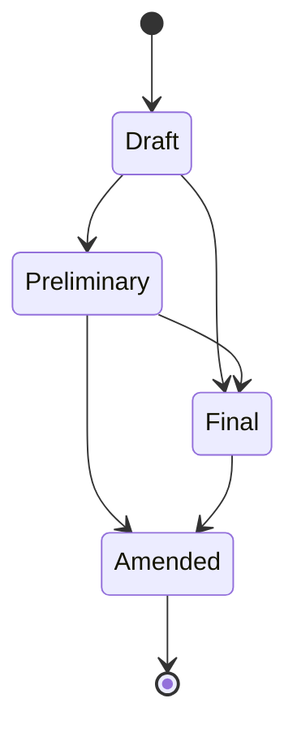

### G. Finance (invoice, installment, insurance claim)

Invoice:

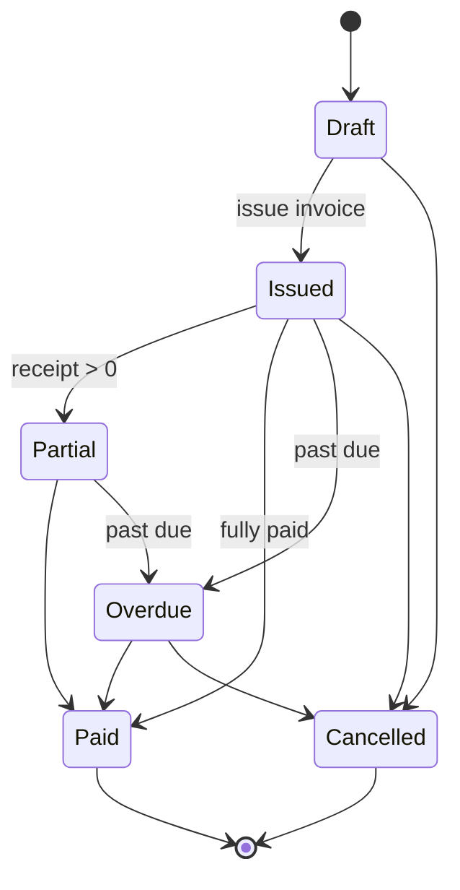

Installment plan:

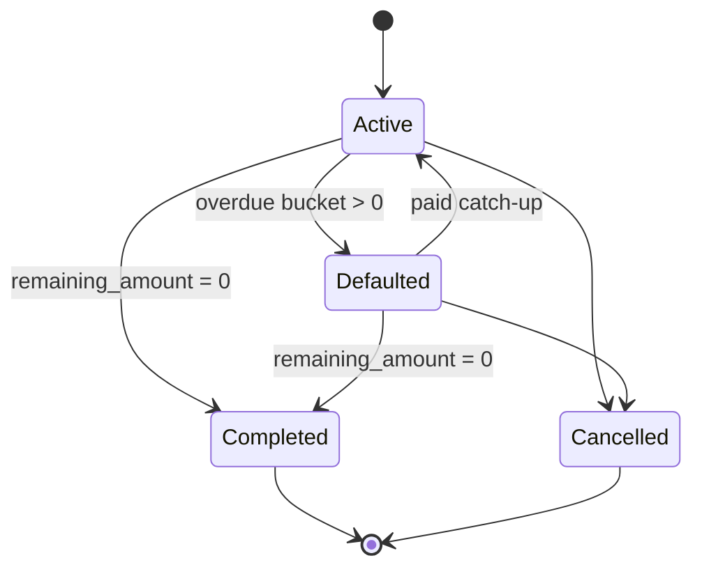

Insurance claim:

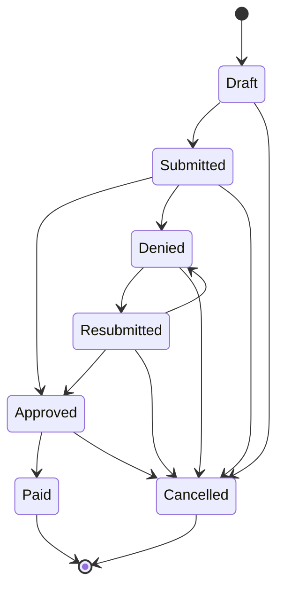

### H. CSKH / Recall note

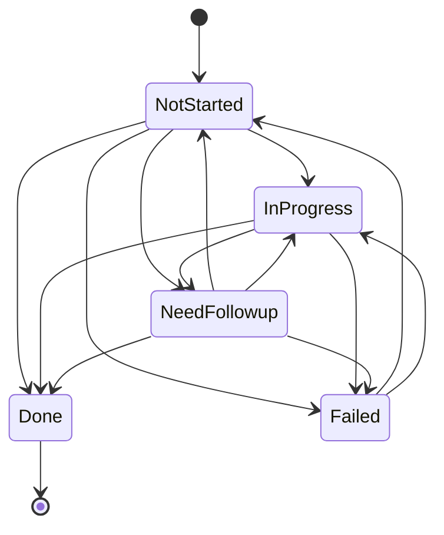

## 5) Module chính

### 5.1 CRM & Frontdesk

- Quản lý khách hàng tiềm năng và chuyển đổi Customer -> Patient.
- Lịch hẹn theo bác sĩ/chi nhánh, trạng thái chuẩn hóa, kiểm soát overbooking.
- Chăm sóc khách hàng đa trạng thái + SLA + ticket automation.

### 5.2 Khám và Điều trị

- Phiếu khám theo ngày, odontogram người lớn/trẻ em.
- Chỉ định cận lâm sàng và upload ảnh theo loại chỉ định.
- Kế hoạch điều trị và item approval lifecycle.
- Tiến trình điều trị theo ngày/phiên, lock theo business event.
- Đơn thuốc và liên kết ngữ cảnh về hồ sơ bệnh nhân.

### 5.3 Tài chính

- Hóa đơn theo bệnh nhân/plan/session.
- Thanh toán đa phương thức, reversal/refund an toàn.
- Installment + dunning.
- Insurance claim lifecycle.
- Thu/chi có liên kết bệnh nhân/hóa đơn để đối soát.

### 5.4 Vận hành và quản trị

- Multi-branch master data sync.
- MPI dedupe/merge liên chi nhánh.
- KPI pack vận hành nha khoa + benchmark + alerts.
- Snapshot report có schema versioning và lineage.
- Scheduler hardening: retry/timeout/alert + single-node safety.

### 5.5 Tích hợp

- Web Lead API ingestion (website -> CRM).
- Zalo/ZNS flow.
- Google Calendar.
- EMR outbound sync (1 chiều từ CRM).

## 6) Bảo mật và toàn vẹn dữ liệu

Hệ thống áp dụng các nguyên tắc:

- Branch isolation ở policy + query scope + action-level authorization.
- Action permission baseline và anti-bypass review.
- Audit log bắt buộc cho hành vi nhạy cảm (clinical/finance/care/security).
- PHI encryption cho trường nhạy cảm trong EMR.
- Critical foreign key gate để tránh orphan dữ liệu lâm sàng/tài chính.
- Idempotency key cho API/flow dễ bị submit lặp.

## 7) Công nghệ

- PHP `8.4`
- Laravel `12`
- Filament `4`
- Livewire `3`
- Sanctum
- Spatie Permission
- Pest `4` + PHPUnit `12`
- Tailwind CSS `4`

## 8) Cấu trúc thư mục quan trọng

- `app/Models`: domain models theo CRM + EMR
- `app/Filament`: admin panel pages/resources
- `app/Console/Commands`: ops gates, reconciliation, automation commands
- `database/migrations`: schema và hardening migrations
- `tests/Feature`: business/regression tests theo module
- `docs`: specification, gap analysis, PM backlog

## 9) Cài đặt local

```bash
composer install
cp .env.example .env
php artisan key:generate
php artisan migrate --seed
npm install
npm run dev
```

Nếu frontend không phản ánh thay đổi mới:

```bash
npm run build
```

## 10) Lệnh kiểm thử và quality gates

### Kiểm tra cơ bản

```bash
vendor/bin/pint --dirty
php artisan migrate:status
php artisan schema:assert-no-pending-migrations
php artisan schema:assert-critical-foreign-keys
php artisan test
```

### Release gates trước deploy

```bash
php artisan ops:run-release-gates --profile=production --with-finance --from=2025-01-01 --to=2026-03-02
```

### Production readiness pack

```bash
php artisan ops:run-production-readiness --with-finance --from=2025-01-01 --to=2026-03-02 --strict-full --fail-fast
```

### Verify artifact readiness + signoff

```bash
php artisan ops:verify-production-readiness-report storage/app/release-readiness/<report>.json --qa=<qa-email> --pm=<pm-email> --strict
```

## 11) Web Lead API (website -> CRM)

Endpoint chính:

- `POST /api/v1/web-leads`

Headers bắt buộc:

- `Authorization: Bearer <token>`
- `X-Idempotency-Key: <unique-key>`
- `Content-Type: application/json`

Payload tối thiểu:

```json
{
  "full_name": "Nguyen Van A",
  "phone": "0909123456",
  "branch_code": "BR-20260119-XXXXXX",
  "note": "Lead từ website"
}
```

Kết quả:

- Tạo mới hoặc merge lead theo policy chuẩn hóa số điện thoại.
- Không tạo duplicate khi request bị gửi lặp với cùng idempotency key.
- Có thể bật realtime notify cho role nhận lead tại Integration Settings.

## 12) Tài liệu tham chiếu

Đọc theo thứ tự:

1. `docs/DENTAL_CRM_SPECIFICATION.md`
2. `docs/GAP_ANALYSIS.md`
3. `docs/IMPLEMENTATION_SPRINT_BACKLOG.md`
4. `docs/PM_DENTAL_FLOW_BACKLOG.md`
5. `DATABASE_SCHEMA.md`

## 13) Ghi chú vận hành production

- Không bỏ qua release gates và readiness report trước deploy.
- Luôn chạy migrate trong maintenance window có backup/restore drill.
- Mọi thay đổi logic nhạy cảm phải có test hồi quy tương ứng.
- Ưu tiên quan sát log `audit`, `security`, `finance`, `emr sync` sau mỗi lần release.
