# IDENT Dental CRM

Hệ thống CRM nha khoa đa chi nhánh, xây bằng Laravel 12 + Filament 4 + Livewire 3, tập trung vào vận hành phòng khám thực tế:

- Frontdesk và Sales pipeline (Lead, Customer, Appointment, CSKH)
- Clinical workflow (Exam, Treatment Plan, Treatment Session, Prescription)
- Finance workflow (Invoice, Payment, Receipts/Expense, Installment, Insurance)
- Governance cho production (RBAC, Audit log, Data lineage, Release gates)
- EMR sync một chiều: `CRM -> EMR`

## 0) Trạng thái repo hiện tại

- Toàn bộ `13/13` module trong `docs/reviews/00-master-index.md` đã đạt `Clean Baseline Reached`.
- Production seeding đã tách riêng khỏi local demo seeding:
  - production: `Database\\Seeders\\ProductionMasterDataSeeder`
  - local/testing demo: `Database\\Seeders\\DatabaseSeeder` -> `Database\\Seeders\\LocalDemoDataSeeder`
- Repo đã có sẵn:
  - runbook deploy production: `docs/PRODUCTION_OPERATIONS_RUNBOOK.md`
  - danh sách user và scenario demo local: `docs/LOCAL_DEMO_USERS.md`
  - full review pipeline theo module: `docs/reviews/REVIEW-PIPELINE.md`

## 0.1) Tài liệu cho người dùng

Nếu bạn là người dùng vận hành bình thường và không cần đọc tài liệu kỹ thuật, bắt đầu ở đây:

- [Mục lục hướng dẫn người dùng](docs/USER_GUIDE.md)
- [Bắt đầu nhanh: đăng nhập, MFA, điều hướng](docs/USER_GUIDE_GETTING_STARTED.md)
- [Hướng dẫn Lễ tân / CSKH](docs/USER_GUIDE_FRONTDESK_CSKH.md)
- [Hướng dẫn Bác sĩ](docs/USER_GUIDE_DOCTOR.md)
- [Hướng dẫn Quản lý / Admin](docs/USER_GUIDE_MANAGER_ADMIN.md)

## 1) Bài toán sản phẩm

CRM này giải quyết các điểm khó phổ biến của phòng khám nha khoa:

- Quản lý vòng đời bệnh nhân xuyên suốt từ lead đến tái khám.
- Đồng bộ dữ liệu đa chi nhánh nhưng vẫn giữ branch isolation nghiêm ngặt.
- Tránh thất thoát doanh thu bằng state machine + policy tài chính + audit trail.
- Hạn chế lỗi vận hành bằng automation, checklist release và gate kỹ thuật.

## 2) Vai trò người dùng chính

- `Lễ tân / Frontdesk`: tạo lead, tạo lịch, check-in, điều phối flow hồ sơ.
- `CSKH`: chăm sóc sau khám, recall/re-care, no-show recovery, follow-up.
- `Bác sĩ`: khám, chẩn đoán, lập kế hoạch điều trị, điều trị theo phiên, kê đơn.
- `Tư vấn điều trị / Manager`: duyệt kế hoạch, theo dõi acceptance, công nợ.
- `Admin`: cấu hình hệ thống, phân quyền, giám sát vận hành và release.

### 2.1) Role keys thực tế trong code và local demo

Các `role key` hiện đang được seed và enforce trong code là:

| Role key | Persona nghiệp vụ | Phạm vi mặc định | Không được làm |
| --- | --- | --- | --- |
| `Admin` | Quản trị hệ thống | toàn hệ thống | không áp dụng giới hạn nghiệp vụ chuẩn, nhưng vẫn chịu MFA |
| `Manager` | Quản lý chi nhánh / tư vấn điều trị | branch-scoped | không vào surface hạ tầng nhạy cảm như firewall IP |
| `Doctor` | Bác sĩ | patient / appointment / treatment theo branch assignment | không xem finance dashboard, không vào firewall |
| `CSKH` | tư vấn / lễ tân / chăm sóc | customer / patient / appointment / care queue theo chi nhánh | không xem finance dashboard, không tạo/xem firewall |
| `AutomationService` | service account cho scheduler / ops | không dùng Filament panel | không dùng để login UI |

Lưu ý:

- Local demo hiện không có technical role tách riêng tên `Frontdesk` hoặc `Consultant`.
- Trong seed demo, persona `lễ tân / tư vấn` đang được map vào role `CSKH`.
- Mọi rule permission phải bám `role key` thực tế này, không bám tên business role tự do trong tài liệu.

## 3) Kiến trúc domain

### CRM domain

- Lead / Customer
- Booking / Appointment
- Patient profile và timeline vận hành
- Care tickets, automation, KPI vận hành

### EMR domain (trong cùng codebase, tách logic nghiệp vụ)

- Patient medical record
- Encounter / Exam session
- Clinical note / orders / results
- Prescription
- Revision, encryption, dedicated EMR audit log

### Shared core

- Auth, User, Role/Permission (Spatie)
- Branch/organization context
- Audit logging framework
- Runtime settings / integrations

## 4) Flow nghiệp vụ chuẩn

Flow chuẩn hệ thống đang bám:

1. Lead -> Booking
2. Booking -> Visit episode (`scheduled/arrived/in-chair/completed`)
3. Exam -> Diagnosis -> Treatment plan approval
4. Treatment sessions -> Materials usage -> Prescription
5. Invoice -> Payment / Installment / Insurance claim
6. Recall / re-care / follow-up -> Loyalty / reactivation

Edge flow đã có:

- `no-show`, `late-arrival`, `walk-in`, `emergency`
- overbooking theo policy chi nhánh
- payment reversal/refund với audit
- idempotency cho các API ghi nhận nhạy cảm

## 4.1) State machine các thành phần chính

Nguồn sự thật là các model/service hiện tại trong `app/Models` và action trong Filament resources.  
Các sơ đồ dưới đây mô tả lifecycle chuẩn để team PM/QA/dev thống nhất khi review regression.

### A. Customer (Lead lifecycle, trạng thái có thể cấu hình)

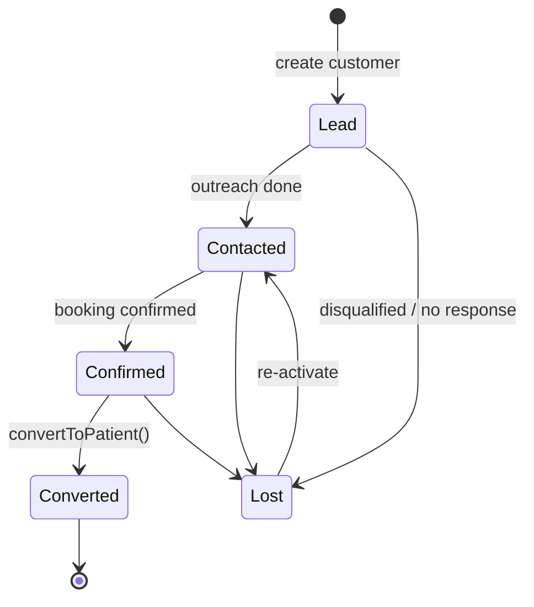

Default labels hiện tại: `lead`, `contacted`, `confirmed`, `converted`, `lost` (configurable qua catalog settings).

### B. Appointment (booking operational state)

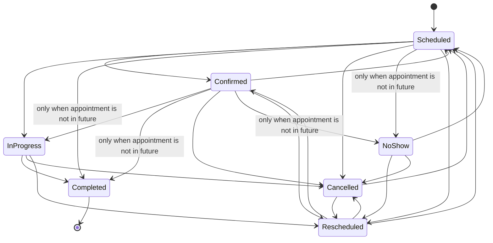

Rule chi tiết đang enforce:

- `completed` và `no_show` được xem là outcome status.
- Backend chặn tuyệt đối việc set `completed` hoặc `no_show` khi `date` của lịch hẹn còn ở tương lai.
- UI manual update cũng phải ẩn 2 lựa chọn này trên lịch tương lai để người dùng không submit rồi mới bị từ chối.
- `cancelled` bắt buộc có `cancellation_reason`.
- `rescheduled` bắt buộc có `reschedule_reason`.
- Mọi thay đổi `doctor_id`, `branch_id`, `date` phải đi qua kiểm tra branch assignment của bác sĩ.
- Chỉ các trạng thái đang chiếm slot vận hành mới được tính vào capacity / overbooking.

### C. Visit episode (chair-time lifecycle)

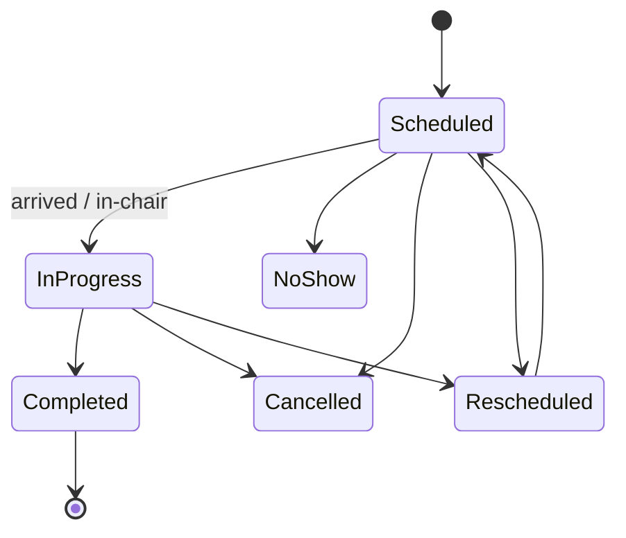

### D. Exam session (clinical form lifecycle)

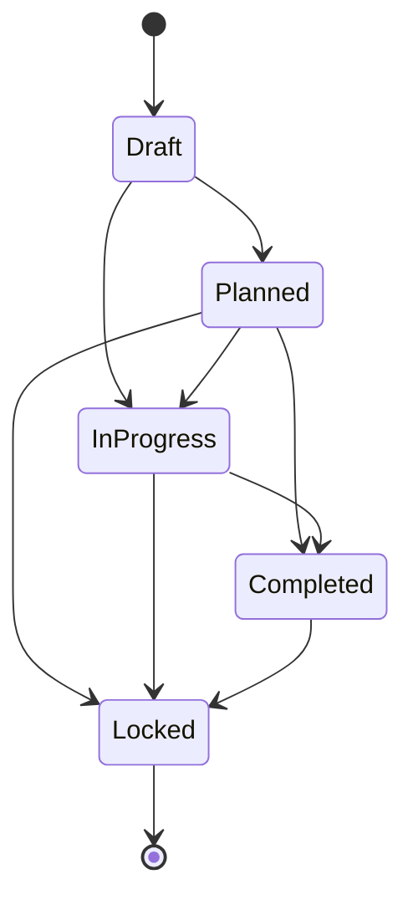

### E. Treatment plan + plan item

Treatment plan:

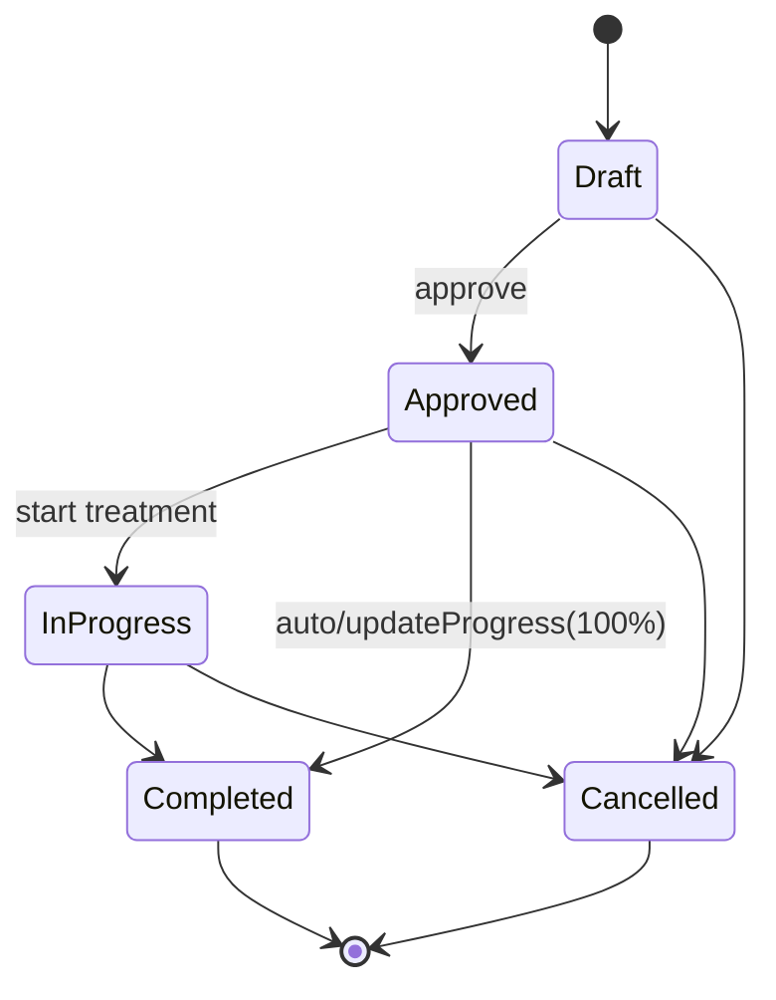

Plan item approval:

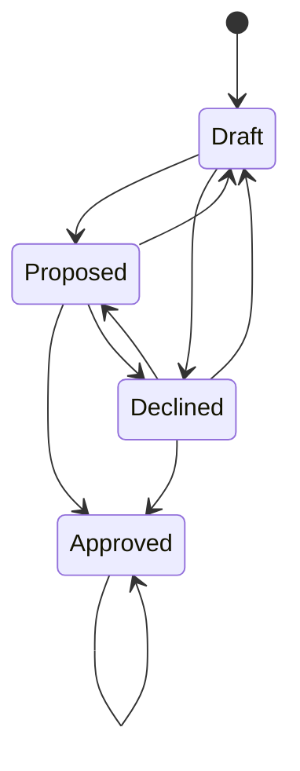

Plan item execution (chỉ được chạy khi `approval_status = approved`):

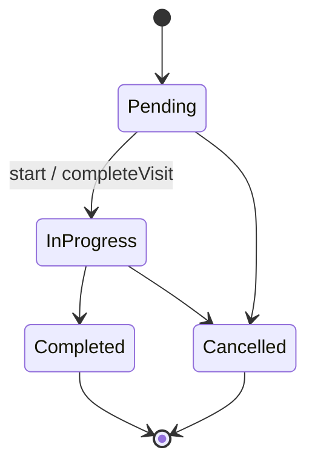

### F. Clinical orders/results

Clinical order:

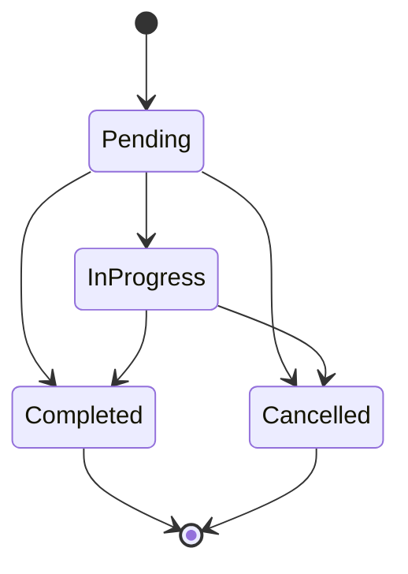

Clinical result:

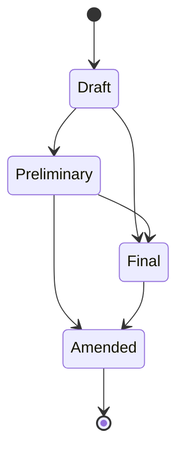

### G. Finance (invoice, installment, insurance claim)

Invoice:

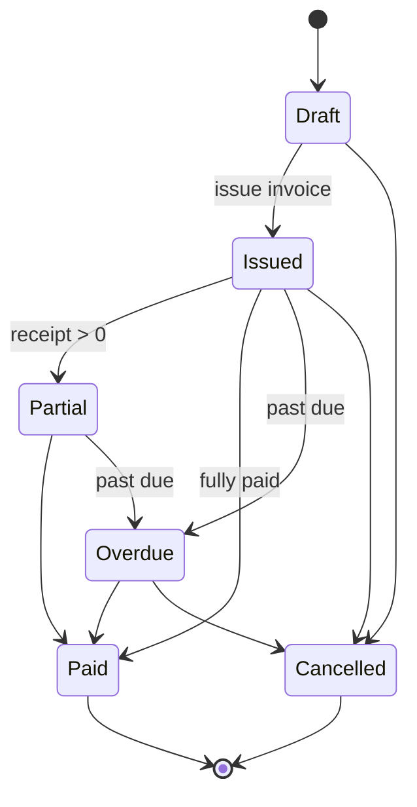

Installment plan:

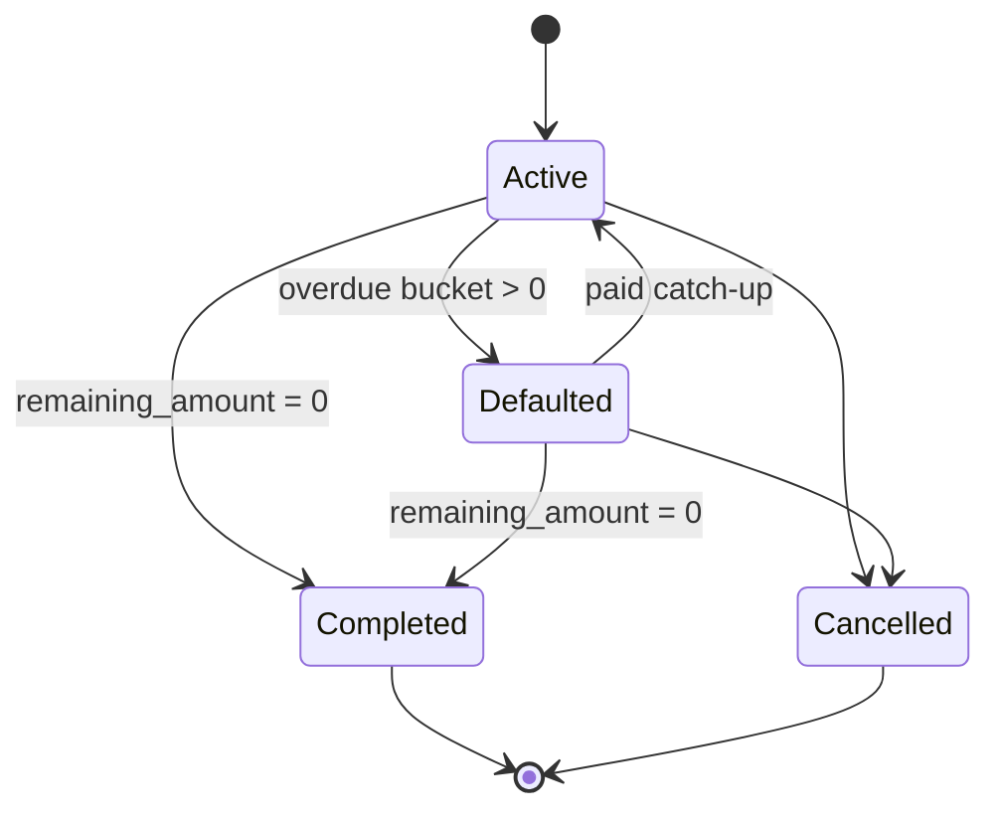

Insurance claim:

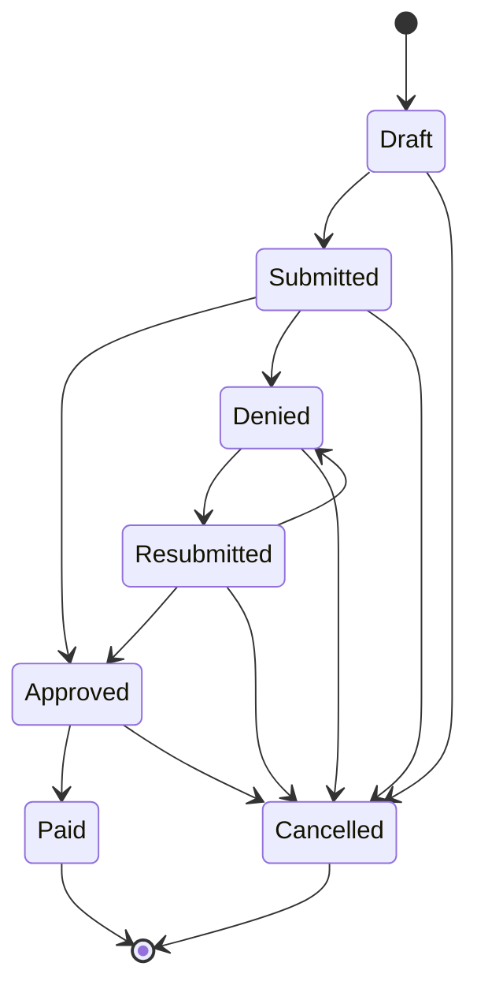

### H. CSKH / Recall note

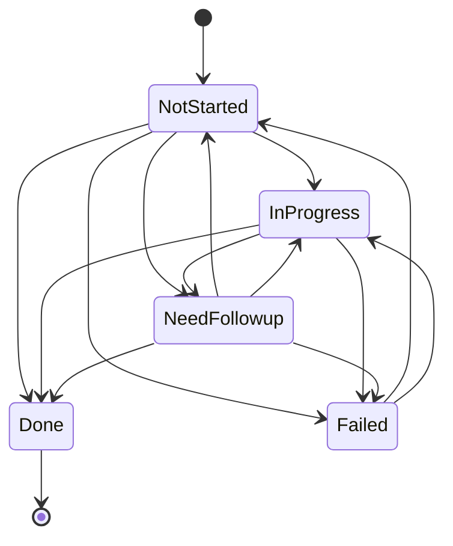

## 4.2) Rulebook chi tiết đang được code enforce

### A. Role, panel access và branch scope

- `Admin` được vào toàn bộ surface quản trị, bao gồm `firewall-ips`.
- `Manager` được vào dashboard tài chính và thu/chi trong phạm vi chi nhánh của mình, nhưng không được vào `firewall-ips`.
- `Doctor` được vào patient / appointment / treatment workflow, nhưng bị chặn ở finance và firewall.
- `CSKH` được thao tác customer -> patient -> appointment workflow và care queue trong phạm vi chi nhánh, nhưng bị chặn ở finance và firewall.
- `AutomationService` là actor cho command/scheduler, không phải UI user.
- Rule phải được enforce ở cả panel access, page/resource policy, table action và deep-link. Không chấp nhận pattern “menu ẩn nhưng URL vẫn vào được”.

### B. MFA cho role nhạy cảm

- Mặc định `Admin` và `Manager` là 2 role bắt buộc MFA qua `config/care.php`.
- Local demo vẫn giữ behavior production-faithful: sau khi login password, user phải qua step MFA.
- `LocalDemoDataSeeder` seed deterministic recovery codes cho các account nhạy cảm và in ra console khi chạy seed local để QA có thể dùng ngay.
- Browser tests và smoke tests role-based phải dùng đúng recovery code seed thay vì bypass middleware.

### C. Customer -> Patient conversion

- Conversion luôn chạy trong transaction và lock customer/appointment liên quan để giảm duplicate do double-submit.
- Hệ thống ưu tiên reuse hồ sơ bệnh nhân hiện có theo identity chuẩn hóa, không tạo patient mới nếu đã có profile trùng phù hợp.
- Luồng convert có thể đồng bộ `patient_id` lại cho appointment nếu appointment được tạo trước khi customer được convert.
- Khi reuse hồ sơ bệnh nhân hiện có ở chi nhánh khác, hệ thống đồng bộ ownership/branch context thay vì silently tạo duplicate patient mới.
- Chỉ mark customer là `converted` khi hồ sơ patient canonical thực sự gắn với customer đó.

### D. Reactivation / recall automation

- Reactivation chỉ tạo ticket khi bệnh nhân đã inactive quá ngưỡng cấu hình.
- Nếu bệnh nhân đã có booking tương lai ở trạng thái `scheduled`, `confirmed`, `rescheduled` hoặc `in_progress` thì automation phải bỏ qua.
- Nếu đã có active ticket `reactivation_follow_up`, automation phải bỏ qua để tránh mở trùng ticket.
- Loyalty bonus cho reactivation chỉ được áp dụng sau khi ticket đã `done` và có visit/appointment hợp lệ phát sinh sau ticket đó.

### E. MPI duplicate review

- Queue duplicate MPI chỉ dành cho duplicate liên chi nhánh.
- Duplicate chỉ xảy ra trong cùng một chi nhánh phải bị auto-ignore khỏi queue liên chi nhánh.
- Merge phải resolve/ignore các case sibling cùng identity một cách nhất quán, không để nhiều `open` case cùng hash.
- Rollback merge phải restore duplicate cases từ snapshot trước merge, không rebuild ngây thơ từ 2 hồ sơ hiện tại.

### F. Finance và destructive surface

- `ReceiptsExpense`, finance dashboard và các finance widget phải tôn trọng branch scope của `Manager` và deny cho `Doctor` / `CSKH`.
- Surface hạ tầng như `firewall-ips` là admin-only.
- Với workflow tài chính, ưu tiên `cancel/void/reverse` theo canonical flow thay vì cho edit/delete tùy ý record đã phát sinh nghiệp vụ.

### G. Filament v4 schema utility injection

- Trong Filament 4, schema/form utility injection phải dùng:
  - `Filament\\Schemas\\Components\\Utilities\\Get`
  - `Filament\\Schemas\\Components\\Utilities\\Set`
- Không dùng namespace cũ `Filament\\Forms\\Get`, `Filament\\Forms\\Set` hoặc `Filament\\Forms\\Components\\Utilities\\*`.
- Rule này đã có guard test quét toàn bộ `app/Filament`, vì lỗi sẽ nổ ở runtime lúc render page chứ không phải lúc compile.

### H. Browser regression bắt buộc cho surface rủi ro cao

- Các flow role-based trọng yếu đã có browser test thật:
  - `CSKH` RBAC + convert lead
  - `Doctor` RBAC
  - `Manager` finance scope + MFA
  - `Admin` firewall access + MFA
- Các create form có nhiều `Get/Set` dependency phải có browser smoke để bắt lỗi render-time, hiện đang cover:
  - invoice create
  - treatment plan create
  - receipts expense create
  - factory order create

## 5) Module chính

### 5.1 CRM & Frontdesk

- Quản lý khách hàng tiềm năng và chuyển đổi Customer -> Patient.
- Lịch hẹn theo bác sĩ/chi nhánh, trạng thái chuẩn hóa, kiểm soát overbooking.
- Chăm sóc khách hàng đa trạng thái + SLA + ticket automation.

### 5.2 Khám và Điều trị

- Phiếu khám theo ngày, odontogram người lớn/trẻ em.
- Chỉ định cận lâm sàng và upload ảnh theo loại chỉ định.
- Kế hoạch điều trị và item approval lifecycle.
- Tiến trình điều trị theo ngày/phiên, lock theo business event.
- Đơn thuốc và liên kết ngữ cảnh về hồ sơ bệnh nhân.

### 5.3 Tài chính

- Hóa đơn theo bệnh nhân/plan/session.
- Thanh toán đa phương thức, reversal/refund an toàn.
- Installment + dunning.
- Insurance claim lifecycle.
- Thu/chi có liên kết bệnh nhân/hóa đơn để đối soát.

### 5.4 Vận hành và quản trị

- Multi-branch master data sync.
- MPI dedupe/merge liên chi nhánh.
- KPI pack vận hành nha khoa + benchmark + alerts.
- Snapshot report có schema versioning và lineage.
- Scheduler hardening: retry/timeout/alert + single-node safety.

### 5.5 Tích hợp

- Web Lead API ingestion (website -> CRM).
- Zalo/ZNS flow.
- Google Calendar.
- EMR outbound sync (1 chiều từ CRM).

## 6) Bảo mật và toàn vẹn dữ liệu

Hệ thống áp dụng các nguyên tắc:

- Branch isolation ở policy + query scope + action-level authorization.
- Action permission baseline và anti-bypass review.
- Audit log bắt buộc cho hành vi nhạy cảm (clinical/finance/care/security).
- PHI encryption cho trường nhạy cảm trong EMR.
- Critical foreign key gate để tránh orphan dữ liệu lâm sàng/tài chính.
- Idempotency key cho API/flow dễ bị submit lặp.

## 7) Công nghệ

- PHP `8.4`
- Laravel `12`
- Filament `4`
- Livewire `3`
- Sanctum
- Spatie Permission
- Pest `4` + PHPUnit `12`
- Tailwind CSS `4`

## 8) Cấu trúc thư mục quan trọng

- `app/Models`: domain models theo CRM + EMR
- `app/Filament`: admin panel pages/resources
- `app/Console/Commands`: ops gates, reconciliation, automation commands
- `database/migrations`: schema và hardening migrations
- `database/seeders`: production master-data seed và local demo seed
- `tests/Feature`: business/regression tests theo module
- `docs/reviews`: review, issue, plan, master index theo module
- `docs`: specification, runbook production, local demo guide, backlog lịch sử

## 9) Cài đặt local

```bash
composer install
cp .env.example .env
php artisan key:generate
npm install
php artisan migrate:fresh --seed
npm run dev
```

Lệnh trên sẽ tạo đầy đủ local demo dataset, gồm:

- chi nhánh demo `HCM-Q1`, `HN-CG`, `DN-HC`
- bộ user demo deterministic
- patient / appointment / finance / labo / ZNS scenarios mẫu

### 9.1) Local demo MFA và QA login

- Account demo và persona có trong `docs/LOCAL_DEMO_USERS.md`.
- `Admin` và `Manager` vẫn phải qua MFA khi login local.
- Mỗi lần chạy `php artisan migrate:fresh --seed` hoặc reseed `LocalDemoDataSeeder`, terminal sẽ in bảng `Demo MFA QA credentials`.
- Dùng recovery code được in ra từ seed thay vì tắt middleware MFA.
- Nếu QA cần replay browser tests bằng tay, ưu tiên seed lại để lấy đúng recovery codes deterministic mới nhất.

Nếu schema đã có sẵn và chỉ muốn nạp lại demo data local:

```bash
php artisan db:seed --class=Database\\Seeders\\LocalDemoDataSeeder --force
```

Trên production, không dùng `DatabaseSeeder`. Thay vào đó:

```bash
php artisan migrate --force
php artisan db:seed --class=Database\\Seeders\\ProductionMasterDataSeeder --force
```

Nếu frontend không phản ánh thay đổi mới:

```bash
npm run build
```

## 10) Lệnh kiểm thử và quality gates

### Kiểm tra cơ bản

```bash
vendor/bin/pint --dirty
php artisan migrate:status
php artisan schema:assert-no-pending-migrations
php artisan schema:assert-critical-foreign-keys
php artisan test tests/Feature/VietnamMarketSeedersTest.php
php artisan test
```

### Regression nên chạy khi đụng rule nhạy cảm

```bash
php artisan test tests/Feature/FilamentSchemaNamespaceGuardTest.php
php artisan test tests/Feature/AdminCriticalPagesSmokeTest.php
php artisan test tests/Browser/CrmRoleWorkflowBrowserTest.php
```

Khi sửa một trong các vùng sau, không nên bỏ qua browser smoke:

- role / MFA / panel access
- create form có nhiều `Get/Set` dependency
- patient / customer conversion
- finance scope và admin-only surface

### Release gates trước deploy

```bash
php artisan ops:run-release-gates --profile=production --with-finance --from=2025-01-01 --to=2026-03-02
```

### Production readiness pack

```bash
php artisan ops:run-production-readiness --with-finance --from=2025-01-01 --to=2026-03-02 --strict-full --fail-fast
```

### Verify artifact readiness + signoff

```bash
php artisan ops:verify-production-readiness-report storage/app/release-readiness/<report>.json --qa=<qa-email> --pm=<pm-email> --strict
```

### Ghi chú CI cho browser suite

- Browser tests là một phần của `php artisan test`.
- GitHub Actions phải setup Node, chạy `npm ci`, build assets và cài Playwright browsers trước khi chạy suite.
- Nếu CI chỉ có PHP/Composer mà thiếu Playwright runtime, các browser smoke sẽ fail dù local feature tests vẫn pass.

## 11) Web Lead API (website -> CRM)

Endpoint chính:

- `POST /api/v1/web-leads`

Headers bắt buộc:

- `Authorization: Bearer <token>`
- `X-Idempotency-Key: <unique-key>`
- `Content-Type: application/json`

Payload tối thiểu:

```json
{
  "full_name": "Nguyen Van A",
  "phone": "0909123456",
  "branch_code": "BR-20260119-XXXXXX",
  "note": "Lead từ website"
}
```

Kết quả:

- Tạo mới hoặc merge lead theo policy chuẩn hóa số điện thoại.
- Không tạo duplicate khi request bị gửi lặp với cùng idempotency key.
- Có thể bật realtime notify cho role nhận lead tại Integration Settings.

## 12) Tài liệu tham chiếu

Đọc theo thứ tự:

1. `docs/USER_GUIDE.md`
2. `docs/USER_GUIDE_GETTING_STARTED.md`
3. `docs/USER_GUIDE_FRONTDESK_CSKH.md`
4. `docs/USER_GUIDE_DOCTOR.md`
5. `docs/USER_GUIDE_MANAGER_ADMIN.md`
6. `docs/reviews/00-master-index.md`
7. `docs/PRODUCTION_OPERATIONS_RUNBOOK.md`
8. `docs/LOCAL_DEMO_USERS.md`
9. `docs/reviews/REVIEW-PIPELINE.md`
10. `docs/DENTAL_CRM_SPECIFICATION.md`
11. `DATABASE_SCHEMA.md`
12. `docs/GAP_ANALYSIS.md`
13. `docs/IMPLEMENTATION_SPRINT_BACKLOG.md`
14. `docs/PM_DENTAL_FLOW_BACKLOG.md`

## 13) Ghi chú vận hành production

- Không bỏ qua release gates và readiness report trước deploy.
- Luôn chạy migrate trong maintenance window có backup/restore drill.
- Chỉ seed production bằng `ProductionMasterDataSeeder`.
- Không chạy `php artisan migrate:fresh --seed` trên production.
- Mọi thay đổi logic nhạy cảm phải có test hồi quy tương ứng.
- Ưu tiên quan sát log `audit`, `security`, `finance`, `emr sync` sau mỗi lần release.
