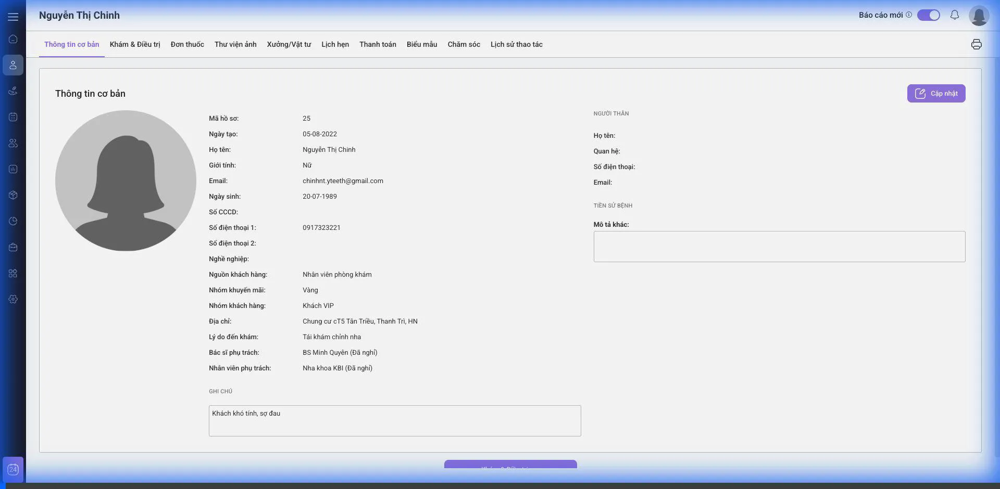
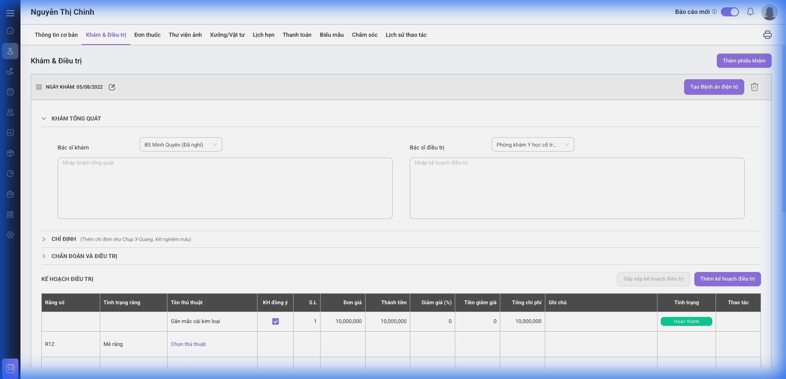
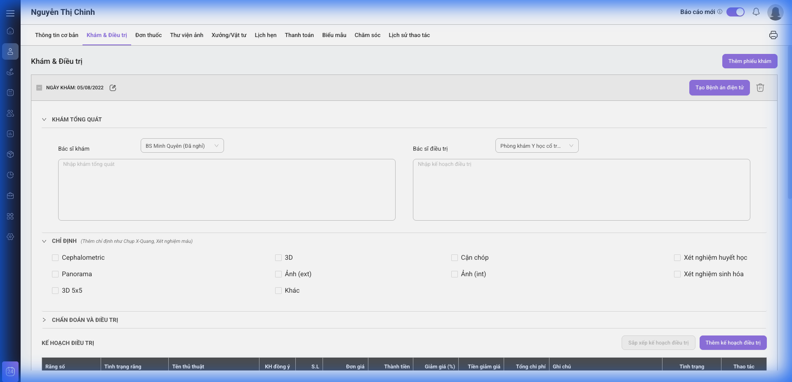
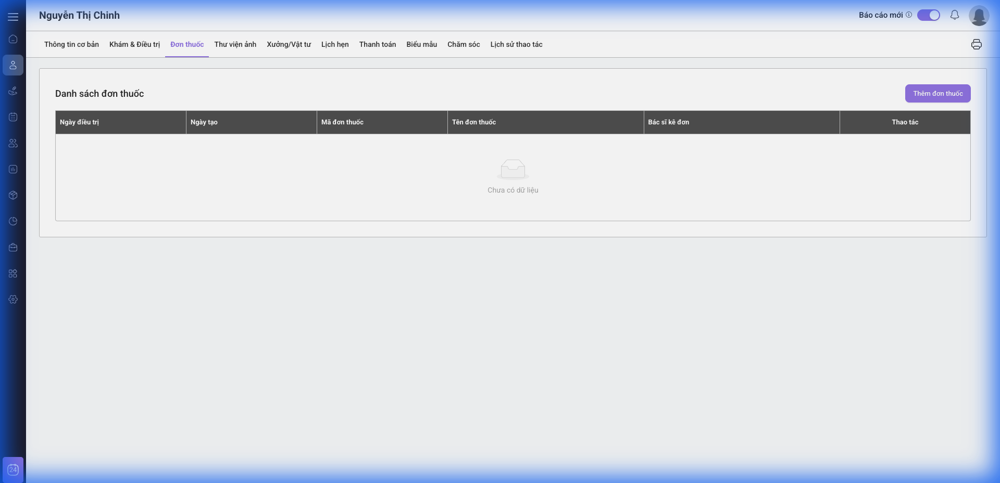
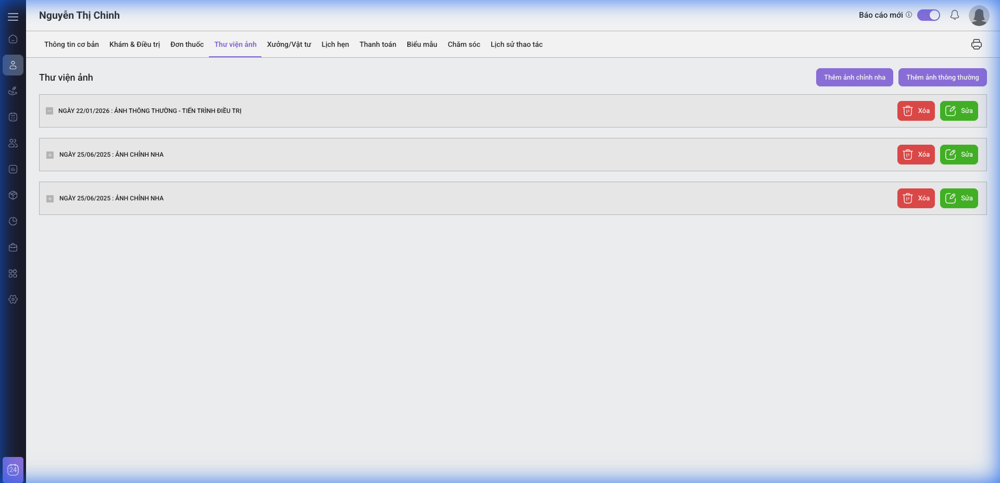
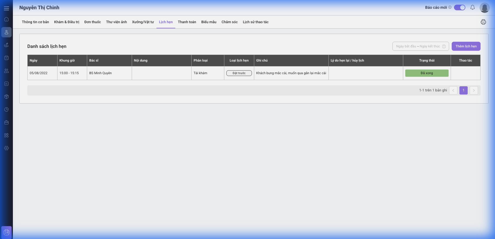
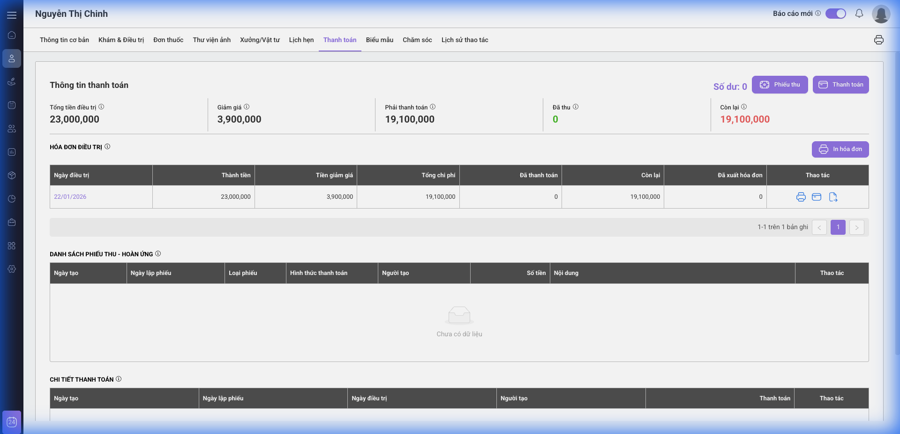
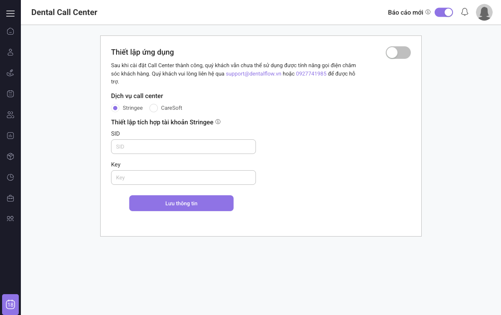
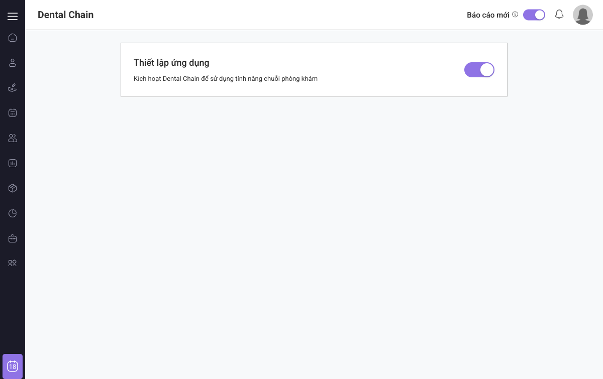

# DentalFlow Clone Specification (Chi tiết theo tính năng)
> Reverse-engineered spec từ bản demo `https://app.dentalflow.vn` để phục vụ clone hệ thống CRM Nha khoa.

## Thông tin đăng nhập demo (ghi nhớ nhanh)
- **URL**: `https://app.dentalflow.vn`
- **Mã phòng khám**: `demo_standard`
- **Tên đăng nhập**: `admin01`
- **Mật khẩu**: `Admin@123`
- **Lưu ý**: chỉ dùng cho môi trường demo, không dùng cho production.

## 0) Thông tin tài liệu
- **Nguồn khảo sát**: `app.dentalflow.vn`
- **Môi trường khảo sát**: tài khoản `demo_standard/admin01`
- **Ngày khảo sát**: **17-02-2026**
- **Phạm vi**: UI/UX flow, route, bảng dữ liệu, form thao tác, module báo cáo, module tích hợp ứng dụng mở rộng.
- **Lưu ý**: Một số rule backend (phân quyền sâu, công thức tính, trigger tự động) không hiển thị đầy đủ ở UI, phần này được mô tả theo hướng clone tương đương hành vi hiện có.

---

## 1) Mục tiêu clone
Xây dựng hệ thống CRM Nha khoa tương đương DentalFlow demo, bao phủ:
- Quản lý khách hàng/hồ sơ bệnh án.
- Khám điều trị, kế hoạch điều trị, đơn thuốc.
- Lịch hẹn và chăm sóc khách hàng đa kênh.
- Thu/chi, công nợ, thanh toán theo ca điều trị.
- Quản lý nhân sự, chi nhánh, báo cáo thống kê.
- Tích hợp ứng dụng mở rộng (Zalo, Google Calendar, e-Invoice, e-Prescription, VNPay, EMR...).

---

## 2) Bản đồ điều hướng (IA + Routes)

### 2.1 Menu chính (sidebar)
| Menu | Route chính |
|---|---|
| Trang chủ | `/` |
| Quản lý khách hàng | `/patient-records-management` |
| Quản lý CSKH | `/customer-care` |
| Quản lý lịch hẹn | `/calendar` |
| Quản lý nhân sự | `/user` |
| Quản lý thu/chi | `/receipts-expense` |
| Quản lý chi nhánh | `/dental-chain` |
| Ứng dụng mở rộng | `/dental-app` |

### 2.2 Route con quan trọng
| Nhóm | Route |
|---|---|
| Dashboard chi tiết lịch hẹn | `/appointment-statistical` |
| Báo cáo doanh thu | `/revenue-statistical` |
| Báo cáo dòng tiền | `/revenue-expenditure` |
| Báo cáo công nợ | `/owed-statistical` |
| Báo cáo khách hàng | `/patient-statistical` |
| Báo cáo vật tư | `/material-statistical` |
| Báo cáo xưởng/labo | `/factory-statistical` |
| Tổng hợp theo thủ thuật | `/trick-group-statistical` |
| Thống kê CSKH | `/customs-care-statistical` |
| Chiến dịch CSKH (ZNS) | `/zalo-zns` |
| Báo cáo chi nhánh | `/dental-chain/report/revenue-statistical` |
| Cài đặt app mở rộng | `/dental-app/setting/*` |
| Chi tiết hồ sơ bệnh nhân | `/patient-record-detail/:id` |

---

## 3) Đặc tả module chi tiết

## 3.1 Authentication
### Màn hình
- Route: `/auth/login/%2F`
- Trường:
  - `Mã phòng khám *`
  - `Tài khoản *`
  - `Mật khẩu *`
  - Checkbox `Ghi nhớ tài khoản`
  - Link `Quên mật khẩu?`
- Nút: `Đăng nhập`

### Rule clone
- Validate required cả 3 trường.
- Sai thông tin -> hiển thị lỗi xác thực.
- Đúng thông tin -> redirect `/`.
- Hỗ trợ lưu phiên đăng nhập (remember me).

---

## 3.2 Dashboard (Trang chủ)
### Route
- `/`

### Thành phần
- Bộ lọc ngày: `Ngày bắt đầu`, `Ngày kết thúc`, nút `Hiển thị`.
- Toggle `Báo cáo mới`.
- KPI cards:
  - `Tổng doanh thu`
  - `Tổng thực thu`
  - `Tổng chi phí`
  - `Tổng công nợ`
- Card `Báo cáo lịch hẹn` + link `Xem chi tiết` -> `/appointment-statistical`.

### Rule clone
- Dữ liệu KPI và card phụ thuộc date range.
- Format tiền VND chuẩn ngăn cách hàng nghìn.

---

## 3.3 Quản lý khách hàng (danh sách hồ sơ)
### Route
- `/patient-records-management`

### Danh sách
- Cột:
  - `Mã hồ sơ`
  - `Họ tên`
  - `Điện thoại`
  - `Địa chỉ`
  - `Tiền sử bệnh`
  - `Ngày tạo`
  - `Ghi chú`
  - `Thao tác`
- Search: `Tìm theo mã hồ sơ, số điện thoại, họ tên`
- Toolbar:
  - `Thêm mới khách hàng`
  - `Bộ lọc`
  - `Hiển thị x/y`
  - `Sắp xếp`
  - `Export`
- Pagination ở cuối bảng.

### Chi tiết dòng
- Click tên khách hàng -> `/patient-record-detail/:id#examAndTreatment`

### Form: Thêm mới khách hàng
- Header: `THÊM MỚI HỒ SƠ KHÁCH HÀNG`
- Tabs form:
  - `Thông tin cơ bản`
  - `Người thân`
  - `Tiền sử bệnh`
  - `Ghi chú`
  - `Người phụ trách`
- Input/field chính:
  - Ảnh hồ sơ (kéo thả / paste)
  - `Mã hồ sơ`
  - Ngày sinh (`dd-mm-yyyy`)
  - Họ tên
  - Số CCCD
  - SĐT 1, SĐT 2
  - Email
  - Địa chỉ
  - Lý do đến khám
  - Mô tả khác
  - Ghi chú
- Checkbox bệnh sử:
  - `Chảy máu lâu`, `Tiểu đường`, `Dị ứng thuốc`, `Truyền nhiễm`, `Huyết áp cao`, `Huyết áp thấp`, `Thai sản`, `Thấp khớp`, `Tim`, `Dạ dày`, `Gan`, `Phổi`, `Bình thường`
- Action:
  - `Lưu thông tin`
  - `Hủy bỏ`

### Rule clone
- Mã hồ sơ có thể tự động sinh hoặc nhập tay.
- SĐT nên unique theo phòng khám (khuyến nghị backend).
- Hỗ trợ upload ảnh + paste clipboard.

---

## 3.4 Hồ sơ bệnh nhân chi tiết (Patient Workspace)
### Route
- `/patient-record-detail/:id`

### Tabs chính
- `Thông tin cơ bản`
- `Khám & Điều trị`
- `Đơn thuốc`
- `Thư viện ảnh`
- `Xưởng/Vật tư`
- `Lịch hẹn`
- `Thanh toán`
- `Biểu mẫu`
- `Chăm sóc`
- `Lịch sử thao tác`

### 3.4.1 Tab Thông tin cơ bản
- Hiển thị snapshot hồ sơ:
  - Mã hồ sơ, ngày tạo, họ tên, giới tính, email, ngày sinh, CCCD, điện thoại, nghề nghiệp...
  - Nguồn KH, nhóm khuyến mãi, nhóm KH, địa chỉ, lý do đến khám, bác sĩ phụ trách, nhân viên phụ trách
  - Người thân
  - Tiền sử bệnh
  - Ghi chú
- Nút: `Cập nhật`

### 3.4.2 Tab Khám & Điều trị (Spec cực chi tiết - tính năng lõi)
- Route: `/patient-record-detail/:id#examAndTreatment`
- Vai trò: workspace lâm sàng trung tâm, kết nối chẩn đoán răng -> kế hoạch điều trị -> tiến trình điều trị -> thanh toán/CSKH.

#### 3.4.2.1 Mục tiêu nghiệp vụ
- Lưu thông tin khám theo từng `ngày khám`.
- Ghi nhận chỉ định cận lâm sàng (X-quang, xét nghiệm, ảnh lâm sàng).
- Chẩn đoán tình trạng răng trên mô hình răng (odontogram theo số răng FDI).
- Tạo kế hoạch điều trị có định danh theo răng/tình trạng răng.
- Quản lý tiến trình điều trị thực tế theo ngày và nhân sự thực hiện.

#### 3.4.2.2 Bố cục màn hình (UI Composition)
1. Thanh hành động đầu tab:
   - `Thêm phiếu khám`
2. Danh sách phiếu khám theo dạng accordion:
   - Header mỗi phiếu: `NGÀY KHÁM: dd/mm/yyyy`
   - Action theo phiếu: `Tạo Bệnh án điện tử`
3. Cụm section trong mỗi phiếu khám:
   - `Khám tổng quát` (expand/collapse)
   - `Chỉ định (Thêm chỉ định như Chụp X-Quang, Xét nghiệm máu)` (expand/collapse)
   - `Chẩn đoán và điều trị` (expand/collapse, chứa odontogram)
4. Khối `Kế hoạch điều trị` nằm ngay dưới cụm chẩn đoán.
5. Khối `Tiến trình điều trị` nằm dưới `Kế hoạch điều trị`.

#### 3.4.2.3 Phiếu khám theo ngày (Exam Session)
- Mỗi session có identity riêng theo `examDate`.
- Tối thiểu một session có thể mở rộng để nhập liệu.
- Quan sát từ UI:
  - Có thể có nhiều session trong cùng bệnh nhân.
  - Session có tiến trình điều trị sẽ bị chặn xóa (tooltip hiển thị: `Ngày khám đã có tiến trình điều trị nên không thể xóa được.`).

#### 3.4.2.4 Section Khám tổng quát
| Trường | Kiểu | UI hiện có | Ghi chú clone |
|---|---|---|---|
| Bác sĩ khám | Combobox single | hiển thị tên bác sĩ + icon clear | bắt buộc khi chốt phiếu khám |
| Nhập khám tổng quát | Text input/textarea | placeholder `Nhập khám tổng quát` | lưu narrative khám ban đầu |
| Bác sĩ điều trị | Combobox single | hiển thị tên bác sĩ + icon clear | có thể trùng bác sĩ khám |
| Nhập kế hoạch điều trị | Text input/textarea | placeholder `Nhập kế hoạch điều trị` | kế hoạch tổng quát trước khi lên item chi tiết |

#### 3.4.2.5 Section Chỉ định
Checklist chỉ định quan sát được:
- `Cephalometric`
- `3D`
- `Cận chóp`
- `Xét nghiệm huyết học`
- `Panorama`
- `Ảnh (ext)`
- `Ảnh (int)`
- `Xét nghiệm sinh hóa`
- `3D 5x5`
- `Khác`

Rule tương tác:
- Bật `Ảnh (ext)` -> hiện khối upload riêng cho ảnh ngoài miệng.
- Bật `Ảnh (int)` -> hiện khối upload riêng cho ảnh trong miệng.
- Mỗi khối upload có:
  - Nút `Thêm ảnh hoặc kéo thả`
  - Vùng paste `Paste image to here`
  - Nhãn loại ảnh (`Ảnh (ext)` hoặc `Ảnh (int)`)

#### 3.4.2.6 Section Chẩn đoán và điều trị (Odontogram)
Đây là phần quan trọng nhất để clone chính xác.

1. Cấu trúc mô hình răng:
- Màn hình hiển thị dãy số răng theo chuẩn FDI:
  - Vĩnh viễn hàm trên: `18 17 16 15 14 13 12 11 21 22 23 24 25 26 27 28`
  - Răng sữa hàm trên: `55 54 53 52 51 61 62 63 64 65`
  - Răng sữa hàm dưới: `85 84 83 82 81 71 72 73 74 75`
  - Vĩnh viễn hàm dưới: `48 47 46 45 44 43 42 41 31 32 33 34 35 36 37 38`

2. Hướng dẫn tương tác multi-select:
- UI hiển thị note:
  - `* Bạn có thể chọn 1 tình trạng cho nhiều răng khác nhau bằng cách giữ phím "Ctrl" + chọn "Răng số..."`
- Clone bắt buộc:
  - Click đơn: chọn 1 răng.
  - `Ctrl + Click`: thêm/bớt răng trong tập chọn.
  - Cho phép áp 1 tình trạng cho nhiều răng đã chọn.

3. Chẩn đoán tình trạng răng:
- Có combobox `(*) Chẩn đoán khác` với placeholder `Chọn tình trạng khác`.
- Clone nên hỗ trợ 2 nguồn chẩn đoán:
  - Bộ mã chuẩn (seed mặc định).
  - Mã custom từ admin (chẩn đoán khác).

4. Chú thích trạng thái răng:
- `Tình trạng hiện tại`
- `Đang được điều trị`
- `Hoàn thành điều trị`

5. Bộ mã tình trạng răng (seed tham chiếu để clone nhanh):
- Nên cấu hình dạng danh mục động.
- Seed tham chiếu từ hệ thống cũ:
  - `(SR)` Sứ răng
  - `(RK)` Răng khấp khểnh
  - `(RV)` Răng viêm
  - `(PL)` Răng đã mất
  - `(SL)` Sâu lõi lớn
  - `(SNR)` Sâu nguyên mật tủy
  - `(A)` Móng trám Amalgam
  - `(MC)` Mô cứng
  - `Implant`
  - `(VN)` Viêm nướu
  - `(RC)` Răng sứ bị hỏng
  - `(RS)` Răng sâu
  - `Khác`

6. Rule cập nhật màu odontogram:
- Khi chỉ chẩn đoán ban đầu -> màu `Tình trạng hiện tại`.
- Khi đã có item điều trị đang thực hiện -> màu `Đang được điều trị`.
- Khi item hoàn tất -> màu `Hoàn thành điều trị`.
- Mapping màu phải cấu hình được để đồng bộ với legend.

#### 3.4.2.7 Kế hoạch điều trị (Treatment Plan)
Action bar:
- `Sắp xếp kế hoạch điều trị` (disabled khi chưa có item)
- `Thêm kế hoạch điều trị`

Table columns:
- `Răng số`
- `Tình trạng răng`
- `Tên thủ thuật`
- `KH đồng ý`
- `S.L`
- `Đơn giá`
- `Thành tiền`
- `Giảm giá (%)`
- `Tiền giảm giá`
- `Tổng chi phí`
- `Ghi chú`
- `Tình trạng`
- `Thao tác`

Tính toán chuẩn:
- `Thành tiền = S.L * Đơn giá`
- `Tiền giảm giá = (Giảm giá (%) / 100) * Thành tiền`
- `Tổng chi phí = Thành tiền - Tiền giảm giá`

#### 3.4.2.8 Popup: Thêm kế hoạch điều trị
Modal cấp 1:
- Header: `Thêm kế hoạch điều trị`
- Section: `Thủ thuật thực hiện *`
- Nút: `Thêm thủ thuật`
- Bảng item trong modal:
  - `STT`, `Răng số`, `Tình trạng răng`, `Tên thủ thuật`, `KH đồng ý`, `S.L`, `Đơn giá`, `Thành tiền`, `Giảm giá (%)`, `Tiền giảm giá`, `Tổng chi phí`, `Ghi chú`, `Thao tác`
- Footer:
  - `Hủy bỏ`
  - `Lưu thông tin`

Modal cấp 2 (chọn thủ thuật):
- Header: `Chọn thủ thuật điều trị`
- Link: `Đi tới thiết lập thủ thuật` (`/setting/trick`)
- Search box: `Tìm theo tên thủ thuật`
- Panel trái: danh sách `Nhóm thủ thuật`
- Panel phải: bảng thủ thuật:
  - `Tên thủ thuật`
  - `Đơn giá`
  - `Quy trình thủ thuật`
  - `Ghi chú`
- Chọn item bằng checkbox.
- Footer:
  - `Chọn thủ thuật`
  - `Hủy bỏ`

Group thủ thuật thấy trên demo:
- `01. Khám Tư vấn X-quang`
- `02. Điều trị viêm lợi - Cạo vôi`
- `03. Tẩy trắng`
- `04. Điều trị tủy`
- `05. Nhổ răng`
- `07. Trồng răng Implant`
- `08. CHỈNH NHA - NIỀNG RĂNG`
- `09. Chụp sứ`
- `10. Hàn răng`
- `11. Nhổ răng`
- `12. Chỉnh nha mắc cài`
- `SẢN PHẨM CHĂM SÓC RĂNG MIỆNG`

#### 3.4.2.9 Tiến trình điều trị (Treatment Progress)
Action bar:
- `Hiển thị x/y`
- `Thêm ngày điều trị`

Table columns:
- `#`
- `Răng số`
- `Tình trạng răng`
- `Tên thủ thuật`
- `Nội dung thủ thuật`
- `Bác sĩ`
- `Trợ thủ`
- `S.L`
- `Đơn giá`
- `Thành tiền`
- `Giảm giá (%)`
- `Tiền giảm giá`
- `Tổng chi phí`
- `Tình trạng`
- `Thao tác`

Rule clone:
- Khi đẩy item từ kế hoạch sang tiến trình -> giữ liên kết `planItemId`.
- Cập nhật trạng thái tiến trình phải phản ánh lại màu odontogram.

#### 3.4.2.10 Quy tắc validate bắt buộc
1. Không lưu kế hoạch điều trị khi chưa có ít nhất 1 thủ thuật.
2. `S.L` > 0 (cho thủ thuật có định lượng); cho phép `0` với thủ thuật chỉ theo dõi nếu cấu hình cho phép.
3. `Đơn giá` >= 0.
4. `Giảm giá (%)` trong [0..100].
5. Nếu có `Răng số` thì phải map được với danh mục răng FDI hợp lệ.
6. `Răng số` có thể để trống cho thủ thuật toàn hàm/toàn ca (theo cấu hình dịch vụ).
7. Không cho xóa ngày khám khi đã có tiến trình điều trị (rule đã thấy trên UI demo).

#### 3.4.2.11 Data model đề xuất cho riêng module này
`exam_sessions`
- `id`, `patient_id`, `exam_date`, `exam_doctor_id`, `treatment_doctor_id`, `general_exam_note`, `treatment_plan_note`, `status`

`exam_indications`
- `id`, `exam_session_id`, `code` (cephalometric|3d|can-chop|panorama|image-ext|image-int|...)

`exam_indication_images`
- `id`, `exam_session_id`, `image_type` (ext|int), `file_url`, `uploaded_by`

`exam_tooth_conditions`
- `id`, `exam_session_id`, `tooth_no`, `condition_code`, `condition_label`, `source` (default|custom), `treatment_state` (current|in_treatment|done)

`treatment_plan_items`
- `id`, `exam_session_id`, `tooth_no`, `condition_code`, `service_id`, `service_name`, `qty`, `unit_price`, `amount`, `discount_percent`, `discount_amount`, `total_amount`, `patient_agreed`, `note`, `status`

`treatment_progress_days`
- `id`, `exam_session_id`, `progress_date`, `doctor_id`, `assistant_id`, `note`

`treatment_progress_items`
- `id`, `progress_day_id`, `plan_item_id`, `tooth_no`, `content`, `qty`, `unit_price`, `discount_percent`, `discount_amount`, `total_amount`, `status`

#### 3.4.2.12 API contract gợi ý (module-level)
- `POST /api/patients/:patientId/exam-sessions`
- `GET /api/patients/:patientId/exam-sessions?include=indications,odontogram,plan,progress`
- `PATCH /api/exam-sessions/:sessionId/general`
- `PUT /api/exam-sessions/:sessionId/indications`
- `POST /api/exam-sessions/:sessionId/indication-images`
- `PUT /api/exam-sessions/:sessionId/tooth-conditions`
- `POST /api/exam-sessions/:sessionId/treatment-plan-items`
- `PATCH /api/treatment-plan-items/:itemId`
- `POST /api/exam-sessions/:sessionId/progress-days`
- `POST /api/progress-days/:dayId/items`
- `PATCH /api/treatment-progress-items/:id/status`

#### 3.4.2.13 Acceptance criteria chi tiết
1. Mở bệnh nhân vào tab `Khám & Điều trị` thấy đúng danh sách session theo ngày khám.
2. Tạo session mới bằng `Thêm phiếu khám` thành công.
3. Cập nhật `Bác sĩ khám`, `Bác sĩ điều trị`, note khám tổng quát lưu thành công.
4. Tick `Ảnh (ext)` hoặc `Ảnh (int)` phải hiển thị ngay vùng upload tương ứng.
5. Upload ảnh bằng click/chọn file, drag-drop, và paste ảnh hoạt động.
6. Mô hình răng hiển thị đủ 52 răng theo dải FDI như UI demo.
7. `Ctrl + click` cho phép chọn nhiều răng.
8. Áp chẩn đoán cho nhiều răng cùng lúc thành công.
9. Chọn `Chẩn đoán khác` từ combobox lưu đúng label.
10. Màu răng đổi theo 3 trạng thái: hiện tại/đang điều trị/hoàn thành.
11. Mở modal `Thêm kế hoạch điều trị` và chọn thủ thuật từ modal con thành công.
12. Bảng kế hoạch tính đúng thành tiền/giảm giá/tổng chi phí.
13. `Sắp xếp kế hoạch điều trị` chỉ enable khi có item.
14. `Lưu thông tin` không thành công nếu chưa có item thủ thuật.
15. `Thêm ngày điều trị` tạo được tiến trình điều trị theo ngày.
16. Chuyển item từ kế hoạch sang tiến trình vẫn giữ liên kết răng/tình trạng.
17. Session có tiến trình thì không cho xóa.
18. Trạng thái tiến trình cập nhật lại màu trên odontogram.
19. Tab không bị mất dữ liệu khi reload trang.
20. Không crash khi bệnh nhân chưa có dữ liệu (state `Chưa có dữ liệu` hiển thị chuẩn).

### 3.4.3 Tab Đơn thuốc
- Bảng:
  - `Ngày điều trị`, `Ngày tạo`, `Mã đơn thuốc`, `Tên đơn thuốc`, `Bác sĩ kê đơn`, `Thao tác`
- Nút: `Thêm đơn thuốc`

#### Popup: Kê đơn thuốc
- Header: `KÊ ĐƠN THUỐC KHÁCH HÀNG`
- Thông tin:
  - Khách hàng, mã hồ sơ
  - Bác sĩ kê đơn
  - Mẫu đơn thuốc
  - Tên đơn thuốc
  - Chẩn đoán
- Bảng thuốc:
  - `STT`, `Mã thuốc`, `Tên biệt dược`, `Tên thuốc`, `Đơn vị`, `Số lượng`, `Cách dùng`
- Có editor lời dặn (rich text)
- Actions: `Thêm thuốc`, `Lưu thông tin`, `Hủy bỏ`

### 3.4.4 Tab Thư viện ảnh
- Nút:
  - `Thêm ảnh chỉnh nha`
  - `Thêm ảnh thông thường`
- Mục tiêu clone:
  - Upload nhiều ảnh
  - Phân loại nhóm ảnh
  - Xem/sửa/xóa ảnh

### 3.4.5 Tab Xưởng/Vật tư
- 2 khối chính:
  - `DANH SÁCH ĐẶT XƯỞNG` (nút `Thêm phiếu chi`, `Thêm đặt xưởng`)
  - `DANH SÁCH VẬT TƯ TIÊU HAO` (nút `Thêm phiếu xuất`)

#### Bảng đặt xưởng
- Cột:
  - `Ngày điều trị`, `Đơn vị Xưởng/Labo`, `Vật liệu`, `S.L`, `Đơn giá`, `Chi phí`, `Chiết khấu (%)`, `Thành tiền`, `Người đặt`, `Người nhận`, `Ngày đặt`, `Ngày trả`, `Ghi chú`, `Trạng thái`, `Thao tác`

#### Bảng vật tư tiêu hao
- Cột:
  - `Ngày xuất`, `Bác sĩ`, `Thủ thuật`, `Tên vật tư`, `Đơn vị`, `Số lượng`, `Tổng tiền`

#### Popup: Đặt xưởng
- Header: `ĐẶT XƯỞNG`
- Fields:
  - `Tổng tiền`
  - `Ngày đặt` (`dd-mm-yyyy`)
  - `Ngày trả` (`dd-mm-yyyy`)
  - `Ghi chú`
  - Chọn vật liệu
- Cột vật liệu trong popup:
  - `Răng/Hàm`, `Màu răng`, `Phụ kiện`
- Actions: `Lưu thông tin`, `Hủy bỏ`

#### Popup: Thêm phiếu xuất vật tư
- Header: `THÊM PHIẾU XUẤT VẬT TƯ`
- Fields:
  - `Ngày xuất` (`dd-mm-yyyy`)
  - Chọn vật tư
- Cột vật tư:
  - `STT`, `Mã vật tư`, `Nhóm/Danh mục vật tư`, `S.L Tồn kho`
- Actions: `Import`, `Thêm mới`, `Hủy bỏ`

### 3.4.6 Tab Lịch hẹn
- Bảng:
  - `Ngày`, `Khung giờ`, `Nội dung`, `Phân loại`, `Loại lịch hẹn`, `Lý do hẹn lại / hủy lịch`, `Thao tác`
- Nút: `Thêm lịch hẹn`

#### Popup: Đặt lịch hẹn (trong hồ sơ)
- Header: `ĐẶT LỊCH HẸN`
- Fields:
  - Chọn khách hàng
  - Ngày hẹn (`dd-mm-yyyy`)
  - Thời gian (`Chọn thời gian`)
  - Ghi chú
- Radio/nhóm:
  - `Đặt trước`, `Phát sinh`, `Dự kiến`
- Actions: `Thêm mới`, `Hủy bỏ`

### 3.4.7 Tab Thanh toán
- Summary:
  - `Tổng tiền điều trị`
  - `Giảm giá`
  - `Phải thanh toán`
  - `Đã thu`
  - `Còn lại`
  - `Số dư`
- Actions:
  - `Phiếu thu`
  - `In hóa đơn`
- Bảng hóa đơn điều trị:
  - `Ngày điều trị`, `Thành tiền`, `Tiền giảm giá`, `Tổng chi phí`, `Đã thanh toán`, `Còn lại`, `Đã xuất hóa đơn`, `Thao tác`
- Bảng phiếu thu/hoàn:
  - `Ngày tạo`, `Ngày lập phiếu`, `Loại phiếu`, `Hình thức thanh toán`, `Người tạo`, `Số tiền`, `Nội dung`, `Thao tác`

#### Popup: Phiếu thu
- Header: `PHIẾU THU`
- Fields:
  - `Ngày lập phiếu`
  - `Người nộp`
  - `Số điện thoại`
  - `Số tiền`
  - `Nội dung`
- Actions: `Lưu thông tin`, `Hủy bỏ`

### 3.4.8 Tab Biểu mẫu
- Mục tiêu clone:
  - Danh sách biểu mẫu ký/đồng thuận điều trị
  - Tạo/In/Xem biểu mẫu theo bệnh nhân và ngày điều trị

### 3.4.9 Tab Chăm sóc
- Bảng lịch sử chăm sóc:
  - `Thời gian chăm sóc`, `Loại chăm sóc`, `Kênh chăm sóc`, `Nhân viên chăm sóc`, `Trạng thái chăm sóc`, `Nội dung`, `Thao tác`
- Nút:
  - `Thêm chăm sóc`
  - `Đặt lịch chăm sóc`

#### Popup: Tạo mới chăm sóc
- Header: `TẠO MỚI CHĂM SÓC`
- Fields:
  - `Ngày` (`dd-mm-yyyy`)
  - `Thời gian`
  - `Nội dung chăm sóc`
- Actions: `Lưu thông tin`, `Hủy bỏ`

#### Popup: Đặt lịch chăm sóc
- Header: `ĐẶT LỊCH CHĂM SÓC`
- Fields:
  - `Ngày` (`dd-mm-yyyy`)
  - `Thời gian`
  - `Nội dung chăm sóc`
  - Checkbox `Chăm sóc định kỳ`
- Actions: `Lưu thông tin`, `Hủy bỏ`

### 3.4.10 Tab Lịch sử thao tác
- Mục tiêu clone:
  - Audit log theo hồ sơ: thời gian, người thực hiện, hành động, dữ liệu đổi trước/sau.

---

## 3.5 Chăm sóc khách hàng (CSKH)
### Route
- `/customer-care`

### Tabs
- `Lịch chăm sóc`
- `Nhắc lịch hẹn`
- `Nhắc lịch uống thuốc`
- `Hỏi thăm sau điều trị`
- `Ngày sinh nhật`

### Cột cơ sở (mọi tab)
- `Mã hồ sơ`, `Họ tên`, `Điện thoại`, `Loại chăm sóc`, `Trạng thái chăm sóc`, `Kênh chăm sóc`, `Thời gian chăm sóc`, `Nhân viên chăm sóc`, `Nội dung`, `Thao tác`

### Cột mở rộng theo tab
- `Nhắc lịch hẹn`: thêm `Thời gian hẹn`, `Bác sĩ`, `Trạng thái lịch`
- `Nhắc lịch uống thuốc`: thêm `Ngày tạo đơn thuốc`, `Tên đơn thuốc`
- `Hỏi thăm sau điều trị`: thêm `Ngày điều trị`, `Tên thủ thuật`, `Bác sĩ thực hiện`, `Thời gian dự kiến chăm sóc`
- `Ngày sinh nhật`: thêm `Ngày sinh nhật`

### Filter & action
- Search theo mã/sđt/họ tên
- Filter ngày bắt đầu/kết thúc
- Filter trạng thái, nhân viên, loại chăm sóc
- `Export`

---

## 3.6 Chiến dịch CSKH (Zalo ZNS)
### Route
- `/zalo-zns`

### Tabs
- `Mẫu tin`
- `Chiến dịch`

### Danh sách mẫu tin
- Cột:
  - `Template ID`
  - `Tên mẫu ZNS`
  - `Loại mẫu ZNS`
  - `Loại Tag`
  - `Ngày tạo`
  - `Đơn giá`
  - `Thao tác`

### Rule clone
- Quản lý template gắn theo mục đích CSKH.
- Hỗ trợ mapping template vào luồng nhắc lịch/chăm sóc.

---

## 3.7 Lịch hẹn tổng
### Route
- `/calendar`

### Chế độ xem
- `Ngày`, `Tuần`, `Tháng`
- Nút: `Thêm lịch hẹn`

### Metrics trên calendar
- `Tổng số lịch hẹn`
- `Đã xong`
- `Điều trị`
- `Đã đến`
- `Chưa đến`
- `Đã hủy`
- `Hẹn lại sau`
- `Đã hẹn lại`

### Route phụ
- `/calendar#isShowPendingAppointment`
  - Tabs: `Lịch hẹn lại`, `Lịch từ website`

### Popup thêm lịch hẹn (global)
- Header: `ĐẶT LỊCH HẸN`
- Trường:
  - Tìm khách hàng theo mã/sđt
  - Ngày hẹn (`dd-mm-yyyy`)
  - Khung giờ
  - Bác sĩ
  - Ghi chú
  - Loại lịch (đặt trước/phát sinh/dự kiến)
- Actions: `Thêm mới`, `Hủy bỏ`

---

## 3.8 Quản lý nhân sự
### Route
- `/user`

### Danh sách
- Cột:
  - `Đang làm việc`
  - `Họ tên`
  - `Tên đăng nhập`
  - `Vai trò`
  - `Màu lịch`
  - `Thứ tự trên lịch hẹn`
  - `Thao tác`
- Search: email/sđt/họ tên
- Toolbar:
  - `Hiển thị x/y`
  - `Thêm mới`

### Form thêm nhân viên
- Header: `THÊM MỚI NHÂN VIÊN`
- Tabs:
  - `Thông tin cơ bản`
  - `Thông tin tài khoản`
- Fields (quan sát được):
  - Ảnh đại diện
  - Họ tên
  - Ngày sinh
  - Số điện thoại
  - Email
  - Địa chỉ
  - Vai trò
  - Username/password (tab tài khoản)
- Actions: `Lưu thông tin`/`Hủy bỏ`

---

## 3.9 Quản lý thu/chi
### Route
- `/receipts-expense`

### Danh sách
- Cột:
  - `Mã phiếu`
  - `Loại phiếu`
  - `Ngày tạo`
  - `Nhóm`
  - `Danh mục`
  - `Số tiền`
  - `Phương thức`
  - `Người nộp/người nhận`
  - `Người tạo`
  - `Nội dung`
  - `Thao tác`
- Bộ lọc:
  - Date range
  - Loại phiếu
  - Nhóm
  - Danh mục
- Actions:
  - `Export`
  - `Thêm mới`

### Form thêm mới phiếu thu/chi
- Header: `THÊM MỚI`
- Loại phiếu: `Phiếu thu` / `Phiếu chi`
- Fields:
  - `Ngày lập phiếu`
  - `Mã phiếu`
  - `Người nộp/người nhận`
  - `Nhóm`
  - `Danh mục`
  - `Số tiền`
  - `Phương thức`
  - `Nội dung` (rich text)
  - `Người tạo` (readonly)
- Actions: `Lưu thông tin`, `Hủy bỏ`

---

## 3.10 Quản lý chi nhánh
### Route
- `/dental-chain`

### Danh sách chi nhánh
- Cột:
  - `Mã phòng khám`
  - `Tên phòng khám`
  - `Số điện thoại`
  - `Địa chỉ`
  - `Giấy phép KCB`
  - `Ngày hết hạn`
  - `Gói tài khoản`
  - `Trạng thái`

### Actions
- `Đồng bộ thiết lập`
- `Xem báo cáo` -> `/dental-chain/report/revenue-statistical`

### Báo cáo chi nhánh
- Route: `/dental-chain/report/revenue-statistical`
- Cột:
  - `Mã phòng khám`
  - `Tên phòng khám`
  - `Tổng số lượng thủ thuật`
  - `Tổng doanh thu`
- Có `Export` và filter date.

---

## 3.11 Báo cáo & thống kê

### 3.11.1 Thống kê lịch hẹn
- Route: `/appointment-statistical`
- KPIs:
  - Tổng lịch hẹn
  - Lịch hẹn mới
  - Lịch hẹn bị hủy
  - Lịch hẹn lại
  - Thời gian chờ trung bình
- Action: `Export`

### 3.11.2 Doanh thu phòng khám
- Route: `/revenue-statistical`
- Góc nhìn:
  - Nhóm thủ thuật & bác sĩ
  - Nhóm thủ thuật & trợ thủ
  - Nhân viên phụ trách
- KPIs:
  - Tổng số lượng thủ thuật
  - Tổng thực thu
  - Tổng vật tư tiêu hao
- Action: `Export`

### 3.11.3 Dòng tiền (thu/chi)
- Route: `/revenue-expenditure`
- Góc nhìn:
  - Tổng hợp thu chi
  - Thu/chi khách hàng
  - Thu/chi phòng khám
- Cột:
  - `Phương thức thanh toán`
  - `Số dư đầu kỳ`
  - `Phát sinh tăng`
  - `Phát sinh giảm`
  - `Số dư cuối kỳ`
  - `Biến động số dư`

### 3.11.4 Công nợ
- Route: `/owed-statistical`
- Cột:
  - `Mã hồ sơ`, `Họ và tên`, `Số điện thoại`, `Nhóm khách hàng`, `Nguồn khách hàng`, `Địa chỉ`
  - `Tổng tiền điều trị`, `Tổng giảm giá`, `Phải thanh toán`, `Đã thanh toán`, `Ngày thanh toán gần nhất`, `Công nợ`, `Tổng công nợ`, `Số dư`

### 3.11.5 Thống kê khách hàng
- Route: `/patient-statistical`
- Góc nhìn:
  - Theo bác sĩ
  - Theo tiền điều trị
  - Kế hoạch điều trị
- Cột mẫu: `Bác sĩ`, `Số khách hàng`, `Thao tác`

### 3.11.6 Thống kê vật tư
- Route: `/material-statistical`
- Góc nhìn:
  - Thống kê vật tư
  - Chi phí nhà cung cấp
  - Vật tư dùng lệch định mức
- Cột:
  - `Nhóm/Danh mục vật tư`, `Mã vật tư`, `Tên vật tư`, `Đơn vị`, `Tồn đầu kỳ`, `Nhập trong kỳ`, `Xuất trong kỳ`, `Tồn cuối kỳ`, `S.L`, `Tổng tiền`, `Ngày nhập cuối`, `Ngày xuất cuối`

### 3.11.7 Thống kê xưởng/labo
- Route: `/factory-statistical`
- Góc nhìn:
  - Thống kê đặt xưởng
  - Vật liệu đặt xưởng
  - Thống kê chi phí
- Cột:
  - `Đơn vị Xưởng/Labo`, `Tổng chi phí`, `Tổng tiền`, `Người đặt`, `Người nhận`, `Ngày đặt`, `Ngày trả`, `Ghi chú`, `Khách hàng`, `Trạng thái`, `Thao tác`

### 3.11.8 Tổng hợp theo thủ thuật
- Route: `/trick-group-statistical`
- Cột:
  - `Nhóm thủ thuật`, `Tên thủ thuật`, `Số lượng thủ thuật`, `Doanh thu`

### 3.11.9 Thống kê CSKH
- Route: `/customs-care-statistical`
- Tabs:
  - `Tổng hợp`
  - `Báo cáo SMS`
  - `Phân loại theo kênh khác`
  - `Phân loại theo nhân viên`
  - `Đánh giá dịch vụ`
- Cột chính:
  - `Phân loại`, `Đã chăm sóc`, `Chưa chăm sóc`, `Tổng`, `Hoàn thành`, `Cần chăm sóc lại`, `Đang xử lý`, `Gửi thất bại`, `Zalo SMS`, `SMS BrandName`, `Số lượng`, `Tổng tiền`

---

## 3.12 Ứng dụng mở rộng (Marketplace + Settings)
### Route tổng
- `/dental-app`

### Danh sách app tích hợp (quan sát trên demo)
- Dental Google Calendar (Miễn phí)
- Dental ZNS (2,000,000 VND, thu 1 lần)
- Dental Chain (Miễn phí)
- Dental SMS Brandname (3,000,000 VND, thu 1 lần)
- Dental Call Center (3,000,000 VND, thu 1 lần)
- Dental Web Booking (Miễn phí)
- Dentalflow - Đơn thuốc quốc gia (Miễn phí)
- Dental Zalo (3,000,000 VND, thu 1 lần)
- DentalFlow - FACEID (Miễn phí)
- Dentalflow - VNPAY (Miễn phí)
- Dentalflow - Hóa đơn điện tử (1,000,000 VND, thu 1 lần)
- Dentalflow - Bệnh án điện tử (Miễn phí giai đoạn beta)

### Cài đặt từng app

#### Google Calendar
- Route: `/dental-app/setting/google-calendar`
- Mục tiêu: đồng bộ lịch hẹn DentalFlow -> Google Calendar.

#### Zalo
- Route: `/dental-app/setting/zalo`
- Hiển thị trạng thái kết nối OA và thông tin tài khoản Zalo.

#### Chain
- Route: `/dental-app/setting/chain`
- Kích hoạt tính năng chuỗi phòng khám.

#### SMS Brandname
- Route: `/dental-app/setting/sms-brand-name`
- Bật/tắt và cấu hình gửi SMS chăm sóc tự động.

#### Call Center
- Route: `/dental-app/setting/call-center`
- Nhà cung cấp: `Stringee`, `CareSoft`
- Fields: `SID`, `Key`
- Nút: `Lưu thông tin`

#### Web Booking
- Route: `/dental-app/setting/web-booking`
- Cấu hình nhận lịch hẹn từ website.

#### Đơn thuốc quốc gia
- Route: `/dental-app/setting/e-prescription`
- Fields:
  - `Mã liên thông phòng khám`
  - `Mã BH (Mã cơ sở)`
  - `Mật khẩu`
- Nút: `Lưu thông tin`

#### Zalo ZNS mở rộng
- Route: `/dental-app/setting/zalo-zns`
- Thông tin OA ID, trạng thái đồng bộ, cấu hình chat/call/ZNS.

#### FaceID
- Route: `/dental-app/setting/face-id`
- Cấu hình bật tính năng check-in/chấm công bằng FaceID.

#### VNPay
- Route: `/dental-app/setting/vn-pay`
- Fields:
  - `Merchant Name`
  - `Merchant Code`
  - `Merchant Type`
  - `Terminal ID`
- Nút: `Lưu thông tin`

#### Hóa đơn điện tử
- Route: `/dental-app/setting/e-invoice`
- Thông tin chung:
  - Đơn vị bán hàng
  - Mã số thuế
  - Điện thoại
  - Địa chỉ
  - Ngân hàng
  - Số tài khoản
  - Email
  - Đơn vị tiền tệ
- Nhà cung cấp: `S-Invoice`, `MISA-eInvoice`, `CA2-eInvoice`, `Easy-eInvoice`, `VNPT-Invoice`
- Thông tin hóa đơn:
  - Mẫu số
  - Ký hiệu
- Nút: `Thêm`, `Lưu thông tin`

#### Bệnh án điện tử (EMR)
- Route: `/dental-app/setting/emr`
- Nút: `Cấu hình Bệnh án điện tử`

---

## 4) Data Model đề xuất để clone

## 4.1 Core entities
- `clinics`
- `users`
- `roles`
- `patients`
- `patient_contacts` (người thân)
- `patient_medical_history`
- `patient_notes`
- `examination_sessions`
- `treatment_plan_headers`
- `treatment_plan_items`
- `treatment_progress_logs`
- `prescriptions`
- `prescription_items`
- `patient_media`
- `factory_orders`
- `material_issue_notes`
- `appointments`
- `care_tickets`
- `receipts`
- `expenses`
- `payment_invoices`
- `branches`
- `integration_settings`
- `audit_logs`

## 4.2 Quan hệ chính
- `patients 1-n examination_sessions`
- `examination_sessions 1-n treatment_plan_items`
- `patients 1-n prescriptions` và `prescriptions 1-n prescription_items`
- `patients 1-n appointments`
- `patients 1-n receipts` (qua payment context)
- `patients 1-n care_tickets`
- `patients 1-n patient_media`
- `branches 1-n users`, `branches 1-n patients`

---

## 5) API contract gợi ý (REST)

## 5.1 Auth
- `POST /api/auth/login`
- `POST /api/auth/logout`
- `GET /api/auth/me`

## 5.2 Dashboard
- `GET /api/dashboard/summary?from&to`
- `GET /api/dashboard/appointment-report?from&to`

## 5.3 Patients
- `GET /api/patients`
- `POST /api/patients`
- `GET /api/patients/:id`
- `PUT /api/patients/:id`

## 5.4 Clinical
- `POST /api/patients/:id/exams`
- `GET /api/patients/:id/exams`
- `POST /api/patients/:id/treatment-plans`
- `PUT /api/treatment-plans/:planId`

## 5.5 Prescription
- `GET /api/patients/:id/prescriptions`
- `POST /api/patients/:id/prescriptions`
- `GET /api/prescriptions/:id/print`

## 5.6 Media
- `GET /api/patients/:id/media`
- `POST /api/patients/:id/media`
- `DELETE /api/media/:id`

## 5.7 Appointments
- `GET /api/appointments`
- `POST /api/appointments`
- `PUT /api/appointments/:id`
- `GET /api/patients/:id/appointments`

## 5.8 Payments / Receipts
- `GET /api/patients/:id/payment-summary`
- `GET /api/patients/:id/invoices`
- `POST /api/patients/:id/receipts`
- `GET /api/receipts-expense`
- `POST /api/receipts-expense`

## 5.9 CSKH
- `GET /api/customer-care?tab=`
- `POST /api/patients/:id/care`
- `POST /api/patients/:id/care-schedules`
- `GET /api/zns/templates`
- `POST /api/zns/campaigns`

## 5.10 Reports
- `GET /api/reports/appointment`
- `GET /api/reports/revenue`
- `GET /api/reports/cashflow`
- `GET /api/reports/debt`
- `GET /api/reports/patient`
- `GET /api/reports/material`
- `GET /api/reports/factory`
- `GET /api/reports/trick-group`
- `GET /api/reports/customer-care`

## 5.11 Integrations
- `GET /api/integrations`
- `GET /api/integrations/:code/settings`
- `PUT /api/integrations/:code/settings`

---

## 6) Rule nghiệp vụ quan trọng khi clone
- Mọi module danh sách cần có: `search + filter + sort + pagination + export`.
- Chuẩn ngày hiển thị: `dd-mm-yyyy`.
- Currency: định dạng VND có phân cách ngàn.
- Mọi popup form có 2 luồng tối thiểu:
  - `Lưu thông tin`
  - `Hủy bỏ`
- Dữ liệu bệnh án phải đi theo timeline (ngày khám -> kế hoạch -> điều trị -> thanh toán -> chăm sóc).
- Audit log bắt buộc cho thao tác chỉnh sửa/xóa.
- Các module tích hợp phải có trạng thái kết nối và validate credential trước khi lưu.

---

## 7) Permission Matrix tối thiểu
| Chức năng | Admin | Bác sĩ | Lễ tân/CSKH | Kế toán |
|---|---:|---:|---:|---:|
| Quản lý hồ sơ bệnh nhân | ✅ | ✅ | ✅ | 👀 |
| Khám & điều trị / đơn thuốc | ✅ | ✅ | 👀 | 👀 |
| Lịch hẹn | ✅ | ✅ | ✅ | 👀 |
| Chăm sóc khách hàng | ✅ | ✅ | ✅ | 👀 |
| Thu/chi & phiếu thu | ✅ | 👀 | 👀 | ✅ |
| Quản lý nhân sự | ✅ | 👀 | ❌ | ❌ |
| Quản lý chi nhánh | ✅ | ❌ | ❌ | ❌ |
| Báo cáo thống kê | ✅ | ✅ (giới hạn) | ✅ (giới hạn) | ✅ |
| Cài đặt tích hợp | ✅ | ❌ | ❌ | ❌ |

`👀`: chỉ xem

---

## 8) Checklist nghiệm thu theo module (UAT)

## 8.1 Hồ sơ khách hàng
- Tạo mới khách hàng thành công với dữ liệu tối thiểu (họ tên + sđt).
- Mở được trang chi tiết hồ sơ và chuyển tab không lỗi.

## 8.2 Khám điều trị
- Tạo phiếu khám mới.
- Thêm kế hoạch điều trị, tính đúng thành tiền/giảm giá/tổng chi phí.
- Đổi trạng thái điều trị hiển thị đúng ở timeline.

## 8.3 Đơn thuốc
- Tạo đơn thuốc có item thuốc.
- In/xuất đơn thuốc hoạt động.

## 8.4 Lịch hẹn
- Tạo lịch hẹn từ calendar và từ hồ sơ bệnh nhân.
- Chuyển trạng thái hẹn (đã đến/không đến/hủy) phản ánh đúng ở tab nhắc lịch.

## 8.5 Thu/chi & thanh toán
- Lập phiếu thu theo bệnh nhân.
- Cập nhật đúng số đã thu/còn lại/công nợ.

## 8.6 CSKH
- Tạo lịch chăm sóc, thêm chăm sóc thủ công.
- Các tab nhắc lịch/nhắc thuốc/hỏi thăm/sinh nhật hiển thị đúng dữ liệu.

## 8.7 Báo cáo
- Date range ảnh hưởng toàn bộ chỉ số.
- Export hoạt động ở tất cả report route.

## 8.8 Tích hợp
- Lưu cấu hình VNPay/e-Prescription/e-Invoice thành công với validate bắt buộc.
- Trạng thái kết nối hiển thị đúng sau khi cập nhật.

---

## 9) Kế hoạch clone theo phase

## Phase 1 (Core vận hành phòng khám)
- Auth, Dashboard, Patients list/detail, Examination/Treatment, Prescription, Appointment.

## Phase 2 (Tài chính + CSKH)
- Payment, Receipts/Expense, Customer Care tabs, ZNS campaign.

## Phase 3 (Quản trị + Báo cáo + Tích hợp)
- Staff, Branch, Reports suite, Integration settings.

## Phase 4 (Nâng cao)
- EMR workflow, quyền chi tiết theo vai trò, automation nhắc lịch đa kênh, tối ưu hiệu năng báo cáo lớn.

---

## 10) Ghi chú triển khai kỹ thuật
- Nên tách `Patient Workspace` thành module độc lập (micro-frontend hoặc bounded context) vì nhiều tab và rule.
- Cần event bus nội bộ để đồng bộ thay đổi giữa các tab (điều trị -> thanh toán -> chăm sóc).
- Nên có bảng `enum_config` để cấu hình danh mục động: trạng thái, nhóm thủ thuật, loại chăm sóc, loại phiếu, phương thức thanh toán.
- Với báo cáo, cần pre-aggregation (daily snapshot) để tránh query nặng realtime.

---

> Tài liệu này là bản đặc tả clone chi tiết từ UI hiện tại trên môi trường demo DentalFlow.
> Có thể dùng trực tiếp để tạo backlog theo epic/feature/story cho team dev.

---

## 11) Phụ lục triển khai chi tiết (Implementation Appendix)

## 11.1 Chuẩn đặt mã và quy ước chung
- Timezone hệ thống: `Asia/Ho_Chi_Minh`.
- Định dạng ngày hiển thị UI: `dd-mm-yyyy`.
- Định dạng datetime API: `ISO-8601` (`YYYY-MM-DDTHH:mm:ssZ`).
- Mã tiền tệ mặc định: `VND`.
- Soft delete: dùng `deleted_at` cho các bảng nghiệp vụ quan trọng.
- Mọi entity có tối thiểu các cột:
  - `id` (UUID hoặc BIGINT)
  - `clinic_id`
  - `created_at`, `created_by`
  - `updated_at`, `updated_by`

## 11.2 Data Dictionary chi tiết (field-level)

### 11.2.1 `patients`
| Field | Type | Null | Rule |
|---|---|---:|---|
| id | uuid | No | PK |
| clinic_id | uuid | No | FK clinics |
| profile_code | varchar(50) | No | unique theo clinic |
| full_name | varchar(255) | No | bắt buộc |
| gender | enum(male,female,other) | Yes | |
| dob | date | Yes | <= current date |
| phone_1 | varchar(20) | No | normalize E.164 nội bộ |
| phone_2 | varchar(20) | Yes | |
| email | varchar(255) | Yes | email format |
| cccd | varchar(20) | Yes | |
| occupation | varchar(255) | Yes | |
| address | text | Yes | |
| customer_source_code | varchar(50) | Yes | FK enum |
| promotion_group_code | varchar(50) | Yes | FK enum |
| customer_group_code | varchar(50) | Yes | FK enum |
| primary_doctor_id | uuid | Yes | FK users |
| owner_staff_id | uuid | Yes | FK users |
| first_visit_reason | text | Yes | |
| note | text | Yes | |
| status | enum(active,inactive,blocked) | No | default active |

### 11.2.2 `exam_sessions`
| Field | Type | Null | Rule |
|---|---|---:|---|
| id | uuid | No | PK |
| patient_id | uuid | No | FK patients |
| clinic_id | uuid | No | |
| exam_date | date | No | 1 patient có nhiều session |
| exam_doctor_id | uuid | Yes | FK users |
| treatment_doctor_id | uuid | Yes | FK users |
| general_exam_note | text | Yes | section Khám tổng quát |
| treatment_plan_note | text | Yes | section Khám tổng quát |
| status | enum(draft,planned,in_progress,completed,locked) | No | default draft |
| has_progress | boolean | No | sync từ progress items |

### 11.2.3 `exam_indications`
| Field | Type | Null | Rule |
|---|---|---:|---|
| id | uuid | No | PK |
| exam_session_id | uuid | No | FK exam_sessions |
| code | enum(cephalometric,panorama,can_chop,xray_3d,xray_3d_5x5,image_ext,image_int,blood_test,biochemistry,other) | No | unique(session,code) |
| is_checked | boolean | No | default true |

### 11.2.4 `exam_indication_images`
| Field | Type | Null | Rule |
|---|---|---:|---|
| id | uuid | No | PK |
| exam_session_id | uuid | No | FK exam_sessions |
| image_type | enum(ext,int) | No | |
| file_url | text | No | object storage URL |
| file_name | varchar(255) | Yes | |
| mime_type | varchar(100) | Yes | |
| file_size | bigint | Yes | bytes |
| uploaded_by | uuid | No | FK users |

### 11.2.5 `tooth_conditions_catalog`
| Field | Type | Null | Rule |
|---|---|---:|---|
| id | uuid | No | PK |
| clinic_id | uuid | No | hỗ trợ custom theo clinic |
| code | varchar(20) | No | ví dụ SR, RK, RV... |
| display_name | varchar(255) | No | |
| color_current | varchar(20) | Yes | màu tình trạng hiện tại |
| color_in_treatment | varchar(20) | Yes | |
| color_done | varchar(20) | Yes | |
| is_default | boolean | No | seed mặc định |
| is_active | boolean | No | |

### 11.2.6 `exam_tooth_conditions`
| Field | Type | Null | Rule |
|---|---|---:|---|
| id | uuid | No | PK |
| exam_session_id | uuid | No | FK exam_sessions |
| tooth_no | varchar(2) | No | FDI code |
| condition_code | varchar(20) | No | FK tooth_conditions_catalog.code |
| source | enum(default,custom) | No | |
| treatment_state | enum(current,in_treatment,done) | No | default current |
| note | text | Yes | |
| applied_by | uuid | No | FK users |
| applied_at | datetime | No | |

### 11.2.7 `services` (thủ thuật)
| Field | Type | Null | Rule |
|---|---|---:|---|
| id | uuid | No | PK |
| clinic_id | uuid | No | |
| service_group_code | varchar(50) | No | |
| service_name | varchar(255) | No | |
| default_price | decimal(18,2) | No | >=0 |
| process_note | text | Yes | Quy trình thủ thuật |
| note | text | Yes | |
| is_active | boolean | No | |

### 11.2.8 `treatment_plan_items`
| Field | Type | Null | Rule |
|---|---|---:|---|
| id | uuid | No | PK |
| exam_session_id | uuid | No | FK exam_sessions |
| patient_id | uuid | No | FK patients |
| tooth_no | varchar(2) | Yes | nullable cho thủ thuật toàn ca |
| condition_code | varchar(20) | Yes | |
| service_id | uuid | No | FK services |
| service_name_snapshot | varchar(255) | No | snapshot tại thời điểm tạo |
| qty | decimal(10,2) | No | >0 hoặc =0 theo cấu hình |
| unit_price | decimal(18,2) | No | >=0 |
| amount | decimal(18,2) | No | qty * unit_price |
| discount_percent | decimal(5,2) | No | 0..100 |
| discount_amount | decimal(18,2) | No | computed |
| total_amount | decimal(18,2) | No | computed |
| patient_agreed | boolean | No | default false |
| note | text | Yes | |
| status | enum(planned,in_progress,completed,cancelled) | No | default planned |
| sort_order | int | No | default 0 |

### 11.2.9 `treatment_progress_days`
| Field | Type | Null | Rule |
|---|---|---:|---|
| id | uuid | No | PK |
| exam_session_id | uuid | No | FK exam_sessions |
| progress_date | date | No | |
| doctor_id | uuid | Yes | |
| assistant_id | uuid | Yes | |
| note | text | Yes | |

### 11.2.10 `treatment_progress_items`
| Field | Type | Null | Rule |
|---|---|---:|---|
| id | uuid | No | PK |
| progress_day_id | uuid | No | FK treatment_progress_days |
| plan_item_id | uuid | Yes | FK treatment_plan_items |
| tooth_no | varchar(2) | Yes | |
| content | text | Yes | Nội dung thủ thuật |
| qty | decimal(10,2) | No | |
| unit_price | decimal(18,2) | No | |
| amount | decimal(18,2) | No | |
| discount_percent | decimal(5,2) | No | |
| discount_amount | decimal(18,2) | No | |
| total_amount | decimal(18,2) | No | |
| status | enum(in_progress,completed,cancelled) | No | |

---

## 12) Enum Catalog (chuẩn mã dùng thống nhất)

## 12.1 Danh sách số răng hợp lệ (FDI)
- Răng vĩnh viễn: `11-18`, `21-28`, `31-38`, `41-48`.
- Răng sữa: `51-55`, `61-65`, `71-75`, `81-85`.

## 12.2 Trạng thái kế hoạch điều trị
- `planned`
- `in_progress`
- `completed`
- `cancelled`

## 12.3 Trạng thái tiến trình điều trị
- `in_progress`
- `completed`
- `cancelled`

## 12.4 Trạng thái lịch hẹn
- `new`
- `confirmed`
- `arrived`
- `in_treatment`
- `done`
- `no_show`
- `cancelled`
- `rescheduled`

## 12.5 Trạng thái chăm sóc
- `not_started`
- `in_progress`
- `done`
- `need_followup`
- `failed`

## 12.6 Phương thức thanh toán
- `cash`
- `bank_transfer`
- `card`
- `wallet`
- `vnpay`

---

## 13) State Machine (vòng đời nghiệp vụ)

## 13.1 Exam Session
- `draft` -> `planned` -> `in_progress` -> `completed` -> `locked`
- Rule:
  - Có progress item thì session tối thiểu `in_progress`.
  - Session `locked` không cho sửa dữ liệu lâm sàng.

## 13.2 Treatment Plan Item
- `planned` -> `in_progress` -> `completed`
- Nhánh phụ: `planned` -> `cancelled`, `in_progress` -> `cancelled`.
- Rule đồng bộ:
  - Khi item chuyển `in_progress` hoặc `completed`, `exam_tooth_conditions.treatment_state` phải cập nhật.

## 13.3 Appointment
- `new` -> `confirmed` -> `arrived` -> `in_treatment` -> `done`
- Nhánh phụ: `new|confirmed` -> `cancelled|no_show|rescheduled`

## 13.4 Receipt/Expense
- `draft` -> `approved` -> `posted`
- Nhánh phụ: `draft|approved` -> `cancelled`

---

## 14) API payload mẫu (chi tiết để dev implement)

## 14.1 Tạo phiếu khám
`POST /api/patients/:patientId/exam-sessions`
```json
{
  "examDate": "2026-02-17",
  "examDoctorId": "usr_01",
  "treatmentDoctorId": "usr_01",
  "generalExamNote": "Khám tổng quát ban đầu",
  "treatmentPlanNote": "Dự kiến điều trị theo 3 giai đoạn"
}
```
Response:
```json
{
  "id": "exs_001",
  "patientId": "pat_001",
  "examDate": "2026-02-17",
  "status": "draft"
}
```

## 14.2 Cập nhật chỉ định
`PUT /api/exam-sessions/:sessionId/indications`
```json
{
  "items": [
    {"code": "panorama", "checked": true},
    {"code": "image_ext", "checked": true},
    {"code": "image_int", "checked": false},
    {"code": "blood_test", "checked": true}
  ]
}
```

## 14.3 Upload ảnh chỉ định
`POST /api/exam-sessions/:sessionId/indication-images`
```json
{
  "imageType": "ext",
  "fileUrl": "https://cdn.example.com/files/exam/ext_001.jpg",
  "fileName": "ext_001.jpg",
  "mimeType": "image/jpeg",
  "fileSize": 248000
}
```

## 14.4 Ghi nhận chẩn đoán răng (multi-tooth)
`PUT /api/exam-sessions/:sessionId/tooth-conditions`
```json
{
  "applyMode": "upsert",
  "items": [
    {"toothNo": "17", "conditionCode": "RS", "source": "default"},
    {"toothNo": "16", "conditionCode": "RS", "source": "default"},
    {"toothNo": "26", "conditionCode": "RC", "source": "default"}
  ]
}
```

## 14.5 Thêm item kế hoạch điều trị
`POST /api/exam-sessions/:sessionId/treatment-plan-items`
```json
{
  "items": [
    {
      "toothNo": "17",
      "conditionCode": "RS",
      "serviceId": "svc_implant_osstem_hq",
      "qty": 1,
      "unitPrice": 12000000,
      "discountPercent": 0,
      "patientAgreed": true,
      "note": "Ưu tiên điều trị trước"
    }
  ]
}
```
Response:
```json
{
  "items": [
    {
      "id": "tpi_001",
      "amount": 12000000,
      "discountAmount": 0,
      "totalAmount": 12000000,
      "status": "planned"
    }
  ]
}
```

## 14.6 Tạo ngày tiến trình điều trị
`POST /api/exam-sessions/:sessionId/progress-days`
```json
{
  "progressDate": "2026-02-20",
  "doctorId": "usr_01",
  "assistantId": "usr_02",
  "note": "Bắt đầu giai đoạn 1"
}
```

## 14.7 Thêm tiến trình từ plan item
`POST /api/progress-days/:dayId/items`
```json
{
  "items": [
    {
      "planItemId": "tpi_001",
      "content": "Cấy implant vị trí 17",
      "qty": 1,
      "unitPrice": 12000000,
      "discountPercent": 0,
      "status": "in_progress"
    }
  ]
}
```

---

## 15) Validation Matrix (đủ để FE/BE map rule)

## 15.1 Form Khám tổng quát
| Field | Required | Rule | Error message |
|---|---:|---|---|
| examDoctorId | Yes (khi lưu session) | phải tồn tại trong users active | `Vui lòng chọn bác sĩ khám` |
| treatmentDoctorId | No | nếu có phải active | `Bác sĩ điều trị không hợp lệ` |
| generalExamNote | No | max 5000 ký tự | `Nội dung quá dài` |
| treatmentPlanNote | No | max 5000 ký tự | `Nội dung quá dài` |

## 15.2 Form Chỉ định
| Field | Required | Rule | Error message |
|---|---:|---|---|
| indications[] | No | code thuộc danh mục | `Chỉ định không hợp lệ` |
| imageType | Yes (khi upload) | ext hoặc int | `Loại ảnh không hợp lệ` |
| fileSize | Yes | <= 20MB (đề xuất) | `Dung lượng vượt quá giới hạn` |
| mimeType | Yes | image/jpeg,png,webp | `Định dạng file không hợp lệ` |

## 15.3 Chẩn đoán răng
| Field | Required | Rule | Error message |
|---|---:|---|---|
| toothNo | Yes | thuộc danh sách FDI | `Răng số không hợp lệ` |
| conditionCode | Yes | thuộc catalog active | `Tình trạng răng không hợp lệ` |
| source | Yes | default/custom | `Nguồn chẩn đoán không hợp lệ` |

## 15.4 Kế hoạch điều trị
| Field | Required | Rule | Error message |
|---|---:|---|---|
| serviceId | Yes | tồn tại, active | `Thủ thuật không hợp lệ` |
| qty | Yes | >0 hoặc =0 theo config | `Số lượng không hợp lệ` |
| unitPrice | Yes | >=0 | `Đơn giá không hợp lệ` |
| discountPercent | Yes | 0..100 | `Giảm giá phải trong khoảng 0-100` |
| patientAgreed | Yes | boolean | `Vui lòng xác nhận trạng thái KH` |

## 15.5 Phiếu thu
| Field | Required | Rule | Error message |
|---|---:|---|---|
| receiptDate | Yes | <= current date + policy | `Ngày lập phiếu không hợp lệ` |
| payerName | Yes | max 255 ký tự | `Vui lòng nhập người nộp` |
| amount | Yes | >0 | `Số tiền phải lớn hơn 0` |
| paymentMethod | Yes | thuộc enum | `Phương thức thanh toán không hợp lệ` |

---

## 16) Business Rules bắt buộc liên module

## 16.1 Đồng bộ Odontogram <-> Kế hoạch <-> Tiến trình
1. Nếu chưa có plan item cho răng đó -> `treatment_state = current`.
2. Có ít nhất 1 plan item `in_progress` cho răng -> `treatment_state = in_treatment`.
3. Tất cả plan/progress item của răng đều `completed` -> `treatment_state = done`.
4. Nếu item bị `cancelled`, phải recalculation state theo item còn lại.

## 16.2 Đồng bộ Tiến trình -> Thanh toán
1. Khi tạo progress item có giá trị > 0, có thể sinh invoice line (theo config clinic).
2. Tổng invoice line của session không vượt tổng `totalAmount` của plan item liên quan.

## 16.3 Đồng bộ Lịch hẹn -> CSKH
1. Appointment `no_show` hoặc `rescheduled` tạo ticket ở tab `Nhắc lịch hẹn`.
2. Có prescription mới tạo ticket `Nhắc lịch uống thuốc` theo offset cấu hình.
3. Có progress completed tạo ticket `Hỏi thăm sau điều trị`.

## 16.4 Quy tắc khóa dữ liệu
1. Session có progress item -> không cho hard delete.
2. Receipt đã posted -> chỉ cho tạo phiếu đảo (reversal), không edit trực tiếp.

---

## 17) Error Code Catalog
| Code | HTTP | Ý nghĩa |
|---|---:|---|
| `AUTH_INVALID_CREDENTIALS` | 401 | Sai thông tin đăng nhập |
| `PATIENT_NOT_FOUND` | 404 | Không tìm thấy bệnh nhân |
| `EXAM_SESSION_NOT_FOUND` | 404 | Không tìm thấy phiếu khám |
| `EXAM_SESSION_LOCKED` | 409 | Phiếu khám đã khóa, không thể chỉnh sửa |
| `INVALID_TOOTH_NO` | 422 | Răng số không hợp lệ |
| `INVALID_CONDITION_CODE` | 422 | Mã tình trạng răng không hợp lệ |
| `INVALID_SERVICE` | 422 | Thủ thuật không hợp lệ |
| `INVALID_DISCOUNT_PERCENT` | 422 | Giảm giá ngoài ngưỡng |
| `EMPTY_PLAN_ITEMS` | 422 | Kế hoạch điều trị chưa có item |
| `APPOINTMENT_STATE_INVALID` | 409 | Chuyển trạng thái lịch hẹn sai luồng |
| `RECEIPT_ALREADY_POSTED` | 409 | Phiếu đã ghi sổ, không thể sửa |
| `FILE_TOO_LARGE` | 413 | File vượt giới hạn |
| `UNSUPPORTED_MEDIA_TYPE` | 415 | Định dạng file không hỗ trợ |

---

## 18) Audit Log Matrix
| Event | Trigger | Payload tối thiểu |
|---|---|---|
| `patient.created` | tạo hồ sơ khách hàng | patientId, profileCode |
| `exam_session.created` | thêm phiếu khám | sessionId, examDate |
| `exam_indication.updated` | update chỉ định | sessionId, diff |
| `tooth_condition.upserted` | áp tình trạng răng | sessionId, toothNos, conditionCode |
| `treatment_plan_item.created` | thêm plan item | planItemId, toothNo, serviceId |
| `treatment_plan_item.updated` | sửa giá/số lượng/discount | planItemId, before/after |
| `progress_day.created` | thêm ngày điều trị | dayId, progressDate |
| `progress_item.status_changed` | đổi trạng thái tiến trình | progressItemId, oldStatus, newStatus |
| `receipt.created` | tạo phiếu thu/chi | receiptId, amount, type |
| `integration.settings_updated` | sửa config tích hợp | integrationCode, changedKeys |

Rule:
- Lưu `actor_id`, `actor_role`, `ip_address`, `user_agent`, `timestamp` cho mọi event.

---

## 19) Non-functional Requirements (NFR)

## 19.1 Hiệu năng
- Trang danh sách 1.000+ record, filter + paging phản hồi < 2s (p95).
- Tải trang Patient Workspace (10 tabs) < 3s (p95) với dữ liệu trung bình.
- Báo cáo tổng hợp dùng pre-aggregation để giữ thời gian phản hồi < 5s (p95).

## 19.2 Bảo mật
- JWT hoặc session token có rotation policy.
- RBAC bắt buộc ở backend, không chỉ ẩn nút ở frontend.
- Log mọi thao tác dữ liệu y tế nhạy cảm.
- Mã hóa at-rest cho file upload nhạy cảm.

## 19.3 Độ tin cậy
- Backup DB hằng ngày, RPO <= 24h.
- File object storage có versioning hoặc lifecycle bảo vệ dữ liệu.

## 19.4 Quan sát hệ thống
- Metrics tối thiểu: request latency, error rate, DB slow query, queue backlog.
- Alert khi tỷ lệ lỗi API > 2% trong 5 phút.

---

## 20) Test Scenario chi tiết (Given/When/Then)

## 20.1 Odontogram multi-select
- Given bệnh nhân có session khám đang mở.
- When user giữ `Ctrl` và click răng `17`, `16`, `26` rồi chọn condition `RS`.
- Then cả 3 răng được lưu condition `RS` và hiển thị trạng thái `Tình trạng hiện tại`.

## 20.2 Tạo kế hoạch điều trị từ răng đã chẩn đoán
- Given răng `17` có condition `RS`.
- When mở modal `Thêm kế hoạch điều trị`, chọn thủ thuật `Implant Osstem HQ`, qty=1, unitPrice=12,000,000.
- Then item kế hoạch được tạo với tổng chi phí đúng 12,000,000.

## 20.3 Chặn lưu kế hoạch rỗng
- Given mở modal `Thêm kế hoạch điều trị` không thêm item.
- When bấm `Lưu thông tin`.
- Then API trả lỗi `EMPTY_PLAN_ITEMS` và UI hiển thị lỗi tương ứng.

## 20.4 Đồng bộ tiến trình và màu răng
- Given plan item của răng `17` ở trạng thái `planned`.
- When tạo progress item và chuyển status `in_progress`.
- Then răng `17` đổi sang màu `Đang được điều trị`.

## 20.5 Không cho xóa session đã có tiến trình
- Given session ngày khám đã có progress item.
- When user thực hiện xóa session.
- Then hệ thống từ chối và hiển thị thông điệp chặn xóa.

## 20.6 Chỉ định ảnh ngoài/trong miệng
- Given section `Chỉ định` đang mở.
- When tick `Ảnh (ext)` và `Ảnh (int)`.
- Then hiển thị 2 vùng upload độc lập có drag-drop + paste.

## 20.7 Phiếu thu cập nhật công nợ
- Given bệnh nhân còn công nợ 10,000,000.
- When tạo phiếu thu 4,000,000 và posted thành công.
- Then công nợ còn lại = 6,000,000 và lịch sử thanh toán có record mới.

---

## 21) Definition of Ready / Definition of Done cho phase build

## 21.1 Definition of Ready
- Tất cả enum nghiệp vụ được chốt mã.
- API contract được chốt request/response/error.
- UI flow đã có acceptance criteria rõ cho từng feature.
- Có seed data demo cho service group, tooth condition, role.

## 21.2 Definition of Done
- Unit test coverage >= 70% cho domain services quan trọng.
- E2E test pass cho luồng: login -> exam -> plan -> progress -> payment -> care.
- Không lỗi P1/P2 trong UAT theo checklist mục 8 + mục 20.
- Có migration script + rollback plan.
- Có tài liệu vận hành và backup/restore drill.

---

## 22) Mức hoàn thiện spec theo module (Freeze Checklist)
| Module | Mức chi tiết hiện tại | Trạng thái | Cần bổ sung để freeze |
|---|---:|---|---|
| Authentication | 85% | gần hoàn tất | policy mật khẩu, lockout, MFA (nếu dùng) |
| Dashboard | 80% | gần hoàn tất | chốt công thức KPI chính thức từ business |
| Quản lý khách hàng | 85% | gần hoàn tất | map đầy đủ filter fields + import/export format |
| Khám & Điều trị (Odontogram) | 95% | đã rất chi tiết | chỉ còn chốt 5 open questions |
| Đơn thuốc | 85% | gần hoàn tất | rule liên thông Đơn thuốc quốc gia chi tiết |
| Thư viện ảnh | 78% | cần bổ sung | metadata ảnh, chuẩn nén/lưu trữ |
| Xưởng/Vật tư | 80% | gần hoàn tất | rule tồn kho và đơn vị tính |
| Lịch hẹn (global + trong hồ sơ) | 82% | gần hoàn tất | rule conflict timeslot, timezone clinic |
| Thanh toán trong hồ sơ | 83% | gần hoàn tất | rule ghi sổ hóa đơn và đảo phiếu |
| Quản lý CSKH | 82% | gần hoàn tất | logic scheduler auto-ticket |
| Chiến dịch CSKH (ZNS) | 72% | cần bổ sung | campaign lifecycle + quota + retry policy |
| Quản lý nhân sự | 78% | cần bổ sung | role permission chi tiết per action |
| Quản lý thu/chi | 84% | gần hoàn tất | luồng approve/posting nhiều cấp |
| Quản lý chi nhánh | 75% | cần bổ sung | chi tiết đồng bộ thiết lập liên chi nhánh |
| Báo cáo thống kê | 76% | cần bổ sung | data lineage và snapshot schedule |
| Ứng dụng mở rộng | 80% | gần hoàn tất | handshake/test connection tiêu chuẩn từng nhà cung cấp |

Kết luận:
- Core module để bắt đầu build: đã đủ.
- Để “freeze spec toàn hệ thống” trước khi code đại trà: bổ sung chi tiết cho `ZNS`, `Nhân sự`, `Chi nhánh`, `Báo cáo`, `Thư viện ảnh`.

---

## 23) Đặc tả chi tiết các module còn lại (nâng mức triển khai)

## 23.1 Authentication & Session
### Routes
- `GET /auth/login/%2F`
- `POST /api/auth/login`
- `POST /api/auth/logout`
- `GET /api/auth/me`

### UI/UX flow
1. User nhập `Mã phòng khám`, `Tài khoản`, `Mật khẩu`.
2. Bấm `Đăng nhập`.
3. Nếu hợp lệ:
   - tạo session token.
   - load profile + permission.
   - redirect dashboard `/`.
4. Nếu sai:
   - hiển thị lỗi xác thực.
   - không reset field mã phòng khám/tài khoản.

### Validation/Policy
- 3 field bắt buộc.
- khóa tài khoản tạm thời sau N lần sai liên tiếp (đề xuất: 5 lần/15 phút).
- session idle timeout đề xuất 30 phút (configurable).

### Data
`auth_sessions`
- `id`, `user_id`, `clinic_id`, `token_hash`, `issued_at`, `expired_at`, `ip`, `user_agent`, `revoked_at`.

---

## 23.2 Dashboard (KPI và tổng quan)
### Mục tiêu
- Cho quản trị xem nhanh tình hình vận hành theo khoảng ngày.

### Inputs
- `fromDate`, `toDate`.

### KPI cards
- `Tổng doanh thu`
- `Tổng thực thu`
- `Tổng chi phí`
- `Tổng công nợ`

### Công thức đề xuất (chốt với business)
- `Tổng doanh thu`: tổng `amount` trước giảm của item điều trị phát sinh trong kỳ.
- `Tổng thực thu`: tổng phiếu thu đã `posted` trong kỳ.
- `Tổng chi phí`: tổng phiếu chi đã `posted` trong kỳ.
- `Tổng công nợ`: tổng `phải thanh toán - đã thanh toán` của các hồ sơ còn dư nợ.

### Acceptance
- đổi date range phải refresh toàn bộ KPI + chart + card lịch hẹn.
- sai date range (`from > to`) hiển thị lỗi.

---

## 23.3 Quản lý khách hàng (Patient Records Management)
### List view
Route: `/patient-records-management`

Columns:
- `Mã hồ sơ`, `Họ tên`, `Điện thoại`, `Địa chỉ`, `Tiền sử bệnh`, `Ngày tạo`, `Ghi chú`, `Thao tác`.

Toolbar:
- `Thêm mới khách hàng`
- `Bộ lọc`
- `Hiển thị x/y`
- `Sắp xếp`
- `Export`

### Bộ lọc đề xuất clone
- Từ khóa: mã hồ sơ/sđt/họ tên.
- Khoảng ngày tạo.
- Nhóm khách hàng.
- Nguồn khách hàng.
- Bác sĩ phụ trách.
- Trạng thái hồ sơ.

### Form tạo/cập nhật
- Tab hóa dữ liệu:
  - `Thông tin cơ bản`, `Người thân`, `Tiền sử bệnh`, `Ghi chú`, `Người phụ trách`.
- Validation bắt buộc:
  - `full_name`, `phone_1`.
- Rule:
  - `profile_code` unique theo clinic.
  - `phone_1` normalize và chống trùng theo policy clinic (strict hoặc warning).

### Export
- Định dạng: CSV/XLSX.
- Cột tối thiểu: profile_code, full_name, phone, dob, source, doctor, created_at.

---

## 23.4 Đơn thuốc
### Phạm vi
- danh sách đơn theo bệnh nhân.
- tạo mới đơn từ tab `Đơn thuốc`.
- in/xuất đơn.

### Field bắt buộc khi lưu đơn
- `doctor_id`
- `prescription_name`
- tối thiểu 1 `prescription_item`.

### `prescription_items`
- `drug_code`
- `drug_name`
- `unit`
- `quantity`
- `usage_instruction`

### Rule
- `quantity > 0`.
- không cho lưu đơn rỗng.
- hỗ trợ template đơn để tái sử dụng.

### In đơn
- endpoint gợi ý: `GET /api/prescriptions/:id/print`.
- format: PDF A4.

---

## 23.5 Thư viện ảnh
### Phân loại
- Ảnh chỉnh nha.
- Ảnh thông thường.
- Ảnh X-quang/chỉ định.

### Metadata bắt buộc
- `patient_id`, `exam_session_id` (nullable theo loại), `image_category`, `captured_at`, `uploader_id`.

### Upload policy
- mime: `jpg/png/webp`.
- size tối đa đề xuất: `20MB/file`.
- nén ảnh server-side giữ bản preview + bản gốc.

### Actions
- upload, xem full, sửa metadata, xóa mềm.

---

## 23.6 Lịch hẹn (Global Calendar)
### Routes
- `/calendar`
- `/calendar#isShowPendingAppointment`

### Chế độ
- Ngày / Tuần / Tháng.

### Entity `appointments`
| Field | Rule |
|---|---|
| patient_id | bắt buộc |
| appointment_date | bắt buộc |
| start_time, end_time | bắt buộc |
| doctor_id | nullable theo policy |
| type | đặt trước/phát sinh/dự kiến |
| status | theo enum appointment status |
| note | optional |

### Rule scheduling
- kiểm tra conflict cùng bác sĩ cùng timeslot.
- cho phép override conflict nếu role admin (log bắt buộc).

### Pending tabs
- `Lịch hẹn lại`: lấy từ status `rescheduled`/`no_show`.
- `Lịch từ website`: đồng bộ từ web booking integration.

---

## 23.7 Chăm sóc khách hàng (CSKH)
### Route
- `/customer-care`

### Tabs nghiệp vụ
- `Lịch chăm sóc`
- `Nhắc lịch hẹn`
- `Nhắc lịch uống thuốc`
- `Hỏi thăm sau điều trị`
- `Ngày sinh nhật`

### Entity `care_tickets`
| Field | Rule |
|---|---|
| patient_id | bắt buộc |
| care_type | enum theo tab |
| channel | gọi điện/zalo/sms/khác |
| scheduled_at | bắt buộc cho lịch |
| assignee_id | optional |
| status | not_started/in_progress/done/need_followup/failed |
| content | ghi nhận tương tác |
| source_event | appointment/prescription/progress/birthday/manual |

### Rule auto-generate ticket
- Appointment no-show -> ticket nhắc lịch hẹn.
- Prescription mới -> ticket nhắc uống thuốc theo offset config.
- Progress completed -> ticket hỏi thăm sau điều trị.
- Ngày sinh nhật -> ticket sinh tự động 00:05 theo timezone clinic.

---

## 23.8 Chiến dịch CSKH (Zalo ZNS)
### Route
- `/zalo-zns`

### Thành phần
1. Tab `Mẫu tin`:
   - quản lý template ZNS sync từ nhà cung cấp.
2. Tab `Chiến dịch`:
   - tạo campaign gửi theo segment.

### Entity `zns_templates`
- `template_id`, `template_name`, `template_type`, `tag_type`, `unit_price`, `status`.

### Entity `zns_campaigns`
- `id`, `campaign_name`, `template_id`, `audience_filter`, `schedule_at`, `status`, `sent_count`, `failed_count`, `cost_estimate`.

### Campaign state
- `draft` -> `scheduled` -> `running` -> `completed`
- nhánh: `draft|scheduled` -> `cancelled`
- lỗi gửi lẻ: `partial_failed`

### Retry policy đề xuất
- retry 3 lần theo exponential backoff cho lỗi tạm thời.

---

## 23.9 Quản lý thu/chi
### Route
- `/receipts-expense`

### Types
- `Phiếu thu`
- `Phiếu chi`

### Approval flow (đề xuất)
- `draft` -> `approved` -> `posted`
- role kế toán tạo, role admin duyệt/post.

### Posting rules
- posted phiếu thu -> cập nhật ledger + công nợ.
- posted phiếu chi -> cập nhật ledger chi phí.
- sau posted: không edit trực tiếp, chỉ reversal.

---

## 23.10 Thanh toán trong hồ sơ bệnh nhân
### Route
- `/patient-record-detail/:id#payment`

### Khối dữ liệu
- summary thanh toán.
- bảng hóa đơn điều trị.
- bảng phiếu thu/hoàn.

### Rule tính công nợ
- `phải thanh toán = tổng total_amount plan/progress đã tính tiền`.
- `đã thu = tổng phiếu thu posted`.
- `còn lại = phải thanh toán - đã thu`.

### Rule tạo phiếu thu tại hồ sơ
- bắt buộc số tiền > 0.
- không vượt `còn lại` trừ khi cho phép prepayment/overpay theo config.

---

## 23.11 Quản lý nhân sự
### Route
- `/user`

### Danh sách
- `Đang làm việc`, `Họ tên`, `Tên đăng nhập`, `Vai trò`, `Màu lịch`, `Thứ tự trên lịch hẹn`, `Thao tác`.

### Form thêm/sửa nhân sự
- thông tin cá nhân + thông tin tài khoản.
- mapping nhiều vai trò trên 1 user (UI demo thể hiện multi-role).

### Rule
- `username` unique theo clinic.
- role thay đổi phải invalidate permission cache.
- màu lịch dùng cho calendar resource view.

---

## 23.12 Quản lý chi nhánh
### Route
- `/dental-chain`

### Danh sách
- `Mã phòng khám`, `Tên phòng khám`, `Số điện thoại`, `Địa chỉ`, `Giấy phép KCB`, `Ngày hết hạn`, `Gói tài khoản`, `Trạng thái`.

### Đồng bộ thiết lập
- sync danh mục dùng chung:
  - service groups/services
  - tooth condition catalog
  - care template
  - payment methods
- ghi log job sync:
  - `started_at`, `finished_at`, `status`, `summary`.

### Báo cáo chi nhánh
- route: `/dental-chain/report/revenue-statistical`.
- metric: số lượng thủ thuật, tổng doanh thu theo từng clinic.

---

## 23.13 Bộ báo cáo thống kê
### Danh sách route
- `/appointment-statistical`
- `/revenue-statistical`
- `/revenue-expenditure`
- `/owed-statistical`
- `/patient-statistical`
- `/material-statistical`
- `/factory-statistical`
- `/trick-group-statistical`
- `/customs-care-statistical`

### Rule chung
- tất cả report có:
  - date range
  - filter dimensions riêng
  - export
  - snapshot/caching theo ngày

### Data lineage (đề xuất)
- revenue report đọc từ progress + receipts.
- debt report đọc từ invoices + receipts.
- care report đọc từ care_tickets + message_logs.
- material/factory đọc từ issue notes + factory orders.

### Snapshot schedule đề xuất
- incremental mỗi 15 phút cho dashboard.
- final daily snapshot lúc 00:30.

---

## 23.14 Ứng dụng mở rộng (Settings chi tiết)
### Route gốc
- `/dental-app`

### Nguyên tắc chung cho mọi integration
1. Có `status` kết nối (connected/disconnected/error).
2. Có nút `Lưu thông tin`.
3. Validate credential trước khi persist (`test connection`).
4. Mask secret khi trả về API.
5. Log event `integration.settings_updated`.

### Field-level theo integration (quan sát + chuẩn hóa)
- Google Calendar:
  - account email, sync enabled flag, calendar id mapping.
- Zalo/ZNS:
  - OA id, app id, app secret/token, template mapping.
- Call Center:
  - provider (`Stringee`/`CareSoft`), `SID`, `Key`.
- e-Prescription:
  - `Mã liên thông phòng khám`, `Mã BH`, `Mật khẩu`.
- VNPay:
  - `Merchant Name`, `Merchant Code`, `Merchant Type`, `Terminal ID`.
- e-Invoice:
  - thông tin doanh nghiệp + provider credentials + mẫu số/ký hiệu.
- EMR:
  - enable flag, profile cấu hình bệnh án điện tử.

---

## 24) Schema/API/UAT bổ sung cho module còn lại

## 24.1 Bảng `appointments`
- `id`, `clinic_id`, `patient_id`, `doctor_id`, `appointment_date`, `start_time`, `end_time`, `type`, `status`, `note`, `source`, `created_by`.

## 24.2 Bảng `appointment_status_logs`
- `id`, `appointment_id`, `old_status`, `new_status`, `changed_by`, `changed_at`, `reason`.

## 24.3 Bảng `care_tickets`
- `id`, `clinic_id`, `patient_id`, `care_type`, `channel`, `scheduled_at`, `assignee_id`, `status`, `content`, `source_event`, `closed_at`.

## 24.4 Bảng `zns_campaigns`
- `id`, `clinic_id`, `campaign_name`, `template_id`, `audience_json`, `schedule_at`, `status`, `sent_count`, `failed_count`, `cost_estimate`, `created_by`.

## 24.5 Bảng `receipts_expense`
- `id`, `clinic_id`, `voucher_code`, `voucher_type` (receipt/expense), `voucher_date`, `group_code`, `category_code`, `amount`, `payment_method`, `payer_or_receiver`, `content`, `status`, `posted_at`, `posted_by`.

## 24.6 Bảng `payment_receipts`
- `id`, `clinic_id`, `patient_id`, `exam_session_id`, `receipt_date`, `amount`, `payment_method`, `payer_name`, `payer_phone`, `content`, `status`.

## 24.7 Bảng `users`
- `id`, `clinic_id`, `full_name`, `username`, `email`, `phone`, `is_working`, `calendar_color`, `calendar_order`, `password_hash`, `status`.

## 24.8 Bảng `user_role_map`
- `id`, `user_id`, `role_code`.

## 24.9 Bảng `branches`
- `id`, `chain_id`, `clinic_code`, `clinic_name`, `phone`, `address`, `license_no`, `license_expired_at`, `plan_code`, `status`.

## 24.10 Bảng `integration_settings`
- `id`, `clinic_id`, `integration_code`, `settings_json`, `status`, `last_tested_at`, `last_error`.

## 24.11 Bảng `report_snapshots`
- `id`, `clinic_id`, `report_code`, `snapshot_date`, `dimension_json`, `metric_json`, `generated_at`.

## 24.12 API endpoints bổ sung
- `GET /api/appointments?view=day|week|month`
- `POST /api/appointments`
- `PATCH /api/appointments/:id/status`
- `GET /api/customer-care?t=careSchedule|remindAppointment|remindMedicationSchedule|takeCareAfterExam|remindBirthday`
- `POST /api/customer-care/tickets`
- `GET /api/zns/templates`
- `POST /api/zns/campaigns`
- `GET /api/receipts-expense`
- `POST /api/receipts-expense`
- `PATCH /api/receipts-expense/:id/approve`
- `PATCH /api/receipts-expense/:id/post`
- `GET /api/users`
- `POST /api/users`
- `PATCH /api/users/:id`
- `GET /api/branches`
- `POST /api/branches/sync-settings`
- `GET /api/integrations/:code/settings`
- `PUT /api/integrations/:code/settings`
- `POST /api/integrations/:code/test-connection`

## 24.13 UAT mở rộng cho module còn lại
1. Tạo lịch hẹn mới bị conflict bác sĩ phải cảnh báo đúng.
2. Chuyển lịch hẹn sang `no_show` tạo ticket nhắc lịch ở CSKH.
3. Tạo campaign ZNS và schedule gửi thành công.
4. Campaign có lỗi gửi một phần phải thể hiện `partial_failed`.
5. Tạo phiếu chi, approve, post đúng luồng.
6. Posted phiếu thu phải cập nhật công nợ bệnh nhân ngay.
7. Tạo nhân sự mới và gán multi-role hiển thị đúng ở bảng user.
8. Đổi thứ tự hiển thị lịch hẹn theo `calendar_order` phản ánh ở calendar.
9. Đồng bộ thiết lập chi nhánh tạo log job đầy đủ.
10. Lưu cấu hình VNPay với credential sai phải fail ở bước test-connection.
11. Export mỗi report route trả đúng file và cột theo filter hiện tại.
12. Snapshot báo cáo ngày hôm sau vẫn đọc đúng số liệu hôm trước (không drift).

---

## 25) Danh sách cần chốt thêm với nghiệp vụ (Open Questions)
1. Quy tắc chính xác cho phép `qty = 0` ở nhóm thủ thuật nào?
2. Khi có nhiều condition trên cùng răng, ưu tiên hiển thị màu theo rule nào?
3. Tiêu chí auto-sinh invoice line từ progress item áp dụng cho mọi clinic hay cấu hình theo clinic?
4. Chính sách sửa/xóa phiếu thu sau khi posted: cho phép reversal hay chỉ hủy mềm?
5. Chuẩn dữ liệu đồng bộ với Đơn thuốc quốc gia và Hóa đơn điện tử theo nhà cung cấp nào là mặc định?
6. Ở lịch hẹn, có cho phép overbooking cùng bác sĩ theo cấu hình ca làm việc hay không?
7. Chiến dịch ZNS có cho phép gửi lại cho khách thất bại theo batch thủ công không?
8. Mapping quyền chi tiết tới cấp action (`view`, `create`, `edit`, `delete`, `approve`, `post`) theo từng vai trò cụ thể?

---

## 26) Spec Freeze v1 (đề xuất chốt phạm vi trước khi build)

## 26.1 Tiêu chí Freeze
Một module được xem là `FROZEN` khi đạt đủ:
1. UI flow chính + luồng lỗi đã mô tả.
2. Schema field-level đã có.
3. API request/response/error code đã có.
4. Validation matrix + business rules đã có.
5. UAT scenario đã có.
6. Permission action-level đã xác định.

## 26.2 Trạng thái Freeze theo module
| Module | Trạng thái đề xuất | Ghi chú |
|---|---|---|
| Authentication | READY_TO_FREEZE | cần xác nhận lockout/MFA policy |
| Dashboard | READY_TO_FREEZE | chốt công thức KPI cuối cùng |
| Quản lý khách hàng | READY_TO_FREEZE | chốt import template |
| Khám & Điều trị | READY_TO_FREEZE | cần xác nhận 2 rule còn mở về qty và màu ưu tiên |
| Đơn thuốc | READY_TO_FREEZE | chốt tích hợp đơn thuốc quốc gia |
| Thư viện ảnh | NEED_DECISION | cần chốt retention/nén ảnh |
| Lịch hẹn | READY_TO_FREEZE | chốt overbooking policy |
| CSKH | READY_TO_FREEZE | chốt scheduler config |
| ZNS Campaign | NEED_DECISION | chốt retry policy và quota |
| Thu/chi | READY_TO_FREEZE | chốt reversal policy |
| Thanh toán hồ sơ | READY_TO_FREEZE | chốt overpay/prepay |
| Nhân sự/RBAC | NEED_DECISION | cần bảng quyền action-level cuối cùng |
| Chi nhánh | READY_TO_FREEZE | chốt phạm vi đồng bộ thiết lập |
| Báo cáo | NEED_DECISION | chốt snapshot SLA |
| Ứng dụng mở rộng | READY_TO_FREEZE | chốt test-connection tiêu chuẩn từng provider |

---

## 27) Default Decision (đề xuất để không bị blocker)
Nếu business chưa phản hồi, dùng mặc định sau để bắt đầu build:

1. `qty = 0`:
- Chỉ cho phép với thủ thuật loại `followup/no-charge`.
- Các thủ thuật còn lại bắt buộc `qty > 0`.

2. Ưu tiên màu khi 1 răng có nhiều condition:
- `in_treatment` > `done` > `current`.

3. Auto-sinh invoice line:
- Bật mặc định theo clinic-level config `auto_invoice_from_progress = true`.

4. Sửa phiếu đã posted:
- Không cho edit trực tiếp.
- Chỉ cho tạo reversal voucher.

5. Appointment overbooking:
- Mặc định `false`.
- Admin có thể override theo clinic setting + audit bắt buộc.

6. Campaign ZNS retry:
- Retry tối đa 3 lần, backoff 1m-5m-15m.

7. Snapshot báo cáo:
- Incremental 15 phút.
- Final snapshot 00:30 hằng ngày.

8. RBAC action-level:
- Mặc định deny all, mở quyền theo matrix mục 28.

---

## 28) Permission Matrix action-level (đề xuất freeze)

## 28.1 Action codes
- `view`, `create`, `edit`, `delete`, `approve`, `post`, `export`, `config`

## 28.2 Matrix chi tiết
| Resource | Admin | Bác sĩ | Lễ tân/CSKH | Kế toán |
|---|---|---|---|---|
| Patients | view/create/edit/delete/export | view/create/edit | view/create/edit | view |
| Exam Sessions | view/create/edit/delete | view/create/edit | view | view |
| Treatment Plan | view/create/edit/delete | view/create/edit | view | view |
| Progress Treatment | view/create/edit/delete | view/create/edit | view | view |
| Prescriptions | view/create/edit/delete/print | view/create/edit/print | view | view |
| Calendar Appointments | view/create/edit/delete/export | view/create/edit | view/create/edit | view |
| Care Tickets | view/create/edit/delete/export | view/create/edit | view/create/edit | view |
| Receipts/Expense | view/create/edit/delete/approve/post/export | view | view | view/create/edit/approve/post/export |
| Payment Receipts | view/create/edit/delete/post | view | view | view/create/edit/post |
| Users/HR | view/create/edit/delete/config | view | none | none |
| Branches | view/create/edit/delete/config | none | none | none |
| Reports | view/export | view/export(limited) | view/export(limited) | view/export |
| Integrations | view/config | none | none | none |

`none`: không cấp quyền mặc định.

---

## 29) API chuẩn dùng chung (contract convention)

## 29.1 Response envelope
```json
{
  "success": true,
  "data": {},
  "error": null,
  "meta": {
    "requestId": "req_123",
    "timestamp": "2026-02-17T12:00:00Z"
  }
}
```

## 29.2 Pagination convention
Query:
- `page` (0-based)
- `size`
- `sort` (`field:asc|desc`)

Response meta:
```json
{
  "meta": {
    "page": 0,
    "size": 15,
    "totalElements": 956,
    "totalPages": 64
  }
}
```

## 29.3 Error envelope
```json
{
  "success": false,
  "data": null,
  "error": {
    "code": "INVALID_TOOTH_NO",
    "message": "Răng số không hợp lệ",
    "details": [{"field": "toothNo", "value": "99"}]
  },
  "meta": {
    "requestId": "req_456",
    "timestamp": "2026-02-17T12:01:00Z"
  }
}
```

---

## 30) Backlog triển khai (Epic -> Feature)

## Epic A: Clinical Core
- A1: Exam Session CRUD
- A2: Odontogram multi-select + condition mapping
- A3: Treatment plan modal 2 lớp
- A4: Progress day + progress item lifecycle
- A5: Sync clinical -> payment

## Epic B: Patient & Appointment
- B1: Patient list/filter/sort/export
- B2: Patient create/edit form tabs
- B3: Calendar day/week/month
- B4: Pending appointments (reschedule/web booking)

## Epic C: Finance
- C1: Receipts/Expense list + create
- C2: Approve/Post flow + reversal
- C3: Payment summary in patient workspace

## Epic D: Care & Campaign
- D1: Care tickets tabs + scheduler
- D2: ZNS templates sync
- D3: ZNS campaign lifecycle + retry

## Epic E: Admin & Integrations
- E1: Users + role mapping
- E2: Branch settings sync
- E3: Integration settings + test connection

## Epic F: Reports & Observability
- F1: Reports API + export
- F2: Snapshot jobs
- F3: Audit logs + monitoring

---

## 31) Test strategy chi tiết (để chạy song song dev)

## 31.1 Unit tests bắt buộc
- Formula tests: amount/discount/total.
- State machine transitions (session, plan, progress, appointment).
- Conflict detection calendar.
- Permission guard tests per action.

## 31.2 Integration tests
- Exam session create -> tooth condition save -> plan create -> progress update -> payment sync.
- Receipt post -> debt recalculation.
- Scheduler tạo care ticket từ event.

## 31.3 E2E tests
1. Login -> create patient -> exam -> treatment plan -> progress -> payment.
2. Calendar create -> no_show -> care reminder visible.
3. ZNS campaign create -> scheduled -> running -> completed.
4. Integration VNPay save with invalid credential -> fail test-connection.

## 31.4 Performance tests
- `GET /api/patients` với 100k record mô phỏng.
- `GET /api/reports/*` với snapshot và không snapshot.
- Patient workspace load time under concurrent users.

---

## 32) Kế hoạch chốt quyết định còn mở (Decision Sprint)

## 32.1 Danh sách quyết định cần owner
| Decision | Owner đề xuất | Deadline đề xuất |
|---|---|---|
| Qty=0 policy | Clinical lead | T+2 ngày |
| Màu condition priority | Clinical lead + UX | T+2 ngày |
| Auto invoice from progress | Finance lead | T+3 ngày |
| Reversal policy posted receipt | Finance lead | T+3 ngày |
| Overbooking policy | Ops lead | T+2 ngày |
| ZNS retry/quota | CSKH lead | T+3 ngày |
| RBAC action-level | Product owner + Tech lead | T+3 ngày |

## 32.2 Nghi thức chốt
- Mỗi quyết định ghi vào bảng `decision_log` với:
  - `decision_key`, `value`, `owner`, `approved_at`, `reason`, `impact`.
- Sau khi chốt đủ 7 quyết định trên -> nâng trạng thái tài liệu lên `SPEC_FREEZE_V1`.

---

## 33) Điều kiện bắt đầu code chính thức
Chỉ bắt đầu sprint code full-scale khi:
1. Mục 26 đạt >= 90% module ở trạng thái `READY_TO_FREEZE`.
2. Mục 32 chốt xong các quyết định mở quan trọng.
3. API convention mục 29 được xác nhận bởi FE + BE.
4. UAT baseline mục 8 + 20 + 24.13 được QA duyệt.
5. Seed dữ liệu demo tối thiểu đã sẵn sàng.

---

## 34) Odontogram Implementation Pack (Ready-To-Rebuild 1:1)

Mục này chốt ở mức implementation detail để team AI/dev có thể tái hiện chính xác phần `Chẩn đoán và điều trị` có mô hình răng, không chỉ mức business flow.

## 34.1 Entry point + route
- Route chính: `/patient-record-detail/:patientId#examAndTreatment`.
- Case khảo sát chuẩn: `patientId=92828561`.
- Session test có 2 ngày khám:
  - `17/02/2026` (đang mở, chứa odontogram đang thao tác).
  - `10/02/2026` (có treatment plan + progress lịch sử).

## 34.2 Component contract quan sát được
- Tab cha: `Khám & Điều trị`.
- Accordion theo ngày khám.
- Bên trong mỗi ngày khám có 3 khối accordion:
  - `Khám tổng quát`.
  - `Chỉ định`.
  - `Chẩn đoán và điều trị`.
- Khối `Chẩn đoán và điều trị` gồm 3 cụm:
  - Cụm mô hình răng (odontogram interactive).
  - Cụm `Kế hoạch điều trị`.
  - Cụm `Tiến trình điều trị`.

## 34.3 DOM/selector contract (để clone FE logic)
Các class chính quan sát được trên DOM odontogram:
- `number-tooth-item`
- `tooth-item-cell`
- `teeth-no-text`
- `selection-item`
- `tooth`
- `has-tooth-sign`
- `tooth-status-list`
- `note-teeth`
- `note-tooth-sign`
- `help-text-select-teeth`

Số lượng node trên ca khảo sát:
- `number-tooth-item`: `52`
- `.tooth`: `52`
- `.teeth-no-text`: `52`
- `.selection-item[item-key]`: `52`

Contract quan trọng:
- Tooth key nằm trên attribute: `selection-item[item-key="43"]`.
- Tooth state hiển thị nằm trên `.tooth` cùng node đó.
- Khi có tình trạng răng, class tăng thêm `has-tooth-sign`.

## 34.4 Tooth key order (thứ tự render thực tế)
Thứ tự `item-key` render trên UI (đúng thứ tự observed):
`18,17,16,15,14,13,12,11,21,22,23,24,25,26,27,28,55,54,53,52,51,61,62,63,64,65,85,84,83,82,81,71,72,73,74,75,48,47,46,45,44,43,42,41,31,32,33,34,35,36,37,38`

Yêu cầu clone:
- Không được tự reorder theo backend.
- Phải render đúng order này để giữ hành vi click/selection nhất quán.

## 34.5 Tooth interaction contract

### 34.5.1 Open tooth modal
- Click 1 ô răng `.selection-item[item-key="<toothNo>"] .tooth` -> mở dialog:
  - Header: `Răng <toothNo>`.
  - Subtitle: `Chọn tình trạng của răng`.

### 34.5.2 Modal checklist trạng thái răng
- Danh sách checkbox từ API `tooth-statuses`.
- Có thêm item đặc biệt `(*) Khác`.
- Footer:
  - `Chọn` (commit thay đổi).
  - `Hủy bỏ` (discard UI change).

### 34.5.3 Multi-status trên cùng 1 răng
- 1 răng có thể nhận nhiều trạng thái cùng lúc.
- Ví dụ test thật:
  - Check `(SR) Sâu răng` + `(RSHB) Răng sứ hở bờ`.
  - Sau commit, text hiển thị trong ô răng là chuỗi ghép: `SRRSHB`.
  - Payload gửi lên có `status` là array 2 phần tử.

### 34.5.4 Commit trigger
- Chỉ click checkbox trong modal chưa gửi API.
- API `PUT /api/medical-records/exam/...` chỉ bắn khi bấm nút `Chọn`.

## 34.6 Other diagnosis combobox contract (`#selectOther`)

### 34.6.1 UI behavior
- Label: `(*) Chẩn đoán khác`.
- Multi-select dạng chip (`li.ant-select-selection__choice`).
- Chip remove có icon close.

### 34.6.2 Data source
- API: `GET /api/tooth-statuses/icd10?noLoading=true`.
- Số lượng observed: `499` record.
- Schema item observed:
  - `shortNameGroup`
  - `shortName`
  - `name`
  - `nameEng`

### 34.6.3 Selected values observed
Case khảo sát có chip mặc định:
- `(K00.1) Răng thừa`
- `(K00) Rối loạn phát triển răng và mọc răng`
- `(K00.0) Không đủ răng`

## 34.7 Tooth status catalog contract
API: `GET /api/tooth-statuses?noLoading=true`

Số lượng observed: `16`.

Schema mỗi status:
- `id`
- `name`
- `shortName`
- `displayOrder`

Danh sách status observed:
- `RD` - Hàm giả tháo lắp
- `Imp` - Implant
- `SR` - Sâu răng
- `RKK` - Răng khấp khểnh
- `RV` - RĂNG VIÊM
- `99` - Răng siêu khôn
- `SL` - Sâu lớn lộ tủy
- `SMN` - Sâu răng mặt nhai
- `A` - Miếng trám Amalgam
- `MR` - Mẻ răng
- `RSHB` - Răng sứ hở bờ
- `VN` - Viêm nướu
- `K 02` - K02 Sâu răng
- `MR` - Mòn cổ răng (trùng shortName với Mẻ răng)
- `HC` - Răng sâu
- `RS` - Răng sâu

Ghi chú clone:
- Không được coi `shortName` là unique key tuyệt đối (vì có duplicate `MR`).
- Key nội bộ nên dùng `id`.

## 34.8 API contract cụ thể cho odontogram save

### 34.8.1 Endpoint
- `PUT /api/medical-records/exam/{patientId}?examId={examId}&noLoading=true`

### 34.8.2 Request envelope observed
```json
{
  "examination": {
    "id": "17712932899711",
    "date": "17-02-2026",
    "generalExamination": {
      "examDoctor": 57137072,
      "treatmentDoctor": 57137072,
      "otherDiagnosis": [
        {"key": "K00", "label": "(K00) Rối loạn phát triển răng và mọc răng"},
        {"key": "K00.0", "label": "(K00.0) Không đủ răng"},
        {"key": "K00.1", "label": "(K00.1) Răng thừa"}
      ],
      "toothStatus": [
        null,
        null,
        null,
        null,
        null,
        null,
        null,
        null,
        null,
        null,
        null,
        null,
        null,
        null,
        null,
        null,
        null,
        null,
        null,
        null,
        null,
        {"status": [{"c": "black", "v": "RSHB"}]}
      ],
      "toothStatusChild": [],
      "toothList": []
    },
    "versions": 0,
    "updateColumn": [
      "generalExamination,otherDiagnosis",
      "generalExamination,toothList",
      "generalExamination,toothStatus",
      "generalExamination,toothStatusChild"
    ]
  },
  "treatmentPlan": null
}
```

### 34.8.3 `updateColumn` semantics observed
- Chỉnh `otherDiagnosis` chip -> có thể gửi:
  - `["generalExamination,otherDiagnosis"]`
- Chỉnh tooth status modal -> gửi:
  - `["generalExamination,toothList","generalExamination,toothStatus","generalExamination,toothStatusChild"]`

Yêu cầu clone:
- Backend update theo partial column marker.
- FE phải gửi marker đúng nhóm field thay đổi.

## 34.9 Dữ liệu treatment liên quan trực tiếp (để map sang plan/progress)

### 34.9.1 Treatment items API
- API: `GET /api/treatment-items`
- Response keys observed:
  - `treatmentItems`
  - `maxDiscountAmount`
- `treatmentItems` count observed: `218`.

Schema item:
- `id`, `name`, `price`, `discount`, `note`, `protocolId`, `status`, `vat`
- `treatmentGroup { id, name }`
- `content`, `code`
- `standardId`, `standardName`, `standardVariant`, `standardManual`

### 34.9.2 Treatment groups API
- API: `GET /api/treatment-groups-tree`
- Count observed: `19` root groups.
- Group node schema:
  - `id`, `name`, `level`, `displayOrder`, `parentId`, `childGroups`, `status`

### 34.9.3 Existing treatment plan schema (from exam API)
`treatmentPlan` keys observed:
- `id`, `examId`, `patientId`, `treatmentDateId`, `createdTime`, `estimatedCost`, `lastUpdate`, `actionTime`, `treatmentPlanConditions`, `createdBy`, `total`, `amount`, `discountAmount`, `empty`

`treatmentPlanCondition` keys:
- `id`, `teethNo`, `condition`, `code`, `treatmentPlanItems`, `treatmentPlanId`, `order`, `total`, `amount`, `discountAmount`, `status`, `empty`

`treatmentPlanItem` keys:
- `id`, `name`, `dueDate`, `agreeStatus`, `status`, `result`, `quantity`, `price`, `discountAmount`, `treatmentItem`, `treatmentPlanConditionId`, `note`, `total`, `amount`

## 34.10 State model tái hiện cho FE
Đề xuất state runtime tách bạch:

1. `odontogram.keys: string[]`
- Chứa 52 tooth keys đúng render order.

2. `odontogram.cellState: Record<toothNo, ToothCellState>`
- `toothNo`: FDI string.
- `statusTags: Array<{id?: number, shortName: string, color: string}>`
- `visualState: current|in_treatment|done`
- `displayText: string` (concat shortName theo rule UI hiện tại).

3. `odontogram.otherDiagnosis: Array<{key: string, label: string}>`

4. `odontogram.pendingModal: { toothNo: string | null, checkedStatusIds: number[] }`

5. `odontogram.dirtyColumns: string[]`
- Build theo rule `updateColumn`.

## 34.11 Critical mapping rules (bắt buộc)
- Không map theo `shortName` vì trùng mã có thật (`MR`).
- Payload `toothStatus` observed đang là cấu trúc sparse array và không tự mang `toothNo`.
- Với backend hiện tại, FE clone phải:
  - Giữ nguyên thuật toán serialize mảng như app gốc.
  - Không tự đổi shape JSON (tránh lệch behavior khi save).

## 34.12 Edge cases observed (đưa vào test)

1. `status: []` ghost entry
- Khi add rồi remove toàn bộ trạng thái của 1 răng, backend có thể lưu entry rỗng:
  - `{"status":[]}`
- Cần cleanup normalization để tránh rác dữ liệu.

2. Duplicate shortName
- `MR` có thể trỏ tới 2 status khác nhau.
- Nếu dùng shortName làm key sẽ gây overwrite sai.

3. Multi-status text concat
- UI hiện tại concat chuỗi ngắn trực tiếp (`SRRSHB`) không separator.
- Clone 1:1 thì giữ behavior này.
- Clone cải tiến UX thì vẫn cần feature flag để bật/tắt separator.

4. Save trigger không đồng nhất
- Tooth modal save dùng nút `Chọn`.
- `otherDiagnosis` có thể auto-save ngay khi thay đổi chip.

## 34.13 Deterministic test vectors (AI/dev dùng để verify clone)

### TV-ODT-01: Open modal from empty tooth
- Precondition: răng `18` không có status.
- Action: click ô răng `18`.
- Expected:
  - Mở dialog header `Răng 18`.
  - Danh sách status hiển thị đầy đủ 16 status + `(*) Khác`.
  - Chưa gọi PUT trước khi bấm `Chọn`.

### TV-ODT-02: Assign single status
- Action:
  - Trong modal răng `43`, check `(RSHB)`.
  - Bấm `Chọn`.
- Expected:
  - Gọi PUT endpoint exam.
  - Payload `toothStatus` có entry chứa `{"c":"black","v":"RSHB"}`.
  - Ô răng `43` có class `has-tooth-sign` và text `RSHB`.

### TV-ODT-03: Assign multi-status one tooth
- Action:
  - Với răng trống, check `(SR)` + `(RSHB)`.
  - Bấm `Chọn`.
- Expected:
  - Payload cùng 1 tooth entry có `status` array gồm 2 phần tử.
  - UI text hiển thị `SRRSHB`.

### TV-ODT-04: Remove all status
- Action:
  - Mở lại modal răng vừa test.
  - Uncheck toàn bộ.
  - Bấm `Chọn`.
- Expected:
  - Không còn sign trên ô răng.
  - Không để lại `status: []` trong persisted data (nếu clone có cleanup).

### TV-ODT-05: ICD10 otherDiagnosis
- Action:
  - Thêm chip `(K00.1) Răng thừa`.
  - Remove chip đó.
- Expected:
  - API save được gọi với `updateColumn` phù hợp.
  - `otherDiagnosis` persisted đúng thứ tự app clone quy định.

## 34.14 Checklist “AI có thể tái hiện chưa?”
Nếu clone đạt đủ mục dưới đây thì có thể xem là mức “AI/dev team có thể tái hiện 1:1”:
- Render đúng 52 tooth keys và thứ tự.
- Click tooth mở modal đúng header theo toothNo.
- Modal lấy data từ catalog `tooth-statuses`.
- Save tooth status gọi đúng endpoint + payload envelope.
- Hỗ trợ multi-status một răng.
- Hỗ trợ `otherDiagnosis` multi-chip từ catalog ICD10 499 item.
- Đồng bộ UI sign (`has-tooth-sign`, text code) sau save.
- Đồng bộ sang `Kế hoạch điều trị` theo condition/tooth context.
- Có test regression cho edge case `status: []`, duplicate shortName.

## 34.15 Artifact tham chiếu (đã capture)
- Snapshot chính (odontogram expanded):
  - `.playwright-cli/page-2026-02-17T11-33-35-418Z.yml`
  - `.playwright-cli/page-2026-02-17T12-32-35-043Z.yml`
- Snapshot modal chọn tình trạng răng:
  - `.playwright-cli/page-2026-02-17T12-37-03-163Z.yml`
  - `.playwright-cli/page-2026-02-17T12-44-38-576Z.yml`
- Network log call sequence:
  - `.playwright-cli/network-2026-02-17T12-39-17-086Z.log`

---

## 35) Treatment Progress + Payment Sync Pack (Ready-To-Rebuild 1:1)

Mục này khóa chi tiết triển khai cho phần `Tiến trình điều trị` và cách dữ liệu điều trị đồng bộ sang tab `Thanh toán`.

## 35.1 UI structure thực tế của Tiến trình điều trị

### 35.1.1 Header/action
- Heading: `Tiến trình điều trị`.
- Nút:
  - `Hiển thị 15/15`
  - `Thêm ngày điều trị`

### 35.1.2 Grid level 1 (treatment item theo ngày)
Columns observed:
- `#`
- `Răng số`
- `Tình trạng răng`
- `Tên thủ thuật`
- `Nội dung thủ thuật`
- `Bác sĩ`
- `Trợ thủ`
- `S.L`
- `Đơn giá`
- `Thành tiền`
- `Giảm giá (%)`
- `Tiền giảm giá`
- `Tổng chi phí`
- `Tình trạng`
- `Thao tác`

### 35.1.3 Group row theo ngày điều trị
Mỗi block ngày hiển thị row header:
- `Ngày điều trị: dd-mm-yyyy`
- Action links cùng row:
  - `Hình ảnh`
  - `Biểu mẫu`
  - `Đơn thuốc`
  - `Xưởng`
  - `Lịch hẹn tiếp theo`
  - `Đánh giá`
  - `Cập nhật`
  - `Xóa`

### 35.1.4 Expand row behavior
- Mỗi item có nút `Expand row` (`+`) / `Collapse row` (`-`).
- Expand mở panel `Lịch sử điều trị` với:
  - Nút `In lịch sử điều trị`
  - Nút `Thêm lịch sử điều trị`
  - Bảng lịch sử với columns:
    - `Ngày`, `Răng số`, `Tình trạng răng`, `Tên thủ thuật`, `Nội dung thủ thuật`, `Bác sĩ`, `Trợ thủ`, `S.L`, `Thao tác`

## 35.2 API contract của Tiến trình điều trị

### 35.2.1 Load progress by exam
- Endpoint:
  - `GET /api/treatment-dates-by-exam?examId={examId}&history=true&noLoading=true`
- Case observed:
  - `examId=17707231856321` -> có dữ liệu (2 ngày điều trị sau khi thao tác hoàn thành).
  - `examId=17712932899711` -> array rỗng.

### 35.2.2 Response schema treatment date
Fields observed ở mỗi `treatmentDate`:
- `id`
- `date` (`YYYY-MM-DD`)
- `diagnose`
- `content`
- `result`
- `nextPlan`
- `completed`
- `discountPercent`
- `discountAmount`
- `paid`
- `selectedTreatmentItems` (array)
- `medicalRecord`
- `examId`
- `total`
- `startExamDate`
- `einvoiceTotal`

### 35.2.3 Response schema selectedTreatmentItem
Fields observed:
- `id`
- `content`
- `condition`
- `quantity`
- `price`
- `discountPercent`
- `discountAmount`
- `completed` (boolean)
- `teethNo`
- `treatmentDate`
- `doctor`
- `treatmentItem`
- `treatmentPlanItemId`
- `treatmentDoctors`
- `parentId`
- `detailTreatment`
- `completeDate`
- `date`
- `finishedDate`
- `paidStatus`
- `paid`
- `total`
- `amount`
- `owed`

## 35.3 Trigger sync quan trọng đã quan sát

### 35.3.1 From plan status to progress record
Observed behavior khi đổi status plan item `Gắn mắc cài kim loại` từ `Điều trị` sang `Hoàn thành`:
- Network phát sinh:
  - `POST /api/treatment-dates` -> `201 Created`
- Side-effects ngay sau đó:
  - Plan item status đổi sang `Hoàn thành`.
  - Tạo row ngày điều trị mới `17-02-2026` trong `Tiến trình điều trị`.
  - Item mới có:
    - `treatmentPlanItemId=92831304`
    - `treatmentItem.id=86343553`
    - `completed=true`
    - `total=10,000,000`
    - `paid=0`
    - `owed=10,000,000`

### 35.3.2 TreatmentPlan status recalculation
Sau thao tác trên:
- `treatmentPlanConditions[*].status` đều chuyển `1` (hoàn thành).
- `treatmentPlanItems[*].status` đều `1`.
- Tổng kế hoạch:
  - `Chi phí dự kiến`: `22,000,000`
  - `Đã hoàn thành`: `22,000,000`
  - `Chưa hoàn thành`: `0`

## 35.4 Payment tab sync contract

### 35.4.1 Endpoints dùng tại tab Thanh toán
- `GET /api/receipts/patient/{patientId}?noLoading=true`
- `GET /api/treatment-dates/owed?patientId={patientId}&noLoading=true`
- `GET /api/invoice-treatments/patient/{patientId}`

### 35.4.2 UI summary mapping
Sau khi phát sinh ngày điều trị `17/02/2026`, summary tab thanh toán hiển thị:
- `Tổng tiền điều trị`: `22,000,000`
- `Phải thanh toán`: `22,000,000`
- `Đã thu`: `12,000,000`
- `Còn lại`: `10,000,000`

### 35.4.3 Hóa đơn điều trị table mapping
Rows observed:
- `10/02/2026`: đã thu đủ (`Còn lại=0`).
- `17/02/2026`: chưa thu (`Đã thanh toán=0`, `Còn lại=10,000,000`).

Rule tổng quát:
- `Còn lại = Tổng chi phí - Đã thanh toán`.
- Sum `Còn lại` theo `treatment-dates/owed` phải khớp số `Còn lại` summary.

### 35.4.4 Schema snapshot các endpoint thanh toán
`/api/receipts/patient/{id}` sample fields:
- `id`, `patientId`, `createdTime`, `payerName`, `payerPhone`, `payerAddress`, `reason`, `amount`, `paymentMethod`, `type`, `collector`, `status`, `actionTime`

`/api/treatment-dates/owed` sample fields:
- `treatmentDateId`, `date`, `medicalRecordId`, `amount`, `paid`, `discountAmount`, `total`, `einvoiceTotal`, `owed`

`/api/invoice-treatments/patient/{id}` sample fields:
- `id`, `createdTime`, `description`, `creator`, `patientId`, `totalAmount`, `treatmentDate`, `status`, `actionTime`, `paymentMethod`

## 35.5 Modal “Thêm ngày điều trị” contract
- Header: `Thêm ngày điều trị`.
- Field:
  - `Ngày điều trị *` (`dd-mm-yyyy`).
- Section:
  - `Thủ thuật thực hiện *`
  - Nút `Thêm thủ thuật` mở modal `Chọn thủ thuật điều trị`.
- Bảng trong modal có columns tương tự grid tiến trình.
- Footer:
  - `Hủy bỏ`
  - `Lưu thông tin`

## 35.6 Deterministic tests cho progress/payment sync

### TV-PRG-01: Complete plan item -> create treatment date
- Precondition: plan item status = `Điều trị`.
- Action: đổi status plan item sang `Hoàn thành`.
- Expected:
  - Có `POST /api/treatment-dates` (201).
  - `treatment-dates-by-exam` tăng thêm 1 ngày mới.
  - Progress grid xuất hiện row item dưới ngày mới.

### TV-PRG-02: Payment summary recalc
- Precondition: có thêm ngày điều trị mới, chưa thu.
- Action: refresh tab `Thanh toán`.
- Expected:
  - `Tổng tiền điều trị` tăng theo amount ngày mới.
  - `Còn lại` tăng đúng phần chưa thu của ngày mới.
  - Bảng `Hóa đơn điều trị` có row ngày mới với `Đã thanh toán=0`.

### TV-PRG-03: Owed endpoint consistency
- Action: gọi `GET /api/treatment-dates/owed`.
- Expected:
  - Mỗi row có `owed = total - paid`.
  - Tổng `owed` khớp summary UI `Còn lại`.

### TV-PRG-04: Progress row detail panel
- Action: click `Expand row` của item tiến trình.
- Expected:
  - Hiển thị panel `Lịch sử điều trị`.
  - Có đầy đủ cột lịch sử + actions `In lịch sử điều trị`, `Thêm lịch sử điều trị`.

## 35.7 Artifact tham chiếu đã capture
- Snapshot day `10/02/2026` expanded + có dữ liệu plan/progress:
  - `.playwright-cli/page-2026-02-17T13-58-23-812Z.yml`
- Snapshot expanded row và panel lịch sử:
  - `.playwright-cli/page-2026-02-17T13-58-50-167Z.yml`
- Snapshot sau status transition (xuất hiện ngày điều trị `17-02-2026`):
  - `.playwright-cli/page-2026-02-17T14-01-15-769Z.yml`
- Snapshot tab thanh toán sau sync:
  - `.playwright-cli/page-2026-02-17T14-02-13-738Z.yml`
- Network log chứa call `POST /api/treatment-dates`:
  - `.playwright-cli/network-2026-02-17T14-01-28-094Z.log`

---

## 36) Prescription + Materials + Forms Pack (Ready-To-Rebuild 1:1)

Mục này khóa spec chi tiết cho 3 phần có tương tác cao trong hồ sơ bệnh án:
- `Đơn thuốc`
- `Xưởng/Vật tư`
- `Biểu mẫu`

Tất cả quan sát trong mục này được capture trên route:
- `/patient-record-detail/92828561#examAndTreatment`
- date run: `17-02-2026`

## 36.1 Tab Đơn thuốc (Prescription)

### 36.1.1 Cấu trúc UI list
- Heading: `Danh sách đơn thuốc`
- CTA: `Thêm đơn thuốc`
- Bảng columns:
  - `Ngày điều trị`
  - `Ngày tạo`
  - `Mã đơn thuốc`
  - `Tên đơn thuốc`
  - `Bác sĩ kê đơn`
  - `Thao tác`
- Empty state: `Chưa có dữ liệu`.

### 36.1.2 Modal `Kê đơn thuốc khách hàng`
- Header: `Kê đơn thuốc khách hàng`
- Thông tin readonly:
  - `Khách hàng`
  - `Mã hồ sơ`
- Trường nhập:
  - `Bác sĩ kê đơn: *` (combobox)
  - `Mẫu đơn thuốc:` (combobox)
  - `Tên đơn thuốc: *` (textbox)
  - `Chẩn đoán: *` (combobox searchable)
- CTA giữa form:
  - `Thêm thuốc` (mở modal chọn thuốc)
- Bảng thuốc trong đơn (trước khi lưu):
  - `STT`
  - `Mã thuốc`
  - `Tên biệt dược`
  - `Tên thuốc`
  - `Đơn vị`
  - `Số lượng`
  - `Cách dùng`
  - `Thao tác`
- Khối lời dặn:
  - `Chọn nội dung lời dặn có sẵn` (combobox)
  - `Lời dặn (Độ dài tối đa là 7000 ký tự!)` (rich-text editor)
- Footer:
  - `Lưu thông tin`
  - `Hủy bỏ`

### 36.1.3 Modal lồng `Chọn thuốc`
- Header: `Chọn thuốc`
- Search:
  - Placeholder: `Tìm kiếm theo tên thuốc, mã thuốc, tên biệt dược`
- CTA:
  - `Thêm mới`
- Bảng columns:
  - `Mã thuốc`
  - `Tên biệt dược`
  - `Tên thuốc/hàm lượng`
  - `Đơn vị tính`
  - `Công dụng`
  - `Cách dùng`
- Row selectable bằng checkbox.
- Footer:
  - `Lưu thông tin`
  - `Hủy bỏ`

### 36.1.4 API contract đã quan sát
- Load list đơn theo hồ sơ:
  - `GET /api/prescriptions?treatmentId=92828561`
  - observed: `[]` (count=0)
- Load danh sách đơn mẫu/toàn hệ thống:
  - `GET /api/prescriptions`
  - observed: count=27
  - sample keys:
    - `id`, `sampleName`, `instruction`, `createdTime`, `sample`, `name`, `treatmentId`, `treatmentDate`, `doctor`, `examId`, `status`, `code`
  - nested `prescriptionRows[]` keys:
    - `id`, `amount`, `guide`, `medicine`, `prescription`
  - nested `medicine` keys:
    - `id`, `name`, `unit`, `useAmount`, `effect`, `code`, `genericDrug`
- Catalog thuốc:
  - `GET /api/medicines?size=1000&sort=id,desc`
  - observed: count=26
  - item keys:
    - `id`, `name`, `unit`, `useAmount`, `effect`, `code`, `genericDrug`
- Catalog lời dặn:
  - `GET /api/instructions`
  - observed: count=4
  - item keys:
    - `id`, `title`, `content` (HTML)
- Catalog bác sĩ:
  - `GET /api/ext/doctors?includeInactiveUser=true`
  - observed: count=31
  - item keys:
    - `id`, `firstName`, `imageUrl`, `color`, `activated`
- Dữ liệu hỗ trợ chẩn đoán:
  - `GET /api/tooth-statuses/icd10?noLoading=true`
  - `GET /api/medical-records/exam/92828561`

## 36.2 Tab Xưởng/Vật tư (Factory + Consumables)

### 36.2.1 Layout tổng quan
Tab gồm 2 block collapse độc lập:
1. `Danh sách đặt xưởng`
2. `Danh sách vật tư tiêu hao`

### 36.2.2 Block `Danh sách đặt xưởng`
- Header actions:
  - `Thêm phiếu chi`
  - `Thêm đặt xưởng`
- Bảng chính columns:
  - `Ngày điều trị`
  - `Đơn vị Xưởng/Labo`
  - `Vật liệu`
  - `S.L`
  - `Đơn giá`
  - `Chi phí`
  - `Chiết khấu (%)`
  - `Thành tiền`
  - `Người đặt`
  - `Người nhận`
  - `Ngày đặt`
  - `Ngày trả`
  - `Ghi chú`
- Footer summary:
  - `Tổng tiền: 0` (khi chưa có record)
- Bảng phụ trạng thái:
  - columns: `Trạng thái`, `Thao tác`

### 36.2.3 Modal `Đặt xưởng`
- Header: `Đặt xưởng`
- Trường chính:
  - `Đơn vị Xưởng/Labo *` (combobox)
  - `Tổng tiền` (disabled, auto-calc)
  - `Trạng thái *` (combobox)
- Giá trị/trạng thái default:
  - `Trạng thái`: `Đã đặt`
  - options observed: `Đã đặt`, `Đã nhận`, `Đã lắp`
- Danh sách vật liệu:
  - Heading: `Danh sách vật liệu *`
  - CTA: `Chọn vật liệu`
  - Trước khi chọn labo: nút `Chọn vật liệu` bị disabled.
  - Sau khi chọn labo: nút `Chọn vật liệu` enabled.
- Bảng vật liệu columns:
  - `Vật liệu`
  - `Răng/Hàm`
  - `Màu răng`
  - `Phụ kiện`
  - `Số lượng`
  - `Đơn giá`
  - `Chi phí`
  - `Chiết khấu (%)`
  - `Thành tiền`
  - `Thao tác`
- Thông tin đơn:
  - `Ngày đặt *` (default `17-02-2026` lúc capture)
  - `Người đặt *` (default `MAI HOÀNG YẾN` lúc capture)
  - `Ngày trả`
  - `Người nhận`
  - `Ghi chú`
- Footer:
  - `Lưu thông tin`
  - `Hủy bỏ`
- Validation observed:
  - save khi chưa chọn vật liệu -> toast:
    - `Danh sách vật liệu không được để trống!`

### 36.2.4 Modal lồng `Chọn vật liệu {FactoryName}`
- Header ví dụ: `Chọn vật liệu Lab Flow`
- Search:
  - Placeholder: `Nhập tên vật liệu để tìm kiếm`
- Bảng columns:
  - checkbox
  - `Vật liệu`
  - `Đơn giá`
  - `Chiết khấu (%)`
- Footer:
  - `Lưu thông tin`
  - `Hủy bỏ`

### 36.2.5 Modal `Thêm phiếu chi`
- Header: `Thêm mới`
- Fields:
  - `Ngày lập phiếu *`
  - `Loại phiếu *` (radio; observed locked ở `Phiếu chi`)
  - `Mã phiếu`
  - `Người nhận *`
  - `Nhóm *` + CTA `Thêm Nhóm`
  - `Danh mục *`
  - `Số tiền *`
  - `Phương thức *` (default `Tiền mặt`)
  - `Nội dung` (rich text)
  - footer text: `Người tạo: MAI HOÀNG YẾN`
- Footer:
  - `Lưu thông tin`
  - `Hủy bỏ`
- Validation messages observed:
  - `Vui lòng nhập Người nhận!`
  - `Vui lòng nhập Nhóm!`
  - `Vui lòng nhập Danh mục!`
  - `Vui lòng nhập Số tiền!`
- Catalog options observed:
  - `Nhóm`: nhiều giá trị (ví dụ `xưởng`, `Vật tư`, `Văn phòng phẩm`, ...)
  - `Danh mục`: phụ thuộc nhóm (ví dụ với nhóm `xưởng` có `khấu hao`)
  - `Phương thức`: `Tiền mặt`, `Chuyển khoản`, `Quẹt thẻ`, `Khác`, `ACB`, `Thuy thu tay`, `CK Tech 9016`

### 36.2.6 Block `Danh sách vật tư tiêu hao`
- Header action:
  - `Thêm phiếu xuất`
- Bảng columns:
  - `Ngày điều trị`
  - `Ngày xuất`
  - `Bác sĩ`
  - `Thủ thuật`
  - `Tên vật tư`
  - `Đơn vị`
  - `Số lượng`
  - `Đơn giá`
  - `Tổng tiền`
  - `Thao tác`
- Footer summary:
  - `Tổng tiền: 0` (khi chưa có record)

### 36.2.7 Modal `Thêm phiếu xuất vật tư`
- Header: `Thêm phiếu xuất vật tư`
- Fields:
  - `Ngày lập phiếu *`
  - `Người xuất *` (default user hiện tại)
  - `Người nhận *` (default user hiện tại)
  - `Tổng tiền` (auto-calc)
- Section `Danh sách vật tư *`:
  - CTA:
    - `Import`
    - `Chọn vật tư`
  - Table columns:
    - `STT`
    - `Mã vật tư`
    - `Tên vật tư`
    - `Nhóm/Danh mục vật tư`
    - `Đơn vị`
    - `S.L Tồn kho`
    - `Số lượng`
    - `Đơn giá`
    - `Thành tiền`
    - `Thao tác`
  - Empty hint:
    - `Bạn chưa chọn vật tư. Xin vui lòng bấm nút Chọn vật tư để điền thông tin`
- `Ghi chú`: rich text editor
- Footer:
  - `Hủy bỏ`
  - `Thêm mới`

### 36.2.8 Modal lồng `Chọn vật tư`
- Header: `Chọn vật tư`
- Search:
  - Placeholder: `Nhập tên hoặc mã vật tư để tìm kiếm`
- Filter chips:
  - `Tất cả`, `Implant`, `Vật tư chỉnh nha`, `Vật tư tiêu hao`, `Y tế`, `Nhổ răng`, `Chỉnh nha`
- Bảng columns:
  - checkbox
  - `Mã vật tư`
  - `Tên vật tư`
  - `Đơn vị`
  - `Đơn giá`
- Footer:
  - `Lưu thông tin`
  - `Hủy bỏ`
- Behavior observed:
  - chọn 1 vật tư + save -> vật tư đổ vào bảng phiếu xuất.
  - default row sau khi đổ:
    - `Số lượng = 1` (editable)
    - `Đơn giá` editable
    - `Thành tiền = Số lượng * Đơn giá`
  - `Tổng tiền` header update theo sum row.

### 36.2.9 API contract đã quan sát
- Load tab materials:
  - `GET /api/factory-orders-medical-record?medicalRecordId=92828561`
    - array, count=0
  - `GET /api/select-material-dentals/patient/92828561`
    - array, count=0
- Catalog cho `Đặt xưởng`:
  - `GET /api/factories?size=1000000000`
    - array, count=10
    - item keys:
      - `id`, `name`, `address`, `phone`, `pic`, `email`, `note`
  - `GET /api/materials-factory?size=100&page=0&factoryId=69421902`
    - object pageable keys:
      - `content`, `first`, `last`, `number`, `numberOfElements`, `pageable`, `size`, `sort`, `totalElements`, `totalPages`
    - `content[]` keys:
      - `id`, `name`, `factoryMaterials`
    - `factoryMaterials[]` keys:
      - `id`, `price`, `discount`, `materialId`, `factory`
    - `factory` keys:
      - `id`, `name`, `address`, `phone`, `pic`, `email`, `note`
- Catalog cho `Phiếu chi`:
  - `GET /api/expense-groups`
    - array, count=28
    - item keys: `id`, `name`, `displayOrder`, `type`
  - `GET /api/expense-categories`
    - array, count=54
    - item keys: `id`, `name`, `note`, `expenseGroup`
  - `GET /api/payment-method`
- Catalog cho `Phiếu xuất vật tư`:
  - `GET /api/material-dental-supplies?size=1000000000&status=false&page=0&sort=desc`
  - `GET /api/material-dental-supplies?size=1000000&status=false&page=0&sort=desc`
    - object pageable; `content[]` keys:
      - `id`, `createdDate`, `updatedDate`, `description`, `name`, `code`, `unit`, `price`, `limit`, `status`, `quantity`, `image`, `materialCategory`
    - nested `materialCategory` keys:
      - `id`, `createdDate`, `updatedDate`, `description`, `name`, `code`, `level`, `status`, `parent`
  - `GET /api/material-categories`
    - array, count=8
    - item keys:
      - `parent`, `childGroups`
  - `GET /api/material-providers`
    - array, count=5
    - item keys:
      - `id`, `code`, `name`, `phone`, `email`, `address`, `pic`, `description`, `createdDate`, `updatedDate`

## 36.3 Tab Biểu mẫu (Consent Forms)

### 36.3.1 Cấu trúc list
- Heading: `Biểu mẫu`
- Combobox action: `Thêm biểu mẫu`
- Bảng columns:
  - `Ngày tạo`
  - `Biểu mẫu`
  - `Thao tác`
- Empty state: `Chưa có dữ liệu`

### 36.3.2 Combobox template `Thêm biểu mẫu`
Options observed (subset):
- `CONSENT FORM BN PHẪU THUẬT`
- `BIỂU MẪU CHỈNH NHA`
- `CONSENT FORM BN NHỔ RĂNG`
- `CONSENT FORM BN IMPLANT`
- `CONSENT FORM KẾT THÚC CHỈNH NHA`
- `CHECKLIST ATPT`
- `CHECKLIST INVISALIGN`
- `CONSENT FORM CHỈNH NHA`
- `CHECKLIST FORM CHỈNH NHA`
- `FORM CHỈNH NHA`
- `TỔNG QUÁT`
- `CAM KẾT DỊCH VỤ CẤY GHÉP IMPLANT`

### 36.3.3 Modal `Thêm biểu mẫu`
- Header: `Thêm biểu mẫu`
- Fields:
  - `Tiêu đề *`
  - `Ngày tạo`
  - `Nội dung` (rich text editor đầy đủ toolbar)
- Footer:
  - `Hủy bỏ`
  - `Lưu thông tin`
- Editor load sẵn HTML template theo option đã chọn.

### 36.3.4 Row actions mapping (đã verify)
Với 1 row đã tạo, cell `Thao tác` có 3 icon:
1. `icon-action` (xem trước/in):
  - mở `iframe` preview tài liệu.
  - preview inject:
    - thông tin phòng khám (tên, địa chỉ, SĐT, giấy phép)
    - thông tin bệnh nhân (mã hồ sơ, họ tên, DOB, SĐT, giới tính, địa chỉ)
    - nội dung mẫu biểu.
2. `icon-action.edit-table`:
  - mở modal `Cập nhật biểu mẫu`.
3. `icon-action.delete-table`:
  - mở confirm dialog:
    - title: `Thông báo xác nhận`
    - message: `Bạn có chắc chắn muốn xóa biểu mẫu này không?`
    - actions: `Xác nhận`, `Hủy bỏ`

### 36.3.5 Modal `Cập nhật biểu mẫu`
- Header: `Cập nhật biểu mẫu`
- Cùng cấu trúc field với modal tạo mới:
  - `Tiêu đề *`
  - `Ngày tạo`
  - `Nội dung`
- Footer:
  - `Hủy bỏ`
  - `Lưu thông tin`

### 36.3.6 API contract đã quan sát
- Load form list theo bệnh nhân:
  - `GET /api/patient/consent-form2s/92828561`
  - observed trước tạo: count=0
- Load catalog template:
  - `GET /api/consent-form2s`
  - observed: count=20
  - item keys:
    - `id`, `patientId`, `parentId`, `createdDate`, `createdBy`, `content`, `consentType`, `name`, `treatmentDate`
  - sample:
    - `name=CONSENT FORM BN PHẪU THUẬT`
    - `content_length=5721`
- Create biểu mẫu:
  - `POST /api/consent-form2s` -> `201 Created`
  - side-effect:
    - list reload (`GET /api/patient/consent-form2s/{patientId}`)
    - toast: `Thêm mới thành công!`
- Update biểu mẫu:
  - `PUT /api/consent-form2s` -> `200 OK`
  - side-effect: list reload.
- Delete biểu mẫu:
  - `DELETE /api/consent-form2s/{id}` -> `200 OK`
  - observed id: `93076474`
  - side-effect:
    - list reload
    - toast: `Đã xóa thành công`

## 36.4 State model tái hiện cho FE

### 36.4.1 Prescription state
- `prescription.list: PrescriptionSummary[]`
- `prescription.catalog.doctors: DoctorOption[]`
- `prescription.catalog.medicines: MedicineOption[]`
- `prescription.catalog.instructions: InstructionOption[]`
- `prescription.draft`:
  - `doctorId`
  - `sampleId`
  - `name`
  - `diagnosis[]`
  - `rows[]` (`medicineId`, `amount`, `guide`)
  - `instructionHtml`

### 36.4.2 Materials state
- `materials.factoryOrders: FactoryOrder[]`
- `materials.consumableIssues: MaterialIssue[]`
- `materials.factoryCatalog: Factory[]`
- `materials.factoryMaterialCatalogByFactoryId: Record<factoryId, FactoryMaterial[]>`
- `materials.expenseGroupCatalog: ExpenseGroup[]`
- `materials.expenseCategoryCatalog: ExpenseCategory[]`
- `materials.materialSupplyCatalog: MaterialSupply[]`
- Drafts:
  - `factoryOrderDraft`
  - `expenseDraft`
  - `materialIssueDraft`

### 36.4.3 Forms state
- `forms.templates: ConsentTemplate[]`
- `forms.patientForms: PatientConsentForm[]`
- `forms.editDraft: {id?, title, createdDate, contentHtml}`
- `forms.preview: {visible, formId, html, patientMeta, clinicMeta}`

## 36.5 Critical mapping rules (bắt buộc)
- Không hardcode option list:
  - bác sĩ, thuốc, xưởng, nhóm chi, danh mục, vật tư, mẫu biểu phải load từ API catalog.
- Các bảng có `Tổng tiền` phải tính từ row runtime, không nhập tay.
- `Biểu mẫu` dùng HTML rich-text lưu nguyên bản:
  - clone phải giữ khả năng round-trip HTML (không strip tag sai).
- Action delete biểu mẫu phải có confirm dialog trước khi gọi `DELETE`.
- Với flow chọn labo:
  - chỉ enable `Chọn vật liệu` sau khi có labo hợp lệ.

## 36.6 Deterministic test vectors

### TV-PRE-01: Open create prescription modal
- Action: click `Thêm đơn thuốc`.
- Expected:
  - mở modal `Kê đơn thuốc khách hàng`.
  - có đủ fields bắt buộc `Bác sĩ kê đơn`, `Tên đơn thuốc`, `Chẩn đoán`.

### TV-PRE-02: Open medicine picker
- Action: trong modal đơn thuốc click `Thêm thuốc`.
- Expected:
  - mở modal `Chọn thuốc`.
  - có search theo `tên thuốc/mã thuốc/tên biệt dược`.

### TV-MAT-01: Factory order dependency
- Action:
  - mở modal `Đặt xưởng`.
  - chưa chọn labo.
- Expected:
  - nút `Chọn vật liệu` disabled.

### TV-MAT-02: Factory order validation
- Action:
  - chọn labo.
  - không chọn vật liệu.
  - click `Lưu thông tin`.
- Expected:
  - hiển thị lỗi `Danh sách vật liệu không được để trống!`.

### TV-MAT-03: Expense form required fields
- Action:
  - mở modal `Thêm phiếu chi`.
  - click `Lưu thông tin` khi chưa nhập.
- Expected:
  - hiện lỗi required cho `Người nhận`, `Nhóm`, `Danh mục`, `Số tiền`.

### TV-MAT-04: Material issue item mapping
- Action:
  - mở `Thêm phiếu xuất vật tư` -> `Chọn vật tư`.
  - chọn 1 row và lưu.
- Expected:
  - row mới xuất hiện trong bảng vật tư.
  - `Số lượng` mặc định = 1.
  - `Thành tiền = Số lượng * Đơn giá`.
  - `Tổng tiền` header cập nhật đúng.

### TV-FRM-01: Create form from template
- Action:
  - tab `Biểu mẫu` chọn template `CONSENT FORM BN PHẪU THUẬT`.
  - click `Lưu thông tin`.
- Expected:
  - gọi `POST /api/consent-form2s` (201).
  - list xuất hiện 1 row mới.
  - toast `Thêm mới thành công!`.

### TV-FRM-02: Update form
- Action:
  - click icon `edit-table`.
  - click `Lưu thông tin`.
- Expected:
  - gọi `PUT /api/consent-form2s` (200).
  - list reload.

### TV-FRM-03: Delete form
- Action:
  - click icon `delete-table`.
  - xác nhận `Xác nhận`.
- Expected:
  - gọi `DELETE /api/consent-form2s/{id}` (200).
  - row biến mất.
  - toast `Đã xóa thành công`.

### TV-FRM-04: Preview rendering
- Action:
  - click icon action xem trước ở row biểu mẫu.
- Expected:
  - mở `iframe` preview.
  - có đầy đủ metadata phòng khám + bệnh nhân + nội dung biểu mẫu.

## 36.7 Checklist “AI/dev có thể tái hiện chưa?”
- Tab `Đơn thuốc` render đúng bảng + modal + modal chọn thuốc.
- Tab `Xưởng/Vật tư` render đủ 2 block và 3 modal chính (`Đặt xưởng`, `Phiếu chi`, `Phiếu xuất`).
- Clone được dependency quan trọng:
  - chọn labo -> enable chọn vật liệu.
  - chọn vật tư -> row + tổng tiền auto-calc.
- Clone được rule validate chính của 3 modal.
- Tab `Biểu mẫu` hỗ trợ full CRUD + preview iframe + confirm delete.
- Đồng bộ đúng endpoint set:
  - prescriptions
  - factory/material catalogs
  - consent forms CRUD
- Có test deterministic cho từng flow nêu tại mục `36.6`.

## 36.8 Artifact tham chiếu đã capture
- Prescription:
  - `.playwright-cli/page-2026-02-17T14-09-11-801Z.yml`
  - `.playwright-cli/page-2026-02-17T14-10-05-360Z.yml`
  - `.playwright-cli/network-2026-02-17T14-09-12-422Z.log`
- Materials:
  - `.playwright-cli/page-2026-02-17T14-11-56-939Z.yml`
  - `.playwright-cli/page-2026-02-17T14-12-12-796Z.yml`
  - `.playwright-cli/page-2026-02-17T14-12-55-050Z.yml`
  - `.playwright-cli/page-2026-02-17T14-14-28-676Z.yml`
  - `.playwright-cli/page-2026-02-17T14-15-56-679Z.yml`
  - `.playwright-cli/page-2026-02-17T14-16-11-312Z.yml`
  - `.playwright-cli/network-2026-02-17T14-16-45-961Z.log`
- Forms:
  - `.playwright-cli/page-2026-02-17T14-17-03-126Z.yml`
  - `.playwright-cli/page-2026-02-17T14-17-35-425Z.yml`
  - `.playwright-cli/page-2026-02-17T14-29-58-972Z.yml`
  - `.playwright-cli/page-2026-02-17T14-31-17-034Z.yml`
  - `.playwright-cli/page-2026-02-17T14-32-13-152Z.yml`
  - `.playwright-cli/network-2026-02-17T14-34-26-627Z.log`

---

## 37) Appointment + Care + Activity Log Pack (Ready-To-Rebuild 1:1)

Mục này chốt đặc tả triển khai chi tiết cho 3 tab cuối của hồ sơ bệnh nhân:
- `Lịch hẹn`
- `Chăm sóc`
- `Lịch sử thao tác`

Scope capture:
- route: `/patient-record-detail/92828561`
- date run: `17-02-2026`

## 37.1 Tab Lịch hẹn

### 37.1.1 Cấu trúc UI list
- Heading: `Danh sách lịch hẹn`
- Filter date range:
  - `Ngày bắt đầu`
  - `Ngày kết thúc`
- CTA: `Thêm lịch hẹn`
- Bảng columns:
  - `Ngày`
  - `Khung giờ`
  - `Bác sĩ`
  - `Nội dung`
  - `Phân loại`
  - `Loại lịch hẹn`
  - `Ghi chú`
  - `Lý do hẹn lại / hủy lịch`
  - `Trạng thái`
  - `Thao tác`
- Empty state: `Chưa có dữ liệu`.

### 37.1.2 Modal `Đặt lịch hẹn` (create)
- Header: `Đặt lịch hẹn`
- Fields:
  - `Bác sĩ *` (combobox; default user hiện tại)
  - `Nội dung` (combobox, search)
  - `Phân loại` (combobox; default observed `Khám mới`)
  - booking type radio:
    - `Đặt trước` (default)
    - `Phát sinh`
    - `Dự kiến`
  - `Thời gian *`:
    - date `dd-mm-yyyy`
    - time picker (`Chọn thời gian`)
    - duration combobox (default observed: `15 phút`)
  - `Ghi chú`
- Footer:
  - `Thêm mới`
  - `Hủy bỏ`

### 37.1.3 Modal `Cập nhật lịch hẹn` (edit)
- Header: `Cập nhật lịch hẹn`
- Fields gần như create modal + thêm:
  - `Lý do hẹn lại`
- Footer:
  - `Cập nhật`
  - `Hủy bỏ`

### 37.1.4 Row actions và trạng thái lịch hẹn
Row action icon mapping (quan sát từ DOM):
- `name=print`: in lịch hẹn.
- `name=edit`: mở modal `Cập nhật lịch hẹn`.
- `name=delete`: mở confirm xóa lịch hẹn.

Status cell có dropdown action:
- `KH chưa đến`
- `Khách hàng đến`
- `Điều trị`
- `Đã xong`
- `Hẹn lại sau`
- `Hủy lịch hẹn`

Tùy status hiện tại, một số menuitem bị disabled (ví dụ đang `Đã đến` thì `Khách hàng đến` disabled).

### 37.1.5 Confirm dialogs liên quan lịch hẹn
- Delete row:
  - title: `Thông báo xác nhận`
  - message: `Bạn có chắc chắn muốn xóa lịch hẹn này không?`
  - actions: `Xác nhận`, `Hủy bỏ`
- `Hẹn lại sau`:
  - title: `Thông báo xác nhận`
  - message: `Bạn có chắc chắn muốn Hẹn lại sau?`
  - field: `Lý do hẹn lại`
  - actions: `Xác nhận`, `Hủy bỏ`

### 37.1.6 API contract đã quan sát
- Load list lịch hẹn:
  - `GET /api/ext/appointments/patient/92828561?limit=1000`
  - schema:
    - item keys:
      - `id`, `startTime`, `endTime`, `arrivalTime`, `updateStatusTime`, `status`, `bookType`, `appointmentType`, `phone`, `appointmentPatientAddress`, `appointmentDoctor`, `patientAppointment`
    - `appointmentDoctor` keys:
      - `id`, `firstName`, `color`
    - `patientAppointment` keys:
      - `id`, `pid`, `name`, `phone`, `phone2`, `phoneForSendMessage`, `email`, `address`, `dob`, `gender`, `medicalHistory`, `medicalHistoryString`, `validPhoneNumber`
- Catalog load khi mở modal:
  - `GET /api/ext/doctors-interns`
  - `GET /api/ext/doctors`
  - `GET /api/appointment-titles`
  - `GET /api/patients/find?keyword=`
  - `GET /api/patients/find?keyword=Nguyễn+Văn+An`
- Create:
  - `POST /api/appointments?check=true` -> `201`
- Update:
  - `PUT /api/appointments?check=true` -> `200`
- Delete:
  - `DELETE /api/appointments/{id}` -> `200`
  - observed id: `93093331`
- Update status quick-action:
  - `PUT /api/ext/appointments/93093332?status=ARRIVED` -> `200` (`Khách hàng đến`)
  - `PUT /api/ext/appointments/93093332?status=EXAMING` -> `200` (`Điều trị`)
  - `PUT /api/ext/appointments/93093332?status=FINISHED` -> `200` (`Đã xong`)
  - `PUT /api/ext/appointments/93093332?status=BOOKED` -> `200` (`KH chưa đến`)
  - `PUT /api/ext/appointments/93093332?id=93093332&reason=...&status=LATER` -> `200` (`Hẹn lại sau`)

## 37.2 Tab Chăm sóc

### 37.2.1 Cấu trúc UI list
- Heading: `Lịch chăm sóc`
- Filter date range:
  - `Ngày bắt đầu`
  - `Ngày kết thúc`
- CTA:
  - `Thêm chăm sóc`
  - `Đặt lịch chăm sóc`
- Bảng columns:
  - `Thời gian chăm sóc`
  - `Loại chăm sóc`
  - `Kênh chăm sóc`
  - `Nhân viên chăm sóc`
  - `Nội dung`
  - `Trạng thái chăm sóc`
  - `Thao tác`

### 37.2.2 Modal `Tạo mới chăm sóc` (immediate care)
- Header: `Tạo mới chăm sóc`
- Fields:
  - `Thời gian *` (date + time)
  - `Kênh chăm sóc *` (combobox)
  - `Trạng thái *` (combobox)
  - `Loại chăm sóc *` (combobox)
  - `Nội dung chăm sóc *` (textbox)
  - readonly text: `Nhân viên chăm sóc: MAI HOÀNG YẾN`
- Footer:
  - `Lưu thông tin`
  - `Hủy bỏ`
- Validation observed:
  - thiếu nội dung -> `Vui lòng nhập nội dung chăm sóc!`

Catalog options observed:
- `Kênh chăm sóc`:
  - `Gửi tin nhắn`
  - `Gọi điện`
  - `Chat`
  - `Tặng quà`
- `Trạng thái`:
  - `Hoàn thành`
  - `Cần chăm sóc lại`
- `Loại chăm sóc`:
  - `Bảo hành`
  - `Hỏi thăm sau điều trị`
  - `Nhắc lịch hẹn`
  - `Nhắc lịch uống thuốc`
  - `Khác`

### 37.2.3 Modal `Đặt lịch chăm sóc` (scheduled care)
- Header: `Đặt lịch chăm sóc`
- Fields:
  - `Thời gian *` (date + time)
  - `Loại chăm sóc *`
  - `Nhân viên chăm sóc *` (combobox lớn từ users)
  - `Nội dung chăm sóc *`
  - `Chăm sóc định kỳ` (checkbox)
- Footer:
  - `Lưu thông tin`
  - `Hủy bỏ`

### 37.2.4 Modal `Cập nhật lịch chăm sóc`
- Header: `Cập nhật lịch chăm sóc`
- Fields:
  - `Thời gian *`
  - `Loại chăm sóc *`
  - `Nhân viên chăm sóc *`
  - `Nội dung chăm sóc *`
  - `Trạng thái chăm sóc *` (radio):
    - `Chưa chăm sóc`
    - `Hoàn thành`
    - `Cần chăm sóc lại`
  - `Kênh chăm sóc *`
- Footer:
  - `Lưu thông tin`
  - `Hủy bỏ`

### 37.2.5 Action rules đã quan sát
- Row `Hoàn thành`:
  - icon `edit/delete` tồn tại nhưng disabled (`icon-disabled`).
- Row `Chưa chăm sóc`:
  - `edit/delete` enabled.
- Delete scheduled care:
  - confirm dialog:
    - title `Thông báo xác nhận`
    - message `Bạn muốn xoá lịch chăm sóc không ?`
    - actions `Xác nhận`, `Hủy bỏ`

### 37.2.6 API contract đã quan sát
- Catalog:
  - `GET /api/sent-notification-types`
    - count observed: `19`
    - item keys: `id`, `name`, `status`
- Load care history:
  - `GET /api/history/patient/92828561?patientId=92828561&page=0&size=15`
  - response pageable keys:
    - `content`, `first`, `last`, `number`, `numberOfElements`, `pageable`, `size`, `sort`, `totalElements`, `totalPages`
  - `content[]` keys:
    - `id`, `type`, `status`, `sentStatus`, `result`, `rate`, `feedback`, `note`, `price`, `tempPrice`, `supplier`, `errorMessage`, `sentDate`, `createdDate`, `creator`, `refId`, `sentNotification`
  - nested `creator` keys:
    - `id`, `firstName`, `color`
  - nested `sentNotification` keys:
    - `id`, `type`, `status`, `sentStatus`, `sentFlag`, `patient`, `patientName`, `phone`, `staff`, `refId`, `refName`, `refDoctor`, `refDate`, `scheduledDate`, `sentDate`, `content`, `note`, `category`, `appointment`, `result`, `supplier`, `errorMessage`, `createdTime`
- Create/update/delete:
  - `PUT /api/sent-notifications` -> `201` (used cho create immediate và update)
  - `POST /api/sent-notifications` -> `201` (used cho schedule care)
  - `DELETE /api/sent-notifications/93093166` -> `200`

## 37.3 Tab Lịch sử thao tác

### 37.3.1 Cấu trúc UI
- Heading: `Lịch sử thao tác`
- Filter combobox: `Loại thao tác` (multi-option có check icon)
- Bảng columns:
  - `Thời gian`
  - `Người thực hiện`
  - `Nội dung`

### 37.3.2 Filter options observed
- `Ngày khám`
- `Tiến trình điều trị`
- `Ảnh`
- `Đơn thuốc`
- `Đặt xưởng`
- `Hồ sơ khách hàng`
- `Hoá đơn`
- `Phiếu thu`
- `Kế hoạch điều trị`
- `Điều trị`
- `Phiếu hoàn ứng`
- `Lịch hẹn`

### 37.3.3 API contract đã quan sát
- Load history log:
  - `GET /api/history-logs/92828561?sort=createdAt,desc&page=0&size=15`
  - response type: array
  - count observed: `13`
  - item keys:
    - `id`, `createdAt`, `createdBy`, `action`, `recordType`, `patientId`, `recordId`, `content`
  - enum observed:
    - `recordType`: `APM`, `EXM`, `INT`, `PRF`, `RPT`, `STI`, `TPL`
    - `action`: `C`, `U`, `D`

### 37.3.4 Content pattern (để parser/render)
Mẫu content record có dạng text mix label-value, ví dụ:
- `Thêm Lịch hẹn: Giờ bắt đầu ...`
- `Thêm Điều trị: Ngày điều trị ...`
- `Thêm Hoá đơn: Ngày tạo ...`
- `Thêm Phiếu thu: ...`
- `Thêm Hồ sơ khách hàng: Mã hồ sơ ...`

Rule clone:
- render raw content text đầy đủ, không cắt mất phần sau dấu `:`.

## 37.4 State model tái hiện cho FE

### 37.4.1 Appointment state
- `appointments.list: AppointmentRow[]`
- `appointments.filters: {dateFrom?, dateTo?}`
- `appointments.catalog: {doctors[], doctorsInterns[], titles[]}`
- `appointments.modalDraft: {doctorId, titleId, classification, bookType, date, time, duration, note, reason}`
- `appointments.pendingStatusChange: {appointmentId, nextStatus, reason?}`

### 37.4.2 Care state
- `care.list: CareRecord[]`
- `care.filters: {dateFrom?, dateTo?}`
- `care.catalog.types: SentNotificationType[]`
- `care.catalog.staff: UserOption[]`
- `care.createDraft`
- `care.scheduleDraft`
- `care.updateDraft`

### 37.4.3 Activity state
- `activity.logs: HistoryLogItem[]`
- `activity.filters.recordTypes: string[]`
- `activity.pagination: {page, size, total?}`

## 37.5 Critical mapping rules (bắt buộc)
- Không hardcode enum status lịch hẹn trong FE:
  - phải map theo label UI <-> query status backend đã observed (`BOOKED`, `ARRIVED`, `EXAMING`, `FINISHED`, `LATER`).
- Với flow `Hẹn lại sau`:
  - bắt buộc có `reason` và gửi kèm status request.
  - reason phải hiển thị lại ở cột `Lý do hẹn lại / hủy lịch`.
- Action icon cần theo rule enable/disable từ status:
  - lịch hẹn: menu options disabled theo state hiện tại.
  - chăm sóc: row `Hoàn thành` khóa edit/delete.
- Tab `Lịch sử thao tác` không normalize content quá mức:
  - giữ nguyên text log từ backend để tránh mất dấu vết nghiệp vụ.

## 37.6 Deterministic test vectors

### TV-APT-01: Create appointment
- Action: `Thêm lịch hẹn` -> `Thêm mới`.
- Expected:
  - `POST /api/appointments?check=true` -> `201`
  - row mới xuất hiện trong bảng.

### TV-APT-02: Edit appointment
- Action: click icon `edit` -> `Cập nhật`.
- Expected:
  - `PUT /api/appointments?check=true` -> `200`
  - list reload.

### TV-APT-03: Delete appointment
- Action: click icon `delete` -> confirm.
- Expected:
  - `DELETE /api/appointments/{id}` -> `200`
  - row biến mất.

### TV-APT-04: Quick status transitions
- Action:
  - dropdown trạng thái -> lần lượt chọn `Khách hàng đến`, `Điều trị`, `Đã xong`, `KH chưa đến`.
- Expected:
  - gọi `PUT /api/ext/appointments/{id}?status=ARRIVED|EXAMING|FINISHED|BOOKED`
  - trạng thái row đổi tương ứng.

### TV-APT-05: Reschedule with reason
- Action: dropdown trạng thái -> `Hẹn lại sau`, nhập reason, confirm.
- Expected:
  - gọi `PUT /api/ext/appointments/{id}?id={id}&reason={...}&status=LATER`
  - cột `Lý do hẹn lại / hủy lịch` hiển thị reason.
  - cột `Trạng thái` hiển thị `Hẹn lại sau`.

### TV-CARE-01: Immediate care validation
- Action: mở `Thêm chăm sóc`, để trống nội dung, save.
- Expected:
  - hiển thị `Vui lòng nhập nội dung chăm sóc!`

### TV-CARE-02: Create immediate care
- Action: điền đủ trường `Thêm chăm sóc` -> save.
- Expected:
  - `PUT /api/sent-notifications` -> `201`
  - row xuất hiện với status đã chọn.

### TV-CARE-03: Create scheduled care
- Action: `Đặt lịch chăm sóc` điền đủ trường -> save.
- Expected:
  - `POST /api/sent-notifications` -> `201`
  - row mới status `Chưa chăm sóc`.

### TV-CARE-04: Delete scheduled care
- Action: row `Chưa chăm sóc` -> delete -> confirm.
- Expected:
  - `DELETE /api/sent-notifications/{id}` -> `200`
  - row biến mất.

### TV-LOG-01: Activity log load
- Action: mở tab `Lịch sử thao tác`.
- Expected:
  - `GET /api/history-logs/{patientId}?sort=createdAt,desc&page=0&size=15`
  - bảng hiển thị đủ 3 cột + content log.

## 37.7 Checklist “AI/dev có thể tái hiện chưa?”
- Clone đầy đủ CRUD lịch hẹn trong hồ sơ bệnh nhân.
- Clone được status quick-action với mapping đúng query param backend.
- Clone được 2 flow chăm sóc:
  - chăm sóc ngay
  - đặt lịch chăm sóc
- Clone đúng rule khóa action theo trạng thái chăm sóc.
- Clone được history log với filter `Loại thao tác` và render content đầy đủ.
- Có regression tests cho:
  - status transitions
  - reason flows (`Hẹn lại`, `Hủy`)
  - disable actions theo status.

## 37.8 Artifact tham chiếu đã capture
- Appointment:
  - `.playwright-cli/page-2026-02-17T14-39-43-725Z.yml`
  - `.playwright-cli/page-2026-02-17T14-40-00-506Z.yml`
  - `.playwright-cli/page-2026-02-17T14-42-21-647Z.yml`
  - `.playwright-cli/page-2026-02-17T14-53-16-930Z.yml`
  - `.playwright-cli/page-2026-02-17T14-59-25-512Z.yml`
  - `.playwright-cli/network-2026-02-17T14-52-36-713Z.log`
  - `.playwright-cli/network-2026-02-17T14-59-38-749Z.log`
- Care:
  - `.playwright-cli/page-2026-02-17T14-43-29-019Z.yml`
  - `.playwright-cli/page-2026-02-17T14-44-01-703Z.yml`
  - `.playwright-cli/page-2026-02-17T14-46-10-722Z.yml`
  - `.playwright-cli/page-2026-02-17T15-00-36-064Z.yml`
  - `.playwright-cli/network-2026-02-17T15-01-12-748Z.log`
- Activity log:
  - `.playwright-cli/page-2026-02-17T14-49-01-968Z.yml`
  - `.playwright-cli/page-2026-02-17T14-49-18-915Z.yml`
  - `.playwright-cli/network-2026-02-17T14-49-34-513Z.log`

---

## 38) Global Appointment Calendar Pack (Ready-To-Rebuild 1:1)

Mục này khóa đặc tả triển khai chi tiết cho module `Lịch hẹn tổng` (route `/calendar`), tách biệt với tab `Lịch hẹn` trong hồ sơ bệnh nhân.

Scope capture:
- route: `/calendar`
- date run: `17-02-2026`

## 38.1 Layout tổng quan và control chính

### 38.1.1 Header + control bar
- Heading trang: `Lịch hẹn`
- Nhóm chọn granularity:
  - `Ngày`
  - `Tuần`
  - `Tháng`
- Date navigator:
  - icon `left`
  - textbox hiển thị chu kỳ hiện tại
  - icon `right`
- Nhóm chọn chế độ hiển thị:
  - mode 1 (grid) `radio checked` mặc định
  - mode 2 (list) `radio`
  - mode 3 đang disabled trong môi trường demo.
- CTA chính:
  - `Thêm lịch hẹn`

### 38.1.2 Summary strip
Summary counters quan sát được:
- `Tổng số lịch hẹn`
- `Đã xong`
- `Điều trị`
- `Đã đến`
- `Chưa đến`
- `Đã hủy`
- `Hẹn lại sau`
- `Đã hẹn lại`

Rule clone:
- summary phải recalc theo date window đang chọn (`Ngày/Tuần/Tháng`).

## 38.2 Mode GRID (lịch trực quan)

### 38.2.1 Day view
- Time axis theo block `15 phút`, range quan sát: `07:00 -> 23:00`.
- Cột resource hiển thị theo bác sĩ/người phụ trách (ví dụ: `MAI HOÀNG YẾN`, `BS Nguyễn Thành Trung`, `Phạm Văn Nam`...).
- Event card hiển thị tối thiểu:
  - tên khách hàng
  - icon `more` cho quick actions.

### 38.2.2 Week view
- Header ngày trong tuần: `16 T2 -> 22 CN`.
- Giữ time axis 15 phút tương tự day view.
- Event phân bổ theo ngày trong tuần.

### 38.2.3 Month view
- Header cột: `T2..CN`.
- Mỗi ô ngày hiển thị danh sách event rút gọn dạng:
  - `HH:mm + Họ tên`
- Khi overflow event trong ô:
  - xuất hiện `Xem thêm (N)`.
- Click `Xem thêm (N)` mở dialog theo ngày:
  - header ví dụ: `thứ tư, 04-02-2026`
  - list toàn bộ event của ngày đó.

### 38.2.4 Click event -> panel `Thông tin khách hàng`
- Click event (không phải icon more) mở side panel `Thông tin khách hàng`.
- Panel có deep-link nhanh vào hồ sơ bệnh nhân:
  - `Thông tin cơ bản`
  - `Khám & Điều trị`
  - `Đơn thuốc`
  - `Thư viện ảnh`
  - `Đặt xưởng`
  - `Lịch hẹn`
  - `Thanh toán`
  - `Biểu mẫu`
  - `Lịch sử thao tác`
  - `Lịch chăm sóc`

### 38.2.5 Quick action menu (icon more trên event)
Menu item quan sát được:
- `KH chưa đến`
- `Khách hàng đến`
- `Điều trị`
- `Đã xong`
- `Hẹn lại sau`
- `Hủy lịch hẹn`
- `Sửa lịch hẹn`
- `Xóa lịch hẹn`

Rule enabled/disabled:
- trạng thái hiện tại bị disabled (ví dụ đang `KH chưa đến` thì item này disabled).
- quan sát thực tế: khi trạng thái chuyển `Khách hàng đến`, item `Xóa lịch hẹn` bị ẩn; khi quay lại `KH chưa đến`, item `Xóa lịch hẹn` xuất hiện lại.

### 38.2.6 Modal tạo/sửa từ calendar
`Thêm lịch hẹn` (global) mở modal `Đặt lịch hẹn` với khác biệt quan trọng so với tab lịch hẹn trong hồ sơ:
- có field bắt buộc `Khách hàng *` (search theo `mã hồ sơ / số điện thoại / họ tên`)
- có nút `+` cạnh field khách hàng để mở flow tạo mới khách hàng.

Field set còn lại:
- `Số điện thoại`
- `Bác sĩ *`
- `Nội dung`
- `Phân loại`
- radio `Đặt trước | Phát sinh | Dự kiến`
- `Thời gian *` (date + time + duration)
- `Ghi chú`

Footer:
- `Thêm mới`
- `Hủy bỏ`

`Sửa lịch hẹn` mở modal `Cập nhật lịch hẹn`:
- giữ đầy đủ field như create
- `Khách hàng` và `Số điện thoại` ở dạng disabled/read-only
- thêm field `Lý do hẹn lại`
- footer: `Cập nhật`, `Hủy bỏ`

Delete flow:
- confirm dialog:
  - title `Thông báo xác nhận`
  - message `Bạn có chắc chắn muốn xóa lịch hẹn này không?`
  - buttons `Xác nhận`, `Hủy bỏ`

## 38.3 Mode LIST (bảng nghiệp vụ)

Mode này bật khi chọn icon view thứ 2.

### 38.3.1 Toolbar + search
- Keyword textbox:
  - placeholder `Tìm theo mã hồ sơ, số điện thoại, họ tên`
- Buttons:
  - `Bộ lọc`
  - `Hiển thị 12/19`
  - `Export`

### 38.3.2 Cấu trúc bảng
Table split 2 phần:
1) Main columns:
- `Ngày`
- `Khung giờ`
- `Họ tên`
- `Điện thoại`
- `Địa chỉ`
- `Bác sĩ`
- `Nội dung`
- `Phân loại`
- `Loại lịch hẹn`
- `Ghi chú`

2) Fixed right columns:
- `Trạng thái`
- `Thao tác`

Pagination:
- text dạng `1-2 trên 2 bản ghi`
- chọn page size (quan sát: `15 / page`).

### 38.3.3 Status + actions trong list mode
Status cell hiển thị label nghiệp vụ (quan sát):
- `Chưa đến`
- `Không đến`

Status dropdown (icon mũi tên) cho phép chuyển nhanh:
- `KH chưa đến`
- `Khách hàng đến`
- `Điều trị`
- `Đã xong`
- `Hủy lịch hẹn`
- `Hẹn lại sau`

Action icon tại cột `Thao tác`:
- in
- sửa
- xóa

### 38.3.4 Panel `Bộ lọc`
Field filters đã quan sát:
- `Nhóm khách hàng`
- `Nguồn khách hàng`
- `Bác sĩ`
- `Trạng thái`
- `Loại lịch hẹn`
- `Phân loại`
- `Nhân viên phụ trách`

Buttons:
- `Xóa bộ lọc`
- `Tìm kiếm`

### 38.3.5 Panel `Hiển thị 12/19` (column chooser)
Danh sách checkbox columns quan sát:
- `Ngày`
- `Khung giờ`
- `Mã hồ sơ`
- `Họ tên`
- `Năm sinh`
- `Điện thoại`
- `Nhóm khách hàng`
- `Nguồn khách hàng`
- `Địa chỉ`
- `Tiền sử bệnh`
- `Bác sĩ`
- `Nội dung`
- `Phân loại`
- `Loại lịch hẹn`
- `Ghi chú`
- `Lý do hẹn lại / hủy lịch`
- `Lịch hẹn tiếp theo`
- `Trạng thái`

Rule clone:
- user có thể bật/tắt cột; danh sách cột hiển thị phải lưu vào persistence layout.

## 38.4 API contract đã quan sát

### 38.4.1 Grid calendar data
- Day:
  - `GET /api/ext/appointments/calendar?fromDate=2026-02-17T00:00:00.000+07:00`
- Week:
  - `GET /api/ext/appointments/calendar?fromDate=2026-02-16T00:00:00.000+07:00&toDate=2026-02-23T00:00:00.000+07:00`
- Month:
  - `GET /api/ext/appointments/calendar?fromDate=2026-02-01T00:00:00.000+07:00&toDate=2026-03-01T00:00:00.000+07:00`

Response envelope chung:
- object key: `appointments` (array)

`appointments[]` keys observed (union):
- `id`, `startTime`, `endTime`, `status`, `bookType`, `appointmentType`
- `title` (có thể null, có thể là JSON string)
- `phone`
- `reason`
- `updateStatusTime`
- `appointmentDoctor`
- `patientAppointment`

Enum observed:
- `status`: `BOOKED`, `ARRIVED`, `REBOOKED`
- `bookType`: `RESERVED`

### 38.4.2 List mode data
- `GET /api/ext/appointments?fromDate=...&toDate=...`
- keyword search:
  - `GET /api/ext/appointments?...&keyword=Nguyễn+Văn+An`

Response:
- object key: `appointments` (array)
- item keys (observed):
  - `id`, `startTime`, `endTime`, `status`, `bookType`, `appointmentType`, `title`, `reason`, `phone`
  - `appointmentPatientAddress`
  - `appointmentDoctor`
  - `patientAppointment`
  - `updateStatusTime`, `arrivalTime`

Nested keys:
- `appointmentDoctor`: `id`, `firstName`, `color`
- `patientAppointment`:
  - `id`, `pid`, `name`, `phone`, `phone2`, `phoneForSendMessage`, `email`, `address`, `dob`, `gender`, `medicalHistory`, `medicalHistoryString`, `validPhoneNumber`

### 38.4.3 Quick actions + modal dependencies
- Update status:
  - `PUT /api/ext/appointments/{id}?status=ARRIVED|BOOKED|EXAMING|FINISHED|LATER`
- Sau đổi status, observed reload:
  - `GET /api/ext/appointments/calendar?...`
  - `GET /api/ext/pending-appointments`
- Mở modal sửa:
  - `GET /api/appointments/{id}`
- Create/update/delete appointment dùng cùng endpoint set với mục 37:
  - `POST /api/appointments?check=true`
  - `PUT /api/appointments?check=true`
  - `DELETE /api/appointments/{id}`

### 38.4.4 Catalog cho create/filter
- `GET /api/users?size=100000`
- `GET /api/ext/doctors`
- `GET /api/ext/doctors?includeInactiveUser=true`
- `GET /api/patients/find?keyword=`
- `GET /api/appointment-titles`
- `GET /api/patient-groups`
- `GET /api/patient-source-tree`

## 38.5 Persistence + state model tái hiện

### 38.5.1 Persistence keys quan sát từ localStorage
- `persist:viewCalendar.showByDirection`:
  - giá trị quan sát: `GRID`
- `persist:layout.tables["list-view-calendar"]`:
  - lưu column set cho list mode.
- `persist:layout.tables["statusViewCalender"]`:
  - lưu column set cho status view.

### 38.5.2 FE state đề xuất
- `calendar.mode: "GRID" | "LIST"`
- `calendar.granularity: "DAY" | "WEEK" | "MONTH"`
- `calendar.window: {fromDate, toDate?}`
- `calendar.summary`
- `calendar.grid.events[]`
- `calendar.list.rows[]`
- `calendar.list.keyword`
- `calendar.list.filters`
- `calendar.list.visibleColumns[]`
- `calendar.modal.createDraft`
- `calendar.modal.editDraft`
- `calendar.pendingStatusChange`
- `calendar.patientSidePanel`

## 38.6 Critical mapping rules (bắt buộc)

- Grid/List không dùng 2 endpoint giống nhau:
  - `GRID` dùng `/api/ext/appointments/calendar`
  - `LIST` dùng `/api/ext/appointments`
- `title` có thể là JSON string (`{\"title\":\"...\"}`), clone cần parse an toàn, fallback raw text nếu parse fail.
- Status summary phải map `REBOOKED` sang label UI `Đã hẹn lại`.
- `Không đến` trong list mode là nhãn nghiệp vụ hiển thị; backend row vẫn có thể giữ `status=BOOKED` (quan sát thực tế), nên cần tách `displayStatus` và `rawStatus`.
- Menu quick action phải theo rule enable/disable theo trạng thái hiện tại; không cho chọn lại cùng trạng thái.
- Side panel `Thông tin khách hàng` phải deep-link đúng anchor trong hồ sơ bệnh nhân.

## 38.7 Deterministic test vectors

### TV-GCAL-01: Day/Week/Month endpoint mapping
- Action: chuyển `Ngày -> Tuần -> Tháng`.
- Expected:
  - gọi đúng `/api/ext/appointments/calendar` với `fromDate/toDate` theo window.

### TV-GCAL-02: Open create modal từ calendar
- Action: click `Thêm lịch hẹn`.
- Expected:
  - modal `Đặt lịch hẹn` có field `Khách hàng *` + nút `+`.

### TV-GCAL-03: Event click opens patient panel
- Action: click card event trong grid.
- Expected:
  - hiện panel `Thông tin khách hàng`
  - link tới `/patient-record-detail/{id}#{section}` hoạt động.

### TV-GCAL-04: Quick status transition
- Action: icon `more` -> chọn `Khách hàng đến`, sau đó `KH chưa đến`.
- Expected:
  - `PUT /api/ext/appointments/{id}?status=ARRIVED`
  - `PUT /api/ext/appointments/{id}?status=BOOKED`
  - summary/list reload.

### TV-GCAL-05: Edit modal from quick menu
- Action: `Sửa lịch hẹn`.
- Expected:
  - `GET /api/appointments/{id}`
  - mở modal `Cập nhật lịch hẹn` với field `Khách hàng`, `Số điện thoại` readonly.

### TV-GCAL-06: Delete confirm flow
- Action: `Xóa lịch hẹn`.
- Expected:
  - dialog `Thông báo xác nhận` xuất hiện với message đúng.

### TV-GCAL-07: Switch to LIST mode
- Action: chọn mode icon thứ 2.
- Expected:
  - gọi `GET /api/ext/appointments?fromDate=...&toDate=...`
  - render table 2 khối (main + status/actions).

### TV-GCAL-08: Keyword search in LIST mode
- Action: nhập `Nguyễn Văn An` và search.
- Expected:
  - call có query `keyword=Nguyễn+Văn+An`
  - số bản ghi giảm đúng theo keyword.

### TV-GCAL-09: Open filter panel
- Action: click `Bộ lọc`.
- Expected:
  - load catalogs `patient-groups`, `patient-source-tree`, `ext/doctors?includeInactiveUser=true`.

### TV-GCAL-10: Column chooser
- Action: click `Hiển thị 12/19`.
- Expected:
  - hiển thị danh sách checkbox column
  - bật/tắt cột phản ánh ngay ở list table.

## 38.8 Checklist “AI/dev có thể tái hiện chưa?”
- Clone đúng 2 mode hiển thị `GRID` và `LIST`.
- Clone đúng 3 granularity `Ngày/Tuần/Tháng` với endpoint window tương ứng.
- Clone được quick menu event gồm status transitions + edit/delete.
- Clone được panel `Thông tin khách hàng` + deep links.
- Clone được list mode với:
  - keyword search
  - filter panel
  - column chooser
  - status/action columns.
- Clone được persistence cho view mode + visible columns.

## 38.9 Artifact tham chiếu đã capture
- Grid day/week/month + modal:
  - `.playwright-cli/page-2026-02-17T15-06-59-525Z.yml`
  - `.playwright-cli/page-2026-02-17T15-07-44-232Z.yml`
  - `.playwright-cli/page-2026-02-17T15-08-10-054Z.yml`
  - `.playwright-cli/page-2026-02-17T15-07-25-137Z.yml`
  - `.playwright-cli/page-2026-02-17T15-15-54-792Z.yml`
- Quick menu + delete confirm:
  - `.playwright-cli/page-2026-02-17T15-15-03-549Z.yml`
  - `.playwright-cli/page-2026-02-17T15-16-33-059Z.yml`
  - `.playwright-cli/page-2026-02-17T15-16-44-706Z.yml`
- Patient side panel + month overflow dialog:
  - `.playwright-cli/page-2026-02-17T15-08-21-985Z.yml`
  - `.playwright-cli/page-2026-02-17T15-08-36-609Z.yml`
- List mode + filter + column chooser:
  - `.playwright-cli/page-2026-02-17T15-17-56-657Z.yml`
  - `.playwright-cli/page-2026-02-17T15-18-28-485Z.yml`
  - `.playwright-cli/page-2026-02-17T15-18-47-995Z.yml`
  - `.playwright-cli/page-2026-02-17T15-22-01-916Z.yml`
- Network logs:
  - `.playwright-cli/network-2026-02-17T15-07-58-249Z.log`
  - `.playwright-cli/network-2026-02-17T15-17-42-367Z.log`
  - `.playwright-cli/network-2026-02-17T15-19-04-820Z.log`
  - `.playwright-cli/network-2026-02-17T15-22-21-598Z.log`

---

## 39) Customer Care Workbench Pack (Ready-To-Rebuild 1:1)

Mục này chốt đặc tả chi tiết module `Chăm sóc khách hàng` (`/customer-care`) ở mức clone 1:1 theo UI và API thực tế.

Scope capture:
- route: `/customer-care`
- date run: `17-02-2026` và `18-02-2026`

## 39.1 Route và hash contract

Các tab trong CSKH map sang hash thực tế:
- `Lịch chăm sóc` -> `#careSchedule`
- `Nhắc lịch hẹn` -> `#remindAppointment`
- `Nhắc lịch uống thuốc` -> `#remindMedicationSchedule`
- `Hỏi thăm sau điều trị` -> `#takeCareAfterExam`
- `Ngày sinh nhật` -> `#remindBirthday`

Rule clone:
- chuyển tab phải cập nhật hash URL để deep-link/tab restore hoạt động.

## 39.2 Common layout contract

### 39.2.1 Header chung
- heading trang: `Chăm sóc khách hàng`
- tab strip 5 tab như trên.

### 39.2.2 Controls chung theo tab
Tab nào cũng có:
- search textbox:
  - `Tìm theo mã hồ sơ, số điện thoại, họ tên`
- date range:
  - `Ngày bắt đầu`
  - `Ngày kết thúc`
- `Hiển thị x/y` (column chooser)
- `Export`
- table + pagination (`15 / page`)

## 39.3 Tab contracts chi tiết

### 39.3.1 Tab `Lịch chăm sóc` (`#careSchedule`)

Filter observed:
- `Trạng thái chăm sóc`
- `Nhân viên chăm sóc`
- `Loại chăm sóc`

Columns:
- `Mã hồ sơ`
- `Họ tên`
- `Điện thoại`
- `Loại chăm sóc`
- `Trạng thái chăm sóc`
- `Kênh chăm sóc`
- `Thời gian chăm sóc`
- `Nhân viên chăm sóc`
- `Nội dung`
- `Thao tác`

Action set (active pane):
- `edit` + `delete`
- có rule enabled/disabled theo trạng thái row (`icon-disabled`).

### 39.3.2 Tab `Nhắc lịch hẹn` (`#remindAppointment`)

Filter observed:
- `Trạng thái chăm sóc`
- `Trạng thái lịch`
- `Bác sĩ`
- `Nhân viên phụ trách`

Columns:
- `Mã hồ sơ`
- `Họ tên`
- `Điện thoại`
- `Thời gian hẹn`
- `Bác sĩ`
- `Trạng thái lịch`
- `Trạng thái chăm sóc`
- `Kênh chăm sóc`
- `Thời gian chăm sóc`
- `Nội dung`
- `Thao tác`

Action set (active pane):
- `infoClone` (xem chi tiết nhắc)
- `squarePlus` (thêm chăm sóc nhanh cho row)

### 39.3.3 Tab `Nhắc lịch uống thuốc` (`#remindMedicationSchedule`)

Filter observed:
- `Trạng thái chăm sóc`
- `Nhân viên phụ trách`

Columns:
- `Mã hồ sơ`
- `Họ tên`
- `Điện thoại`
- `Ngày tạo đơn thuốc`
- `Tên đơn thuốc`
- `Trạng thái chăm sóc`
- `Kênh chăm sóc`
- `Thời gian chăm sóc`
- `Nội dung`
- `Thao tác`

Action set (active pane):
- `infoClone`
- `squarePlus`

### 39.3.4 Tab `Hỏi thăm sau điều trị` (`#takeCareAfterExam`)

Filter observed:
- `Trạng thái chăm sóc`
- `Tên thủ thuật`
- `Bác sĩ điều trị`
- `Nhân viên phụ trách`
- range `Thời gian dự kiến chăm sóc` (start/end)

Columns:
- `Mã hồ sơ`
- `Họ tên`
- `Điện thoại`
- `Ngày điều trị`
- `Tên thủ thuật`
- `Bác sĩ thực hiện`
- `Trạng thái chăm sóc`
- `Kênh chăm sóc`
- `Thời gian chăm sóc`
- `Thời gian dự kiến chăm sóc`
- `Nội dung`
- `Thao tác`

Action set (active pane):
- `infoClone`
- `squarePlus`

### 39.3.5 Tab `Ngày sinh nhật` (`#remindBirthday`)

Filter observed:
- `Trạng thái chăm sóc`
- `Nhân viên phụ trách`

Columns:
- `Mã hồ sơ`
- `Họ tên`
- `Điện thoại`
- `Ngày sinh nhật`
- `Năm sinh`
- `Trạng thái chăm sóc`
- `Kênh chăm sóc`
- `Thời gian chăm sóc`
- `Nội dung`
- `Thao tác`

Action set (active pane):
- `infoClone`
- `squarePlus`

## 39.4 Action flows và modal contracts

### 39.4.1 `squarePlus` -> modal `Tạo mới chăm sóc`
Quan sát khi click icon `squarePlus` ở tab reminder:
- mở modal `Tạo mới chăm sóc`
- footer:
  - `Hủy bỏ`
  - `Lưu thông tin`

Modal field set đồng nhất với flow thêm chăm sóc ở mục 37:
- thời gian
- kênh
- trạng thái
- loại
- nội dung
- nhân viên chăm sóc.

### 39.4.2 `edit` (ở tab Lịch chăm sóc) -> modal `Cập nhật lịch chăm sóc`
Quan sát khi click icon `edit` (enabled):
- header: `Cập nhật lịch chăm sóc`
- có:
  - `Nội dung chăm sóc`
  - `Trạng thái chăm sóc *` (radio `Chưa chăm sóc`, `Hoàn thành`, `Cần chăm sóc lại`)
  - `Kênh chăm sóc *`
- footer:
  - `Hủy bỏ`
  - `Lưu thông tin`

### 39.4.3 `delete` (ở tab Lịch chăm sóc) -> confirm dialog
- title: `Thông báo xác nhận`
- message: `Bạn muốn xoá lịch chăm sóc không ?`
- buttons:
  - `Xác nhận`
  - `Hủy bỏ`

### 39.4.4 `infoClone` -> dialog `Chi tiết chăm sóc khách hàng`
Quan sát khi click `infoClone`:
- header: `Chi tiết chăm sóc khách hàng`
- section `Thông tin khách hàng`:
  - mã hồ sơ, họ tên, số điện thoại, ngày sinh
- section `Thông tin nhắc lịch hẹn`:
  - thời gian hẹn, trạng thái lịch, bác sĩ, nội dung
- section `Lịch chăm sóc`:
  - bảng lịch chăm sóc + nút `Thêm chăm sóc`
- section `Lịch hẹn`:
  - bảng lịch hẹn + nút `Thêm lịch hẹn`
  - trạng thái lịch trong bảng có dropdown + action icons tương tự module lịch hẹn.

## 39.5 API contract đã quan sát

### 39.5.1 Tab data endpoints

`Lịch chăm sóc`:
- `GET /api/sent-notifications/findByCreatedType?createdType=MANUAL&page=0&size=15&fromSentDate=2026-02-01&toSentDate=2026-02-28`

`Nhắc lịch hẹn`:
- `GET /api/appointment-notifications?page=0&size=15&fromDate=2026-02-01T00:00:00.000+07:00&toDate=2026-02-28T00:00:00.000+07:00`

`Nhắc lịch uống thuốc`:
- `GET /api/prescription-notifications?page=0&size=15&fromDate=2026-02-01&toDate=2026-02-28`

`Hỏi thăm sau điều trị`:
- `GET /api/treatment-notifications?page=0&size=15&fromDate=2026-02-01&toDate=2026-02-28`

`Ngày sinh nhật`:
- `GET /api/birthday-notifications?page=0&size=15&fromDate=2026-02-01&toDate=2026-02-28`

### 39.5.2 Schema snapshot (5 endpoints tab data)
Quan sát thực tế: các endpoint trên trả `array`, item keys đồng dạng:
- `id`, `category`, `type`
- `status`, `sentStatus`, `sentFlag`
- `note`, `result`, `content`
- `scheduledDate`, `sentDate`, `createdTime`
- `refId`, `refDate`, `refName`, `refDoctor`
- `patient`, `staff`, `appointment`
- `supplier`, `phone`, `patientName`, `errorMessage`

### 39.5.3 Enum/status quan sát theo từng tab

`MANUAL` (`Lịch chăm sóc`):
- `category`: `OTHER`
- `status`: `DONE`, `TO_DO`
- `sentStatus`: `NONE`, `SMS`
- `sentFlag`: `0`, `2`

`appointment-notifications`:
- `category`: `APPOINTMENT`
- `status`: `DONE`
- `sentStatus`: `AUTO_ZALO`, `NONE`
- `sentFlag`: `0`, `512`
- `supplier`: `ZALO`

`prescription-notifications`:
- `sentStatus`: `NONE`
- `sentFlag`: `0`

`treatment-notifications`:
- `category`: `TREATMENT`
- `status`: `TO_DO`
- `sentStatus`: `NONE`
- `sentFlag`: `0`

`birthday-notifications`:
- `sentStatus`: `NONE`
- `sentFlag`: `0`

### 39.5.4 Nested schema highlights

`patient` keys (union observed):
- `id`, `pid`, `name`, `phone`, `phone2`, `phoneForSendMessage`, `email`
- `dob`, `address`, `city`, `district`, `street`, `village`
- `gender`, `startExamDate`, `medicalHistoryString`, `validPhoneNumber`
- một số endpoint có thêm `patientGroup`, `patientSource`, `care`

`appointment` keys (appointment-notifications):
- `id`, `category`, `title`, `appointmentType`, `bookType`
- `patientName`, `phone`, `email`, `doctor`
- `startTime`, `endTime`, `startExam`, `endExam`
- `status`, `reason`, `note`

### 39.5.5 Endpoints phát sinh từ dialog chi tiết (`infoClone`)
Quan sát network khi mở dialog chi tiết:
- `GET /api/patients/{patientId}?noLoading=true`
- `GET /api/ext/doctors-interns`
- `GET /api/ext/appointments/patient/{patientId}?limit=1000`

### 39.5.6 Catalog endpoints
- `GET /api/users?size=100000`
- `GET /api/sent-notification-types`
- `GET /api/ext/doctors?includeInactiveUser=true`

### 39.5.7 Export endpoints
Endpoint export đúng (đã probe trực tiếp, trả `200`, file `.xlsx`):
- `/api/appointment-notifications/export?...fromDate...toDate...`
- `/api/prescription-notifications/export?...fromDate...toDate...`
- `/api/treatment-notifications/export?...fromDate...toDate...`
- `/api/birthday-notifications/export?...fromDate...toDate...`

Observed edge case trong UI capture:
- request:
  - `GET /api/birthday-notifications/export?page=0&size=15&createdType=MANUAL&fromSentDate=...&toSentDate=...&hiddenCol=`
- response: `400`.
- inference: FE đang dùng sai param set (`createdType/fromSentDate`) cho birthday export trong một số trạng thái chuyển tab.

## 39.6 Critical mapping rules (bắt buộc)

- Không dùng một endpoint chung cho mọi tab:
  - mỗi tab map endpoint riêng như mục `39.5.1`.
- Action theo tab:
  - `Lịch chăm sóc` dùng `edit/delete`.
  - các tab reminder dùng `infoClone/squarePlus`.
- `infoClone` phải mở dialog aggregate (khách hàng + nhắc lịch + lịch chăm sóc + lịch hẹn), không chỉ popup text.
- `squarePlus` luôn mở `Tạo mới chăm sóc` prefill theo patient của row.
- Cần map đúng range params:
  - `findByCreatedType` dùng `fromSentDate/toSentDate`
  - notification endpoints khác dùng `fromDate/toDate`.
- `Hiển thị x/y` và `hiddenCol` phải đồng bộ theo active tab để tránh export sai param context.

## 39.7 FE state model tái hiện

- `customerCare.activeTabKey`
- `customerCare.filtersByTab[tabKey]`
- `customerCare.listByTab[tabKey]`
- `customerCare.paginationByTab[tabKey]`
- `customerCare.columnConfigByTab[tabKey]`
- `customerCare.detailDialog`
- `customerCare.createCareDraft`
- `customerCare.updateCareDraft`
- `customerCare.pendingDeleteCare`

## 39.8 Deterministic test vectors

### TV-CC-01: Hash navigation
- Action: chuyển qua 5 tab.
- Expected:
  - URL hash đổi đúng:
    - `careSchedule`
    - `remindAppointment`
    - `remindMedicationSchedule`
    - `takeCareAfterExam`
    - `remindBirthday`

### TV-CC-02: Endpoint by tab
- Action: mở từng tab.
- Expected:
  - gọi đúng endpoint tương ứng mục `39.5.1`.

### TV-CC-03: Care schedule actions
- Action: tab `Lịch chăm sóc`, click edit/delete row enabled.
- Expected:
  - edit mở `Cập nhật lịch chăm sóc`
  - delete mở confirm `Bạn muốn xoá lịch chăm sóc không ?`.

### TV-CC-04: Reminder actions
- Action: tab reminder bất kỳ, click `infoClone`.
- Expected:
  - mở `Chi tiết chăm sóc khách hàng`
  - có 4 section như mục `39.4.4`.

### TV-CC-05: Quick add care
- Action: click `squarePlus`.
- Expected:
  - mở `Tạo mới chăm sóc`.

### TV-CC-06: Export contract
- Action: export ở từng tab.
- Expected:
  - endpoint export đúng theo tab.
  - response file `.xlsx` (`200`).

### TV-CC-07: Export regression guard
- Action: stress chuyển tab nhanh rồi export.
- Expected:
  - không phát sinh request dạng `birthday-notifications/export?...createdType=MANUAL...` (400).

## 39.9 Checklist “AI/dev có thể tái hiện chưa?”
- Clone đủ 5 tab với hash đúng.
- Clone đúng bộ filter/cột theo từng tab.
- Clone đúng action set theo tab (`edit/delete` vs `infoClone/squarePlus`).
- Clone được dialog chi tiết đa section từ `infoClone`.
- Clone được modal `Tạo mới chăm sóc` từ `squarePlus`.
- Clone đúng endpoint/param theo tab.
- Clone export theo tab không lỗi param chéo.

## 39.10 Artifact tham chiếu đã capture

Snapshots:
- `.playwright-cli/page-2026-02-18T04-14-02-432Z.yml` (`careSchedule`)
- `.playwright-cli/page-2026-02-18T04-14-53-944Z.yml` (`remindAppointment`)
- `.playwright-cli/page-2026-02-18T04-15-06-324Z.yml` (`remindMedicationSchedule`)
- `.playwright-cli/page-2026-02-18T04-15-20-243Z.yml` (`takeCareAfterExam`)
- `.playwright-cli/page-2026-02-18T04-15-46-020Z.yml` (`remindBirthday`)
- `.playwright-cli/page-2026-02-18T04-17-27-643Z.yml` (`squarePlus` -> `Tạo mới chăm sóc`)
- `.playwright-cli/page-2026-02-18T04-17-52-984Z.yml` (`infoClone` -> dialog chi tiết)
- `.playwright-cli/page-2026-02-18T04-18-18-257Z.yml` (`edit` -> `Cập nhật lịch chăm sóc`)
- `.playwright-cli/page-2026-02-18T04-18-40-121Z.yml` (delete confirm)
- `.playwright-cli/page-2026-02-18T04-19-14-786Z.yml` (birthday column chooser)

Network logs:
- `.playwright-cli/network-2026-02-18T04-15-52-093Z.log`
- `.playwright-cli/network-2026-02-18T04-19-27-133Z.log`
- `.playwright-cli/network-2026-02-18T04-19-53-273Z.log`
- `.playwright-cli/network-2026-02-18T04-20-16-095Z.log`

## 40) Zalo ZNS Campaign Pack (Ready-To-Rebuild 1:1)

Mục này chốt đặc tả chi tiết module `Zalo ZNS` tại route `/zalo-zns` ở mức clone 1:1 theo UI/API thực tế.

Scope capture:
- route: `/zalo-zns`
- date run: `18-02-2026`
- session capture: `pack40`, `pack40c`

## 40.1 Route và hash contract

Hash tab thực tế:
- `Mẫu tin` -> `#zaloZnsTemplate`
- `Chiến dịch` -> `#zaloZnsCampain`

Rule clone bắt buộc:
- giữ nguyên key hash `zaloZnsCampain` (đúng theo app hiện tại, dù chính tả là `Campain`).
- chuyển tab phải đồng bộ URL hash để deep-link/tab restore hoạt động.

## 40.2 Layout contract chung

### 40.2.1 Header + tab strip
- heading trang: `Chiến dịch CSKH`
- tab strip:
  - `Mẫu tin`
  - `Chiến dịch`

### 40.2.2 Known overlay/interaction blockers (observed)
- popup chúc tết `detail-notification` có thể xuất hiện và chặn click toàn màn hình.
- một số flow action làm xuất hiện drawer skeleton (`* * * *`) và intercept click từ header.
- clone cần có guard đóng overlay trước khi thao tác action quan trọng (tab switch, add/edit).

## 40.3 Tab `Mẫu tin` (`#zaloZnsTemplate`)

### 40.3.1 Table contract
Columns:
- `Template ID`
- `Tên mẫu ZNS`
- `Loại mẫu ZNS`
- `Loại Tag`
- `Ngày tạo`
- `Đơn giá`
- `Thao tác`

Sample rows observed:
- `328582 | Tin chào mừng | Dạng bảng | TAG2 | 10/04/2024 | 300`
- `328573 | Thông báo nhắc lịch hẹn | Dạng bảng | TAG1 | 10/04/2024 | 300`
- `328593 | Đánh giá chất lượng dịch vụ | Dạng đánh giá dịch vụ | TAG2 | 10/04/2024 | 440`

### 40.3.2 Action contract
Action set mỗi row:
- `infoClone` (DOM: `span[name=infoClone]`)

Click `infoClone`:
- mở tab mới ngoài app:
  - `https://account.zalo.cloud/znspreview/<token>`
- tab title observed: `Zalo Notification Service`.

## 40.4 Tab `Chiến dịch` (`#zaloZnsCampain`)

### 40.4.1 List/filter contract
Controls:
- search textbox: `Nhập tên chiến dịch để tìm kiếm`
- button: `Thêm mới`
- table + pagination (`15 / page`)

Columns:
- `Tên chiến dịch`
- `Ngày tạo`
- `Ngày gửi`
- `Số lượng gửi`
- `Trạng thái`
- `Thao tác`

Status observed:
- `Chưa gửi`
- `Đã gửi`

### 40.4.2 Action matrix theo trạng thái row

`Chưa gửi`:
- actions: `edit`, `delete`, `duplicate`

`Đã gửi`:
- actions: `duplicate`

Evidence:
- DOM query row `NHẮC LỊCH ... Chưa gửi` trả action `[edit, delete, duplicate]`.
- DOM query row `Nhắc ... Đã gửi` trả action `[duplicate]`.

### 40.4.3 Campaign detail dialog (click tên chiến dịch)
Click vào cell `Tên chiến dịch` mở dialog:
- title: `Danh sách gửi tin của chiến dịch <TEN_CHIEN_DICH>`
- filter: `Trạng thái`
- columns:
  - `Mã hồ sơ`
  - `Họ và tên`
  - `Số điện thoại`
  - `Thời gian gửi`
  - `Trạng thái`
  - `Ghi chú`

### 40.4.4 Delete confirm dialog
Click action `delete` ở row `Chưa gửi` mở confirm:
- title: `Thông báo xác nhận`
- message: `Bạn có chắc chắn muốn xóa chiến dịch này không?`
- buttons:
  - `Xác nhận`
  - `Hủy bỏ`

## 40.5 Drawer + modal contracts

### 40.5.1 Drawer `Thêm chiến dịch`
Fields/sections:
- `Tên chiến dịch *`
- `Chọn mẫu gửi tin *`
- section `Danh sách khách hàng *` + button `Chọn khách hàng`
- section `Danh sách biến`
- `Thời gian gửi *` (date + time)
- checkbox `Gửi luôn`
- footer:
  - `Hủy bỏ`
  - `Lưu thông tin`

### 40.5.2 Modal `Chọn khách hàng`
Filter set:
- `Ngày tạo khách hàng`
- `Ngày điều trị`
- `Lịch hẹn`
- `Ngày điều trị cuối`
- `Nhóm khách hàng`
- `Nguồn khách hàng`
- `Nhóm thủ thuật`
- `Tên thủ thuật`
- `Tình trạng điều trị`
- `Giới tính`
- `Độ tuổi`
- `Nhân viên phụ trách`
- `Ngày sinh nhật`

Actions:
- `Xóa bộ lọc`
- `Tìm kiếm`

Result table columns:
- `Mã hồ sơ`
- `Họ tên`
- `Điện thoại`
- `Năm sinh`
- `Giới tính`
- `Nhóm khách hàng`
- `Nguồn khách hàng`
- `Địa chỉ`

Footer:
- `Chọn khách hàng` (disabled khi chưa chọn row)
- `Hủy bỏ`

### 40.5.3 Flow update/duplicate (observed behavior)
- `duplicate` trên row `Chưa gửi` phát sinh ngay:
  - `POST /api/campaign` -> `201`
  - sau đó reload list `GET /api/campaign?page=0&size=15`
  - record counter tăng (`1-12` -> `1-13`).
- Trong một số run, sau action duplicate/edit UI xuất hiện drawer skeleton (`* * * *`) và cần đóng overlay trước thao tác tiếp theo.
- `edit` có phát sinh `POST /api/get-campaign-patient?page=0&size=10` (inference: khởi tạo dataset khách cho form cập nhật).

## 40.6 API contract đã quan sát

### 40.6.1 Tab data endpoints
`Mẫu tin`:
- `GET /api/template?supplierTemplate=ZALO&pageNumber=0&size=15`

`Chiến dịch`:
- `GET /api/campaign?page=0&size=15`

### 40.6.2 Dialog/drawer supporting endpoints
- `GET /api/campaign-send/{campaignId}?page=0&size=10` (dialog danh sách gửi tin)
- `GET /api/patient-groups`
- `GET /api/patient-source-tree`
- `GET /api/treatment-groups-tree`
- `GET /api/treatment-items`
- `GET /api/users?size=100000`
- `GET /api/patients/filter-campaign?page=0&size=10` (từ `Tìm kiếm` trong modal chọn khách hàng)
- `POST /api/get-campaign-patient?page=0&size=10` (observed ở flow edit/dup runtime)

### 40.6.3 Mutation endpoints observed
- `POST /api/campaign` -> `201 Created` (observed trực tiếp khi click `duplicate` ở row `Chưa gửi`).

## 40.7 Schema snapshots (UI/API aligned)

### 40.7.1 Template row (UI projection)
- `templateId`
- `templateName`
- `templateType`
- `tagType`
- `createdDate`
- `unitPrice`
- `action = infoClone`

### 40.7.2 Campaign row (UI projection)
- `campaignName`
- `createdAt`
- `sentAt`
- `sendCount`
- `status` (`Chưa gửi` | `Đã gửi`)
- `actions[]` (rule theo status)

### 40.7.3 Campaign-send row (dialog projection)
- `patientCode`
- `patientName`
- `phone`
- `sentTime`
- `status`
- `note`

### 40.7.4 Campaign form draft (FE model projection)
- `name` (required)
- `templateId` (required)
- `customers[]` (required)
- `variables[]`
- `sendDate` + `sendTime` (required khi không `Gửi luôn`)
- `sendNow` (boolean)

## 40.8 Critical mapping rules (bắt buộc)

- Hash tab giữ đúng:
  - `#zaloZnsTemplate`
  - `#zaloZnsCampain`
- Tab `Mẫu tin` chỉ có action `infoClone` và mở preview Zalo ở tab ngoài.
- Action theo status phải đúng:
  - `Chưa gửi`: `edit/delete/duplicate`
  - `Đã gửi`: `duplicate`
- Click tên chiến dịch phải mở dialog danh sách gửi tin, không mở drawer add/edit.
- `Chọn khách hàng` phải có đủ 13 filter như `40.5.2`.
- `duplicate` hiện tại có side effect tạo mới ngay (`POST /api/campaign`) và refresh list.
- Clone cần xử lý overlay blocker (`detail-notification`, mask/drawer skeleton) để tránh dead-click.

## 40.9 FE state model tái hiện

- `zns.activeTabHash`
- `zns.templateList`
- `zns.templatePagination`
- `zns.campaignList`
- `zns.campaignFilters`
- `zns.campaignPagination`
- `zns.sendLogDialog`
- `zns.createCampaignDraft`
- `zns.editCampaignDraft`
- `zns.customerPickerFilters`
- `zns.customerPickerResult`
- `zns.pendingDeleteCampaign`
- `zns.overlayGuardState`

## 40.10 Deterministic test vectors

### TV-ZNS-01: Hash navigation contract
- Action: chuyển giữa `Mẫu tin` và `Chiến dịch`.
- Expected:
  - hash lần lượt là `#zaloZnsTemplate`, `#zaloZnsCampain`.

### TV-ZNS-02: Template preview action
- Action: tại tab `Mẫu tin`, click action `infoClone`.
- Expected:
  - mở tab mới `account.zalo.cloud/znspreview/...`.

### TV-ZNS-03: Action matrix by status
- Action: inspect row `Chưa gửi` và `Đã gửi`.
- Expected:
  - `Chưa gửi` có `edit/delete/duplicate`.
  - `Đã gửi` chỉ có `duplicate`.

### TV-ZNS-04: Campaign send log dialog
- Action: click tên campaign ở tab `Chiến dịch`.
- Expected:
  - dialog `Danh sách gửi tin của chiến dịch ...` mở, có filter `Trạng thái` và 6 cột theo `40.4.3`.

### TV-ZNS-05: Add campaign drawer + customer picker
- Action: click `Thêm mới` -> `Chọn khách hàng`.
- Expected:
  - drawer `Thêm chiến dịch` mở đủ field required.
  - modal `Chọn khách hàng` có đủ 13 filter + bảng kết quả + footer action.

### TV-ZNS-06: Duplicate side-effect contract
- Action: click `duplicate` ở row `Chưa gửi`.
- Expected:
  - phát sinh `POST /api/campaign` (`201`).
  - list reload `GET /api/campaign?page=0&size=15`.
  - tổng bản ghi tăng (ví dụ `1-12` -> `1-13`).

### TV-ZNS-07: Customer search endpoint contract
- Action: trong modal `Chọn khách hàng`, click `Tìm kiếm`.
- Expected:
  - gọi `GET /api/patients/filter-campaign?page=0&size=10` (`200`).

### TV-ZNS-08: Delete confirm contract
- Action: click `delete` ở row `Chưa gửi`.
- Expected:
  - dialog xác nhận mở đúng title/message/button như `40.4.4`.

## 40.11 Checklist “AI/dev có thể tái hiện chưa?”
- Clone đúng 2 tab + hash.
- Clone đúng bảng `Mẫu tin` + action preview ngoài app.
- Clone đúng bảng `Chiến dịch` + status/action matrix.
- Clone được dialog `Danh sách gửi tin`.
- Clone được drawer thêm campaign + modal chọn khách hàng (đủ filter/cột/action).
- Map đúng endpoint theo từng hành vi.
- Tái hiện đúng side-effect `duplicate => POST /api/campaign`.
- Có guard chống overlay blocker để flow không bị dead-click.

## 40.12 Artifact tham chiếu đã capture

Snapshots:
- `.playwright-cli/page-2026-02-18T04-27-57-295Z.yml` (`Mẫu tin`)
- `.playwright-cli/page-2026-02-18T04-29-53-269Z.yml` (`Chiến dịch` + action matrix baseline)
- `.playwright-cli/page-2026-02-18T04-30-35-134Z.yml` (`Thêm chiến dịch`)
- `.playwright-cli/page-2026-02-18T04-32-02-846Z.yml` (`Cập nhật chiến dịch` + danh sách biến)
- `.playwright-cli/page-2026-02-18T04-33-05-258Z.yml` (`Danh sách gửi tin của chiến dịch`)
- `.playwright-cli/page-2026-02-18T04-40-24-607Z.yml` (`Chiến dịch` hash `#zaloZnsCampain`)
- `.playwright-cli/page-2026-02-18T04-41-37-726Z.yml` (`Chọn khách hàng` modal đầy đủ filter/cột)
- `.playwright-cli/page-2026-02-18T04-48-50-557Z.yml` (delete confirm dialog)

Network logs:
- `.playwright-cli/network-2026-02-18T04-33-26-428Z.log`
- `.playwright-cli/network-2026-02-18T04-40-52-520Z.log`
- `.playwright-cli/network-2026-02-18T04-41-47-216Z.log`
- `.playwright-cli/network-2026-02-18T04-45-41-170Z.log`
- `.playwright-cli/network-2026-02-18T04-46-43-806Z.log`

## 41) Receipts & Expense Ledger Pack (Ready-To-Rebuild 1:1)

Mục này chốt đặc tả chi tiết module `Thu chi` tại route `/receipts-expense`.

Scope capture:
- route: `/receipts-expense`
- date run: `18-02-2026`

## 41.1 Route và layout contract

Header + filter bar:
- range date:
  - `Ngày bắt đầu`
  - `Ngày kết thúc`
- filter:
  - `Loại phiếu`
  - `Nhóm`
  - `Danh mục`
- action buttons:
  - `Export`
  - `Thêm mới`

Default observed:
- from date: `01-02-2026`
- to date: `28-02-2026`

## 41.2 Table contract

Columns:
- `Mã phiếu`
- `Loại phiếu`
- `Ngày tạo`
- `Nhóm`
- `Danh mục`
- `Số tiền`
- `Phương thức`
- `Người nộp/người nhận`
- `Người tạo`
- `Nội dung`
- `Thao tác`

Sample row observed:
- `Phiếu chi | 02/02/2026 | 1. Chi lương - Thưởng | Lương bác sĩ | 10,000,000 | Tiền mặt | Phạm Văn Nam | MAI HOÀNG YẾN`

Row action set:
- `print`
- `edit`
- `delete`

## 41.3 Add/update modal contract

### 41.3.1 `Thêm mới` -> modal tạo phiếu
Field set:
- `Loại phiếu *`:
  - `Phiếu chi`
  - `Phiếu thu`
- `Mã phiếu`
- `Người nhận *` (khi loại phiếu là `Phiếu chi`)
- `Nhóm *`
- `Danh mục *`
- `Số tiền *`
- `Phương thức *`
- `Nội dung`

Footer:
- `Lưu thông tin`
- `Hủy bỏ`

### 41.3.2 `edit` -> modal `Cập nhật`
Observed rules:
- heading: `Cập nhật`
- `Loại phiếu` bị disabled (không đổi loại trong flow update)
- có field `Mã phiếu`
- footer:
  - `Lưu thông tin`
  - `Hủy bỏ`

## 41.4 API contract đã quan sát

List + filter catalogs:
- `GET /api/expenses?page=0&size=15&fromDate=2026-02-01&toDate=2026-02-28`
- `GET /api/expense-groups`
- `GET /api/expense-categories`
- `GET /api/users?size=100000`

Export:
- `GET /api/expenses/export?page=0&size=15&fromDate=2026-02-01&toDate=2026-02-28` -> `200`, file `.xlsx`

## 41.5 Critical mapping rules

- Bắt buộc map đúng date params `fromDate/toDate` cho list và export.
- Action row phải đủ `print/edit/delete`.
- `Loại phiếu` phải điều khiển label actor:
  - inference từ UI: `Người nhận` cho `Phiếu chi`, `Người nộp` cho `Phiếu thu`.
- Update flow không cho đổi `Loại phiếu`.

## 41.6 Deterministic test vectors

### TV-EX-01: List loading
- Action: mở `/receipts-expense`.
- Expected:
  - gọi `GET /api/expenses...`
  - gọi catalogs group/category.

### TV-EX-02: Action matrix
- Action: inspect row đầu tiên.
- Expected:
  - có action `print`, `edit`, `delete`.

### TV-EX-03: Add voucher form
- Action: click `Thêm mới`.
- Expected:
  - modal có đủ field required và 2 radio `Phiếu chi/Phiếu thu`.

### TV-EX-04: Export
- Action: click `Export`.
- Expected:
  - gọi `GET /api/expenses/export...`
  - nhận file `.xlsx`.

## 41.7 Checklist “AI/dev có thể tái hiện chưa?”
- Clone đúng filter bar date + loại/nhóm/danh mục.
- Clone đúng table và cột nghiệp vụ thu chi.
- Clone đúng action row (`print/edit/delete`).
- Clone đúng modal tạo/cập nhật phiếu.
- Clone đúng endpoint list/catalog/export.

## 41.8 Artifact tham chiếu đã capture

Snapshots:
- `.playwright-cli/page-2026-02-18T05-04-41-467Z.yml` (list thu chi)
- `.playwright-cli/page-2026-02-18T05-05-16-813Z.yml` (`Thêm mới` phiếu)
- `.playwright-cli/page-2026-02-18T05-05-45-786Z.yml` (`Cập nhật` phiếu)
- `.playwright-cli/page-2026-02-18T05-12-26-325Z.yml` (list + filter stable)
- `.playwright-cli/page-2026-02-18T05-12-39-172Z.yml` (sau export)

Network logs:
- `.playwright-cli/network-2026-02-18T05-04-50-239Z.log`
- `.playwright-cli/network-2026-02-18T05-05-22-012Z.log`
- `.playwright-cli/network-2026-02-18T05-05-55-350Z.log`
- `.playwright-cli/network-2026-02-18T05-12-44-969Z.log`

## 42) Staff & User Administration Pack (Ready-To-Rebuild 1:1)

Mục này chốt đặc tả chi tiết module quản trị nhân viên tại route `/user`.

Scope capture:
- route: `/user`
- date run: `18-02-2026`

## 42.1 List + filter contract

Top controls:
- search: `Tìm theo email, số điện thoại, họ tên`
- status filter: mặc định `Đang làm việc`
- column chooser: `Hiển thị 7/12`
- action button: `Thêm mới`

Table columns:
- `Đang làm việc`
- `Họ tên`
- `Tên đăng nhập`
- `Vai trò`
- `Màu lịch`
- `Thứ tự trên lịch hẹn`
- `Thao tác`

Observed row action:
- `edit` (ở role admin demo chưa thấy delete trực tiếp trên list)

## 42.2 Modal `Thêm mới nhân viên`

Modal tabs:
- `Thông tin cơ bản`
- `Thông tin tài khoản`

### 42.2.1 Tab `Thông tin cơ bản`
Fields:
- upload avatar (`Thêm ảnh hoặc kéo thả`)
- `Họ tên *`
- `Ngày sinh`
- `Giới tính`
- `Số điện thoại`
- `Email *`
- `Địa chỉ`
- `Vai trò *` (multi-select)

### 42.2.2 Tab `Thông tin tài khoản`
Fields:
- `Tên đăng nhập *`
- `Mật khẩu mới *`
- `Nhập lại mật khẩu *`

Footer:
- `Thêm mới`
- `Hủy bỏ`

## 42.3 Modal `Cập nhật nhân viên`

Observed:
- heading: `Cập nhật nhân viên`
- giữ cấu trúc tab giống create modal.
- footer:
  - `Cập nhật`
  - `Hủy bỏ`

## 42.4 API contract đã quan sát

List + reference:
- `GET /api/users?paged=true&size=1000`
- `GET /api/users/authorities`

Edit preload:
- `GET /api/users/{login}` (observed: `/api/users/hienhtm`)
- `GET /api/users/authorities` (refetch trước form edit)

## 42.5 Critical mapping rules

- Modal user bắt buộc tách 2 tab `Thông tin cơ bản` và `Thông tin tài khoản`.
- `Vai trò` là required multi-select.
- `Đang làm việc` map vào checkbox status trên từng row.
- Edit flow cần preload theo `login` để đổ data chính xác.

## 42.6 Deterministic test vectors

### TV-USR-01: User list contract
- Action: mở `/user`.
- Expected:
  - table có đúng 7 cột như mục `42.1`.

### TV-USR-02: Create modal tabs
- Action: click `Thêm mới`.
- Expected:
  - modal `Thêm mới nhân viên` có 2 tab + full field set.

### TV-USR-03: Edit preload
- Action: click `edit` bất kỳ row.
- Expected:
  - gọi `GET /api/users/{login}`
  - mở modal `Cập nhật nhân viên`.

## 42.7 Checklist “AI/dev có thể tái hiện chưa?”
- Clone đúng list/filter/column chooser.
- Clone đúng row action `edit`.
- Clone đúng modal create/update 2-tab.
- Clone đúng authority preload + user preload API.

## 42.8 Artifact tham chiếu đã capture

Snapshots:
- `.playwright-cli/page-2026-02-18T05-06-07-070Z.yml` (list user)
- `.playwright-cli/page-2026-02-18T05-06-41-253Z.yml` (`Thêm mới nhân viên` - tab cơ bản)
- `.playwright-cli/page-2026-02-18T05-06-54-806Z.yml` (`Thông tin tài khoản`)
- `.playwright-cli/page-2026-02-18T05-07-34-465Z.yml` (`Cập nhật nhân viên`)

Network logs:
- `.playwright-cli/network-2026-02-18T05-06-12-400Z.log`
- `.playwright-cli/network-2026-02-18T05-07-11-278Z.log`
- `.playwright-cli/network-2026-02-18T05-07-43-605Z.log`

## 43) Clinic Chain Registry Pack (Ready-To-Rebuild 1:1)

Mục này chốt đặc tả chi tiết module chuỗi phòng khám tại route `/dental-chain`.

Scope capture:
- route: `/dental-chain`
- date run: `18-02-2026`

## 43.1 List contract

Page heading:
- `Danh sách chi nhánh`

Table columns:
- `Mã phòng khám`
- `Tên phòng khám`
- `Số điện thoại`
- `Địa chỉ`
- `Giấy phép KCB`
- `Ngày hết hạn`
- `Gói tài khoản`
- `Trạng thái`

Sample rows observed:
- `demo_standard | [T] Nha khoa DentalFlow | 0938719000 | ... | 78HY/KCB | Tiêu chuẩn | Đang hoạt động`
- `demo_standard2 | Nha Khoa Enkomm | 0333517771 | ... | Tiêu chuẩn | Đóng`

## 43.2 Permission/interaction notes

Observed in admin demo:
- chưa thấy action CRUD trực tiếp trên row.
- checkbox cột đầu có row bị disabled (tenant hiện tại), suy ra rule “không thao tác trực tiếp tenant đang đăng nhập”.

## 43.3 API contract đã quan sát

- `GET /api/clinics`
- `GET /api/pricing-models`
- Deep runtime schema + mutation/error taxonomy của chain API đã được mở rộng ở `54.1` và `54.2`.

## 43.4 Critical mapping rules

- Bắt buộc map `pricing model` ra cột `Gói tài khoản`.
- Map trạng thái clinic theo enum backend ra label hiển thị (`Đang hoạt động`, `Đóng`).
- Tôn trọng quyền/tenant guard ở row hiện tại.

## 43.5 Deterministic test vectors

### TV-CHAIN-01: List loading
- Action: mở `/dental-chain`.
- Expected:
  - gọi `/api/clinics`, `/api/pricing-models`
  - render đúng 8 cột.

### TV-CHAIN-02: Tenant guard
- Action: inspect row `demo_standard`.
- Expected:
  - checkbox row hiện tại disabled.

## 43.6 Artifact tham chiếu đã capture

Snapshots:
- `.playwright-cli/page-2026-02-18T05-07-56-657Z.yml`

Network logs:
- `.playwright-cli/network-2026-02-18T05-08-03-222Z.log`

## 44) Dental App Integration Marketplace Pack (Ready-To-Rebuild 1:1)

Mục này chốt đặc tả chi tiết module tích hợp ứng dụng tại route `/dental-app` và các route setting con.

Scope capture:
- route chính: `/dental-app`
- route setting mẫu:
  - `/dental-app/setting/zalo`
  - `/dental-app/setting/zalo-zns`
  - `/dental-app/setting/google-calendar`
- date run: `18-02-2026`

## 44.1 Marketplace grid contract (`/dental-app`)

Heading:
- `Ứng dụng đã tích hợp`

Card observed (mỗi card có link `Thiết lập`):
- `Dental Google Calendar`
- `Dental ZNS`
- `Dental Chain`
- `Dental SMS Brandname`
- `Dental Call Center`
- `Dental Web Booking`
- `Dentalflow - Đơn thuốc quốc gia`
- `Dental Zalo`
- `DentalFlow - FACEID`
- `Dentalflow - VNPAY`
- `Dentalflow - Hóa đơn điện tử`
- `Dentalflow - Bệnh án điện tử`

Route map captured từ link `Thiết lập`:
- `/dental-app/setting/google-calendar`
- `/dental-app/setting/zalo-zns`
- `/dental-app/setting/chain`
- `/dental-app/setting/sms-brand-name`
- `/dental-app/setting/call-center`
- `/dental-app/setting/web-booking`
- `/dental-app/setting/e-prescription`
- `/dental-app/setting/zalo`
- `/dental-app/setting/face-id`
- `/dental-app/setting/vn-pay`
- `/dental-app/setting/e-invoice`
- `/dental-app/setting/emr`

## 44.2 Setting page contract (pattern chung)

Pattern chung ở các page setting:
- heading feature riêng
- block mô tả tích hợp
- trạng thái kết nối (`Đã kết nối...` hoặc `Đồng bộ đang tắt`)
- switch bật/tắt từng capability

### 44.2.1 `/dental-app/setting/zalo`
Observed:
- heading: `Thiết lập ứng dụng`
- block: `Thông tin tài khoản ZALO`
- message: `Đã kết nối tài khoản ZALO`
- capability toggle:
  - `Dental ZNS` (switch checked)

### 44.2.2 `/dental-app/setting/zalo-zns`
Observed:
- heading feature: `Dental ZALO`
- trạng thái: `Đã kết nối tài khoản ZALO OA`
- 2 switches:
  - `Trò chuyện trực tiếp với khách hàng qua ZALO Chat`
  - `Gửi tin nhắn chăm sóc khách hàng tự động qua ZALO ZNS`

### 44.2.3 `/dental-app/setting/google-calendar`
Observed:
- heading: `Thiết lập đồng bộ lịch hẹn trên Google Calendar`
- text trạng thái:
  - `Đồng bộ lịch hẹn đã bị tắt, vui lòng Bật đồng bộ để bắt đầu...`
- có switch bật/tắt sync.

## 44.3 API contract đã quan sát

- `GET /api/features` (source chính cho trạng thái tích hợp)
- `GET/POST/PUT /api/clinic-settings`
- `PUT /api/clinic-settings/multiple`
- `GET/POST/PUT/DELETE /api/payment-method`
- `GET/POST /api/noti-setting` và `GET /api/noti-setting/{category}` (chi tiết ở mục `52`)

Note:
- mutation endpoints đã được capture và verify runtime ở pass sau; xem matrix đầy đủ tại mục `52`.

## 44.4 Critical mapping rules

- Route setting phải map 1:1 theo list ở `44.1`.
- Trạng thái card/switch phải phản ánh từ `features` API.
- Không hard-code trạng thái kết nối; luôn hiển thị theo backend.

## 44.5 Deterministic test vectors

### TV-APP-01: Marketplace route map
- Action: mở `/dental-app`.
- Expected:
  - đủ danh sách card + link `Thiết lập` theo `44.1`.

### TV-APP-02: Zalo setting contract
- Action: mở `/dental-app/setting/zalo`.
- Expected:
  - có block `Thông tin tài khoản ZALO` + switch `Dental ZNS`.

### TV-APP-03: Zalo OA setting contract
- Action: mở `/dental-app/setting/zalo-zns`.
- Expected:
  - có 2 switch Chat + ZNS automation.

### TV-APP-04: Google Calendar setting contract
- Action: mở `/dental-app/setting/google-calendar`.
- Expected:
  - hiển thị trạng thái đồng bộ + switch bật/tắt.

## 44.6 Artifact tham chiếu đã capture

Snapshots:
- `.playwright-cli/page-2026-02-18T05-12-58-292Z.yml` (`/dental-app`)
- `.playwright-cli/page-2026-02-18T05-09-24-731Z.yml` (`/dental-app/setting/zalo`)
- `.playwright-cli/page-2026-02-18T05-13-37-869Z.yml` (`/dental-app/setting/zalo-zns`)
- `.playwright-cli/page-2026-02-18T05-13-12-105Z.yml` (`/dental-app/setting/google-calendar`)

Network logs:
- `.playwright-cli/network-2026-02-18T05-09-06-568Z.log`
- `.playwright-cli/network-2026-02-18T05-13-20-829Z.log`

## 45) Appointment Statistical Report Pack (Ready-To-Rebuild 1:1)

Mục này chốt đặc tả module thống kê lịch hẹn tại route `/appointment-statistical`.

Scope capture:
- route: `/appointment-statistical`
- date run: `18-02-2026`

## 45.1 Layout contract

Header:
- title: `Thống kê lịch hẹn`
- date range:
  - `Ngày bắt đầu`
  - `Ngày kết thúc`
- action:
  - `Export`

KPI strip:
- `Tổng số lịch hẹn`
- `Tổng số lịch hẹn mới`
- `Tổng số lịch hẹn bị hủy`
- `Tổng số lịch hẹn lại`
- `Thời gian chờ trung bình KH`

Detail area:
- bảng thống kê theo bác sĩ/khung giờ (khi có dữ liệu)
- trạng thái empty: `Chưa có dữ liệu`

## 45.2 API contract đã quan sát

Data:
- `GET /api/appointment-summaries?fromDate=2026-02-18&toDate=2026-02-18`
- `GET /api/v2/report/new-appointment-count?startDate=2026-02-18&endDate=2026-02-18`

Export:
- `GET /api/v2/report/appointment-export?startDate=2026-02-18&endDate=2026-02-18&hiddenTimeDoctor=false` -> `200`, file `.xlsx`

## 45.3 Critical mapping rules

- Date range của UI phải map sang 2 nhóm param:
  - `fromDate/toDate` cho `appointment-summaries`
  - `startDate/endDate` cho API report v2.
- Export phải đồng bộ cùng range filter hiện tại.

## 45.4 Deterministic test vectors

### TV-APTREP-01: Load KPIs
- Action: mở `/appointment-statistical`.
- Expected:
  - gọi 2 endpoint data (`appointment-summaries`, `new-appointment-count`)
  - render KPI strip.

### TV-APTREP-02: Export contract
- Action: click `Export`.
- Expected:
  - gọi `/api/v2/report/appointment-export...`
  - tải file `.xlsx`.

## 45.5 Artifact tham chiếu đã capture

Snapshots:
- `.playwright-cli/page-2026-02-18T05-10-29-989Z.yml`
- `.playwright-cli/page-2026-02-18T05-11-19-459Z.yml`

Network logs:
- `.playwright-cli/network-2026-02-18T05-10-36-221Z.log`
- `.playwright-cli/network-2026-02-18T05-11-23-608Z.log`

## 46) Dashboard KPI Pack (Ready-To-Rebuild 1:1)

Mục này chốt đặc tả dashboard tổng quan tại route `/`.

Scope capture:
- route: `/`
- date run: `18-02-2026`

## 46.1 Layout contract

Top controls:
- date range (`Ngày bắt đầu`, `Ngày kết thúc`)
- toggle `Báo cáo mới`

KPI cards:
- `Tổng doanh thu` (VND)
- `Tổng thực thu` (VND)
- `Tổng chi phí` (VND)
- `Tổng công nợ` (VND)

Report widget:
- `Báo cáo lịch hẹn`
- CTA `Xem chi tiết` -> `/appointment-statistical`

## 46.2 API contract đã quan sát

- `GET /api/v2/report/dashboard-report?fromDate=2026-02-18&toDate=2026-02-18&beforeFromDate=2026-02-17&beforeToDate=2026-02-17&summaryBy=day&advance=DA,TI,DP,TTA,DMI,`

## 46.3 Critical mapping rules

- Dashboard range luôn kéo theo `beforeFromDate/beforeToDate` để so sánh kỳ trước.
- `Xem chi tiết` của widget lịch hẹn phải deep-link đúng `/appointment-statistical`.

## 46.4 Deterministic test vectors

### TV-DB-01: KPI load
- Action: mở dashboard.
- Expected:
  - gọi `/api/v2/report/dashboard-report...`
  - render 4 KPI cards.

### TV-DB-02: Drilldown
- Action: click `Xem chi tiết` trong block `Báo cáo lịch hẹn`.
- Expected:
  - chuyển sang `/appointment-statistical`.

## 46.5 Artifact tham chiếu đã capture

Snapshots:
- `.playwright-cli/page-2026-02-18T05-11-36-649Z.yml`

Network logs:
- `.playwright-cli/network-2026-02-18T05-11-43-017Z.log`

## 47) Dental App Settings Deep-Dive Pack (Ready-To-Rebuild 1:1)

Mục này chốt đặc tả chi tiết toàn bộ cụm route `dental-app/setting/*` ở mức clone 1:1, bao gồm UI động theo provider và mapping khóa cấu hình backend.

Scope capture:
- route group: `/dental-app/setting/*`
- date run: `18-02-2026`
- source evidence: session `pack47`

## 47.1 Route matrix contract

Các route setting quan sát được từ UI:
- `/dental-app/setting/google-calendar`
- `/dental-app/setting/zalo-zns`
- `/dental-app/setting/chain`
- `/dental-app/setting/sms-brand-name`
- `/dental-app/setting/call-center`
- `/dental-app/setting/web-booking`
- `/dental-app/setting/e-prescription`
- `/dental-app/setting/zalo`
- `/dental-app/setting/face-id`
- `/dental-app/setting/vn-pay`
- `/dental-app/setting/e-invoice`
- `/dental-app/setting/emr`

Rule clone:
- route con phải giữ nguyên path slug như hiện tại để deep-link từ card `Thiết lập` không vỡ.

## 47.2 UI contracts theo từng route

### 47.2.1 Google Calendar (`/dental-app/setting/google-calendar`)
Observed:
- heading: `Thiết lập đồng bộ lịch hẹn trên Google Calendar`
- mô tả: lịch hẹn DentalFlow đồng bộ lên Google Calendar email quản trị viên.
- 1 switch bật/tắt sync.
- khi tắt hiển thị message:
  - `Đồng bộ lịch hẹn đã bị tắt, vui lòng Bật đồng bộ để bắt đầu...`

### 47.2.2 Zalo (`/dental-app/setting/zalo`)
Observed:
- heading: `Thiết lập ứng dụng`
- trạng thái: `Đã kết nối tài khoản ZALO`
- block `Thông tin tài khoản ZALO`.
- capability toggle:
  - `Dental ZNS` (switch checked).

### 47.2.3 Zalo OA + ZNS (`/dental-app/setting/zalo-zns`)
Observed:
- heading: `Dental ZALO`
- trạng thái: `Đã kết nối tài khoản ZALO OA`
- block `Thông tin tài khoản ZALO OA`.
- 2 capability switches:
  - `Trò chuyện trực tiếp với khách hàng qua ZALO Chat`
  - `Gửi tin nhắn chăm sóc khách hàng tự động qua ZALO ZNS`

### 47.2.4 Chain (`/dental-app/setting/chain`)
Observed:
- heading: `Thiết lập ứng dụng`
- mô tả: kích hoạt Dental Chain để dùng chuỗi phòng khám.
- 1 switch active/inactive, không có form credential.

### 47.2.5 SMS Brandname (`/dental-app/setting/sms-brand-name`)
Observed:
- heading: `Thiết lập ứng dụng`
- mô tả gửi tin CSKH tự động qua SMS Brandname.
- 1 switch active/inactive, không có form credential ở màn hình hiện tại.

### 47.2.6 Call Center (`/dental-app/setting/call-center`)
Observed:
- heading: `Thiết lập ứng dụng`
- hotline/support block.
- section `Dịch vụ call center`:
  - radio `Stringee`
  - radio `CareSoft`
- 1 switch service active/inactive.

Provider behavior:
- khi chọn `Stringee`:
  - hiện form `SID`, `Key`
  - có nút `Lưu thông tin`.
- khi chọn `CareSoft`:
  - form `SID/Key` ẩn đi (không render field credential trong pane quan sát).

Runtime/bundle contract (deep-dive):
- provider enum dùng trong `CALL_CENTER_ACTIVE`:
  - `STRINGEE`
  - `CARESOFT`
- khi Call Center đang active:
  - radio provider bị disable (không cho đổi provider trực tiếp).
- form Stringee:
  - fields: `sid`, `key`
  - trim trước khi submit
  - validate max length `50` cho mỗi field
  - save gọi `POST /api/call-center/stringee-config?sid=...&key=...`
    (query-form mode, không gửi JSON body).
- toggle switch Call Center ghi đồng thời 2 key settings:
  - `CALL_CENTER_ACTIVE`
  - `CALL_CENTER_TYPE`
  với mapping:
  - provider `STRINGEE` -> `CALL_CENTER_TYPE=CALL_CENTER`
  - provider `CARESOFT` -> `CALL_CENTER_TYPE=CLICK_TO_CALL`.

### 47.2.7 Web Booking (`/dental-app/setting/web-booking`)
Observed:
- heading: `Thiết lập ứng dụng`
- mô tả: khách hàng đặt lịch qua website phòng khám.
- 1 switch active/inactive.
- không có field mở rộng trong pane hiện tại.

### 47.2.8 Đơn thuốc quốc gia (`/dental-app/setting/e-prescription`)
Observed:
- heading: `Thiết lập tích hợp đơn thuốc quốc gia`
- switch active/inactive.
- field set:
  - `Mã liên thông phòng khám *`
  - `Mã BH (Mã cơ sở) *`
  - `Mật khẩu *`
- CTA: `Lưu thông tin` (disabled khi thiếu required).
- có iframe hướng dẫn (YouTube embed) ở cuối trang.

### 47.2.9 Face ID (`/dental-app/setting/face-id`)
Observed:
- heading: `Thiết lập ứng dụng`
- mô tả hỗ trợ check-in + link support email/phone.
- 1 switch active/inactive.

### 47.2.10 VNPay (`/dental-app/setting/vn-pay`)
Observed:
- heading: `Thiết lập thông tin VNPay`
- switch active/inactive.
- field set:
  - `Merchant Name *`
  - `Merchant Code *`
  - `Merchant Type *`
  - `Terminal ID *`
- CTA: `Lưu thông tin` (disabled khi thiếu required).

Runtime/bundle contract:
- switch map tới key settings `VNPAY_ACTIVE`.
- form map tới key settings `VNPAY_SETTING` với JSON value:
  - `merchantName`
  - `merchantCode`
  - `merchantType`
  - `terminalId`
- rule length quan sát từ validator:
  - `merchantName <= 25`
  - `merchantCode <= 20`
  - `merchantType <= 9`
  - `terminalId <= 20`.

### 47.2.11 Hóa đơn điện tử (`/dental-app/setting/e-invoice`)
Observed:
- heading: `Thiết lập thông tin Hóa đơn điện tử`
- switch active/inactive.
- block `Thông tin chung`:
  - `Đơn vị bán hàng`
  - `Mã số thuế *`
  - `Điện thoại`
  - `Địa chỉ`
  - `Ngân hàng`
  - `Số tài khoản`
  - `Email`
  - `Đơn vị tiền tệ mặc định`
- block `Nhà cung cấp hóa đơn điện tử`:
  - `S-Invoice`
  - `MISA-eInvoice`
  - `CA2-eInvoice`
  - `Easy-eInvoice`
  - `VNPT-Invoice` (disabled ở tenant quan sát)
- block `Thông tin hóa đơn`:
  - `Mẫu số *`
  - `Ký hiệu *`
  - nút `Thêm`.
- CTA: `Lưu thông tin` (disabled trong snapshot quan sát).

Provider-specific credential fields:
- `S-Invoice`:
  - `Tên đăng nhập *`
  - `Mật khẩu *`
- `MISA-eInvoice`:
  - `Email/SĐT *`
  - `Mật khẩu *`
- `CA2-eInvoice`:
  - `Tên đăng nhập *`
  - `Mật khẩu *`

### 47.2.12 Bệnh án điện tử (`/dental-app/setting/emr`)
Observed:
- heading: `Thiết lập thông tin Bệnh án điện tử`
- switch active/inactive.
- button: `Cấu hình Bệnh án điện tử`.

Routing behavior:
- click `Cấu hình Bệnh án điện tử` mở tab ngoài:
  - `https://emr.dentalflow.vn/setting/hospital`
  - page title observed: `NTQ EMR - Bệnh án điện tử`.

## 47.3 API contract đã quan sát (settings group)

Primary endpoints:
- `GET /api/features`
- `GET /api/clinic-settings`
- `GET /api/payment-method` (được gọi khi vào một số setting liên quan thanh toán, ví dụ VNPay)
- `PUT /api/clinic-settings`
- `PUT /api/clinic-settings/multiple`
- `POST /api/clinic-settings`
- `GET /api/noti-setting`
- `GET /api/noti-setting/{category}`
- `POST /api/noti-setting`
- `POST /api/call-center/stringee-config?sid=...&key=...`

Observed note:
- mutation contract đã được verify thêm ở pass sau và chốt tại mục `52`.
- UI state/field data phần lớn được hydrate từ `clinic-settings` + `features`.
- ở route full-page `/payment-qr-code`, nếu chưa có `vnPayPaymentQRInfo` trong store thì UI chỉ render heading `Mã thanh toán` (không tự fetch list giao dịch).

## 47.4 Backend key map (redacted, clone-safe)

Các key quan sát trong `clinic-settings` liên quan integration:
- `DENTAL_CHAIN` = `ACTIVATE`
- `CALL_CENTER_ACTIVE` = `{ DEACTIVATE | STRINGEE | CARESOFT }`
- `CALL_CENTER_TYPE` = `{ CALL_CENTER | CLICK_TO_CALL }`
- `SMS_BRAND_NAME_ACTIVE` = `ACTIVATE`
- `WEB_BOOKING` = `ACTIVATE`
- `SET_WEB_BOOKING` = `{ startTime, endTime, timeFrame, color }`
- `GOOGLE_CALENDAR_ACTIVE` = `DEACTIVATE`
- `GOOGLE_CALENDAR_GMAIL` = `<email>`
- `NATIONNAL_PRESCRIPTION_ACTIVE` = `ACTIVATE`
- `FACEID_ACTIVE` = `ACTIVATE`
- `VNPAY_ACTIVE` = `{ ACTIVATE | DEACTIVATE }`
- `VNPAY_SETTING` = `{ merchantName, merchantCode, merchantType, terminalId }`
- `EMR_ACTIVE` = `ACTIVATE`
- `EMR_TOKEN` = `<redacted>`
- `E_INVOICE_ACTIVE` = `ACTIVATE`
- `E_INVOICE` = `{ provider, invoiceTemplatesCount, defaultCurrencyCode }`
- `ZALO_OA_NAME`, `ZALO_OA_ID` = `<connected account>`
- `ZALO_CHAT_REGISTERED` = `REGISTERED`
- `ZALO_ZNS_PROVIDER` = `ZALO`
- `ZALO_ZNS_ACTIVE` = `ACTIVATE`
- template mapping keys:
  - `ZALO_APPOINTMENT_TEMPLATE`
  - `ZALO_APPOINTMENT_CREAT_TEMPLATE`
  - `ZALO_APPOINTMENT_CANCEL_TEMPLATE`
  - `ZALO_TREATMENT_TEMPLATE`
  - `ZALO_TREATMENT_RATING_TEMPLATE`
  - `ZALO_PRESCRIPTION_TEMPLATE`
  - `ZALO_PAYMENT_SUCCESS_TEMPLATE`
  - `ZALO_PATIENT_CREAT_TEMPLATE`

Sensitive keys phải luôn redact trong tài liệu clone:
- toàn bộ key chứa `TOKEN`, `PASSWORD`, `KEY`, `SID`, `REFRESH`, `ACCESS`, `ACCOUNT`.

## 47.5 Critical mapping rules

- Không hard-code form theo 1 provider:
  - `e-invoice` và `call-center` có field động theo radio provider.
- Toggle state phải đồng bộ 2 chiều với backend key tương ứng.
- `emr` cần hỗ trợ hành vi mở tab ngoài (`emr.dentalflow.vn`), không chỉ modal nội bộ.
- Các setting đơn giản (`chain`, `sms-brand-name`, `web-booking`, `face-id`) vẫn phải có contract toggle + mô tả trạng thái.
- Ở môi trường có popup notification, phải có guard đóng overlay trước thao tác config để tránh dead-click.

## 47.6 Deterministic test vectors

### TV-INT-01: Route matrix
- Action: click `Thiết lập` từng card trong `/dental-app`.
- Expected:
  - chuyển đúng 12 route setting theo `47.1`.

### TV-INT-02: Call center dynamic provider form
- Action: chọn `Stringee` rồi `CareSoft`.
- Expected:
  - `Stringee` hiển thị `SID/Key`.
  - `CareSoft` ẩn `SID/Key`.

### TV-INT-03: E-invoice dynamic credentials
- Action: chuyển provider `S-Invoice` -> `MISA` -> `CA2`.
- Expected:
  - credential fields đổi đúng theo provider.

### TV-INT-04: VNPay required fields
- Action: vào `/dental-app/setting/vn-pay`.
- Expected:
  - có đủ 4 field merchant + nút lưu disabled khi thiếu required.

### TV-INT-05: e-prescription contract
- Action: vào `/dental-app/setting/e-prescription`.
- Expected:
  - có 3 field required + iframe hướng dẫn.

### TV-INT-06: EMR external config
- Action: click `Cấu hình Bệnh án điện tử`.
- Expected:
  - mở tab `https://emr.dentalflow.vn/setting/hospital`.

### TV-INT-07: Backend keys consistency
- Action: đọc `GET /api/clinic-settings`.
- Expected:
  - có đầy đủ key core của từng integration như `47.4`.

## 47.7 Checklist “AI/dev có thể tái hiện chưa?”
- Clone đúng toàn bộ route `dental-app/setting/*`.
- Clone đúng pattern page setting + toggle.
- Clone đúng dynamic form theo provider (`call-center`, `e-invoice`).
- Clone đúng behavior mở tab ngoài cho EMR.
- Clone đúng key map backend và redact secrets trong tài liệu.
- Có test vector deterministic cho từng nhóm integration.

## 47.8 Artifact tham chiếu đã capture

Snapshots:
- `.playwright-cli/page-2026-02-18T05-20-52-490Z.yml` (`call-center` Stringee)
- `.playwright-cli/page-2026-02-18T05-21-11-337Z.yml` (`chain`)
- `.playwright-cli/page-2026-02-18T05-21-28-884Z.yml` (`e-invoice` S-Invoice)
- `.playwright-cli/page-2026-02-18T05-21-48-719Z.yml` (`e-prescription`)
- `.playwright-cli/page-2026-02-18T05-22-02-524Z.yml` (`web-booking`)
- `.playwright-cli/page-2026-02-18T05-22-20-811Z.yml` (`sms-brand-name`)
- `.playwright-cli/page-2026-02-18T05-22-33-932Z.yml` (`face-id`)
- `.playwright-cli/page-2026-02-18T05-22-45-823Z.yml` (`vn-pay`)
- `.playwright-cli/page-2026-02-18T05-22-59-821Z.yml` (`emr`)
- `.playwright-cli/page-2026-02-18T05-23-39-060Z.yml` (`call-center` CareSoft)
- `.playwright-cli/page-2026-02-18T05-24-53-588Z.yml` (`e-invoice` MISA)
- `.playwright-cli/page-2026-02-18T05-25-12-598Z.yml` (`e-invoice` CA2)
- `.playwright-cli/page-2026-02-18T05-25-40-301Z.yml` (`zalo-zns`)
- `.playwright-cli/page-2026-02-18T05-25-52-704Z.yml` (`google-calendar`)
- `.playwright-cli/page-2026-02-18T05-26-09-064Z.yml` (`zalo`)

Network logs:
- `.playwright-cli/network-2026-02-18T05-20-52-998Z.log`
- `.playwright-cli/network-2026-02-18T05-21-11-809Z.log`
- `.playwright-cli/network-2026-02-18T05-21-29-355Z.log`
- `.playwright-cli/network-2026-02-18T05-21-49-243Z.log`
- `.playwright-cli/network-2026-02-18T05-22-03-002Z.log`
- `.playwright-cli/network-2026-02-18T05-22-21-347Z.log`
- `.playwright-cli/network-2026-02-18T05-22-34-409Z.log`
- `.playwright-cli/network-2026-02-18T05-22-46-321Z.log`
- `.playwright-cli/network-2026-02-18T05-23-00-277Z.log`
- `.playwright-cli/network-2026-02-18T05-25-40-818Z.log`
- `.playwright-cli/network-2026-02-18T05-25-53-192Z.log`
- `.playwright-cli/network-2026-02-18T05-26-09-536Z.log`

## 48) Route Coverage Matrix Pack (Ready-To-Rebuild 1:1)

Mục này chốt ma trận coverage toàn bộ route chính đã được bóc spec ở mức clone 1:1.

## 48.1 Coverage map theo route

- `/`
  - mapped pack: `46) Dashboard KPI Pack`
- `/patient-records-management`
  - mapped packs: `34)`, `35)`, `36)`, `37)` và các mục nền trước đó về hồ sơ bệnh nhân.
- `/patient-record-detail/{id}#examAndTreatment`
  - mapped packs: `34) Odontogram`, `35) Treatment Progress + Payment Sync`, `36) Prescription + Materials + Forms`
- `/calendar`
  - mapped pack: `38) Global Appointment Calendar Pack`
- `/customer-care`
  - mapped pack: `39) Customer Care Workbench Pack`
- `/zalo-zns`
  - mapped pack: `40) Zalo ZNS Campaign Pack`
- `/receipts-expense`
  - mapped pack: `41) Receipts & Expense Ledger Pack`
- `/user`
  - mapped pack: `42) Staff & User Administration Pack`
- `/dental-chain`
  - mapped pack: `43) Clinic Chain Registry Pack`
- `/dental-app`
  - mapped packs: `44) Dental App Integration Marketplace Pack`, `47) Dental App Settings Deep-Dive Pack`
- `/appointment-statistical`
  - mapped pack: `45) Appointment Statistical Report Pack`

## 48.2 Coverage status

Status hiện tại:
- Main nav routes: covered.
- Core patient/treatment flow: covered (odontogram, treatment, payment, prescription, care, appointment).
- Integration settings routes: covered (12 setting routes).

## 48.3 Verification checklist (route-level)

- Mỗi route có:
  - route contract
  - layout contract
  - action/mutation contract
  - API mapping
  - deterministic test vectors
  - artifacts snapshot/network

## 48.4 Deterministic route tests

### TV-ROUTE-01: Sidebar route parity
- Action: mở từng route ở `48.1`.
- Expected:
  - URL hợp lệ, không redirect lỗi quyền.

### TV-ROUTE-02: Deep link parity
- Action: mở trực tiếp hash routes (ví dụ `#zaloZnsCampain`, `#careSchedule`).
- Expected:
  - active tab và query context đúng theo spec pack liên quan.

### TV-ROUTE-03: Cross-pack API parity
- Action: chạy smoke theo từng pack.
- Expected:
  - endpoint mapping không lệch path/param/verb.

## 49) Cross-Cutting Runtime Rules Pack (Ready-To-Rebuild 1:1)

Mục này chốt các rule runtime dùng chung khi clone app để tránh lỗi khó debug ở production-like môi trường.

## 49.1 Overlay and popup guard

Observed runtime risk:
- popup campaign/notification (`detail-notification`) có thể intercept mọi click.
- `ant-modal-mask`/drawer overlay có thể chặn thao tác tab/button.

Clone rules:
- trước action quan trọng (tab switch, save, delete, open modal) cần kiểm tra overlay blocker.
- ưu tiên close chính thống từ nút `Close`/`X` trước; fallback guard chỉ dùng cho automation/test harness.
- e2e suite cần có util `dismissBlockingOverlay()` để tránh flaky test.

## 49.2 Auth/header rules

Observed:
- gọi API trực tiếp không kèm bearer có thể trả `401`.
- app runtime inject token từ storage (`TokenUser`) vào request headers.

Clone rules:
- mọi API protected phải đi qua HTTP client có interceptor bearer.
- cấm hardcode token trong source/spec; chỉ dùng key names + redacted values.

## 49.3 Date and timezone conventions

Observed parameter styles:
- có endpoint dùng `fromDate/toDate` dạng `YYYY-MM-DD`.
- có endpoint dùng `startDate/endDate` hoặc ISO datetime.
- một số module có range theo local timezone (`+07:00` trong capture trước).

Clone rules:
- normalize date format theo từng endpoint contract, không ép 1 format chung.
- FE state giữ date object chuẩn, format ở boundary layer request builder.

## 49.4 Dynamic form rendering rules

Observed:
- cùng route nhưng field set thay đổi theo provider selection.
  - `call-center`: `Stringee` vs `CareSoft`
  - `e-invoice`: `S-Invoice` vs `MISA` vs `CA2`...

Clone rules:
- schema form phải dạng conditional renderer theo provider.
- validation rules cũng conditional theo branch provider.

## 49.5 Export/download contract

Observed:
- nhiều module export trả file `.xlsx`.
- tên file có pattern theo khoảng ngày.

Clone rules:
- trigger download từ endpoint chính xác theo tab/module context.
- verify status `200` + content-type file trong integration tests.

## 49.6 Security/logging rules for spec and automation

- Không ghi secret thực vào spec:
  - access token, refresh token, password, key, sid.
- Khi cần chứng minh mapping backend:
  - chỉ ghi key name và value đã redacted.
- Artifact log cần lưu trong workspace nội bộ, không đính kèm public nguyên văn secret payload.

## 49.7 Deterministic tests (cross-cutting)

### TV-XCUT-01: Overlay resilience
- Action: mô phỏng popup mở và chạy flow click action chính.
- Expected:
  - util dismiss hoạt động, flow không dead-click.

### TV-XCUT-02: Auth interceptor
- Action: gọi API protected qua client app và qua raw fetch không bearer.
- Expected:
  - raw fetch `401`, client app `200`.

### TV-XCUT-03: Conditional form branch
- Action: đổi provider trong call-center/e-invoice.
- Expected:
  - field set và validator đổi đúng branch.

### TV-XCUT-04: Secret redaction
- Action: export spec artifact/check generated docs.
- Expected:
  - không lộ raw token/password/key/sid.

## 50) Core Config API Contract Pack (Read-Only Runtime Verified)

Mục này khóa contract backend runtime dùng để khởi động app + gating quyền + bật/tắt integration.
Nguồn kiểm chứng là capture read-only trực tiếp từ tenant demo đang đăng nhập.

## 50.1 Scope endpoint

- `GET /api/noti-setting`
- `GET /api/role-privileges`
- `GET /api/features`
- `GET /api/clinic-settings`
- `GET /api/account`
- `GET /api/clinic`

## 50.2 Bootstrap call-sequence (observed)

Khi vào route setting (`/dental-app/setting/chain`) hệ thống luôn gọi theo nhóm:
- `account`
- `role-privileges`
- `clinic`
- `clinic-settings`
- `noti-setting`
- `features` (ở một số bước render/gating)

Implication để clone:
- app shell phải có bootstrap orchestrator.
- các page setting không nên tự fetch rời rạc từng nơi theo cách không đồng bộ; cần cache/store chung để tránh race condition.

## 50.3 `GET /api/noti-setting` contract

Observed response shape:
- top-level: `Array<Tuple3>`
- tuple format: `[EVENT_CODE, CHANNEL_CODE, FLAG]`
- sample row:
  - `["APPOINTMENT_SUCCESS", "EMAIL", null]`

Observed cardinality:
- total rows: `24`
- event count: `6` event, mỗi event có `4` channel

Observed event enum:
- `APPOINTMENT_SUCCESS`
- `TREATMENT_RATING`
- `PAYMENT_SUCCESS`
- `CHANGE_TIME_APPOINTMENT`
- `PATIENT_CREATE`
- `ADVANCE_PAYMENT`

Observed channel enum:
- `EMAIL`
- `SMS`
- `SMS_BRAND_NAME`
- `SMS_BRAND_NAME_AUTO`
- `AUTO_ZALO`
- `ZALO`

Observed matrix runtime:
- `APPOINTMENT_SUCCESS`: `EMAIL=null`, `SMS=null`, `SMS_BRAND_NAME=false`, `AUTO_ZALO=false`
- `TREATMENT_RATING`: `EMAIL=null`, `SMS=null`, `AUTO_ZALO=false`, `SMS_BRAND_NAME_AUTO=null`
- `PAYMENT_SUCCESS`: `EMAIL=null`, `SMS=null`, `SMS_BRAND_NAME=false`, `ZALO=false`
- `CHANGE_TIME_APPOINTMENT`: `EMAIL=null`, `SMS=null`, `AUTO_ZALO=null`, `SMS_BRAND_NAME_AUTO=null`
- `PATIENT_CREATE`: `EMAIL=null`, `SMS=null`, `AUTO_ZALO=false`, `SMS_BRAND_NAME_AUTO=null`
- `ADVANCE_PAYMENT`: `EMAIL=null`, `SMS=null`, `AUTO_ZALO=false`, `SMS_BRAND_NAME_AUTO=null`

Giá trị observed:
- chỉ thấy `null` và `false`.
- inference: `false` là disable explicit; `null` là chưa bật branch cụ thể/đang dùng default server-side.

Clone rules:
- model FE lưu tuple đúng thứ tự index (không đổi thành object nếu chưa normalize layer).
- khi migrate dữ liệu, giữ nguyên semantics `null` vs `false` (không ép kiểu boolean toàn bộ).

## 50.4 `GET /api/role-privileges` contract

Observed response shape:
- top-level: `Array<RolePrivileges>`
- `RolePrivileges`:
  - `authority: string`
  - `permissions: number[]` (fixed length `71`)

Observed role count:
- `11`

Observed authorities:
- `ROLE_CUSTOMER_CARE`
- `ROLE_RECEPTIONIST`
- `ROLE_DOCTOR_ASSISTANT`
- `ROLE_ACCOUNTANT`
- `ROLE_CONSULTING_SERVICES`
- `ROLE_USER`
- `ROLE_DOCTOR`
- `ROLE_MANAGER`
- `ROLE_TECHNICAL`
- `ROLE_INTERN`
- `ROLE_ADMIN`

Observed permission value domain:
- `0, 1, 3, 5, 7, 15, 17, 19, 23, 31`
- inference: đây là bitmask integer theo action-set trên từng slot module.

Observed role summary:
- `ROLE_ADMIN`: `slots=71`, `nonZero=71`, `uniqueValues=[31]`
- `ROLE_ACCOUNTANT`: `nonZero=31`, `max=31`
- `ROLE_RECEPTIONIST`: `nonZero=25`, `max=23`
- `ROLE_CUSTOMER_CARE`: `nonZero=25`, `max=7`
- `ROLE_DOCTOR`: `nonZero=22`, `max=15`
- `ROLE_USER`: `nonZero=2`, `max=1`

Clone rules:
- tuyệt đối không hardcode permission theo tên role; phải decode từ vector `permissions[index]`.
- index mapping phải liên kết với matrix ở mục `28)` + `29)` (action-level convention).
- giá trị `31` cần được hiểu là full bitset cho slot tương ứng.

## 50.5 `GET /api/features` contract

Observed response shape:
- top-level: `Array<FeatureCatalogItem>`
- field set cố định mỗi item:
  - `id`, `code`, `name`, `price`, `icon`, `image`, `content`, `description`, `status`, `priceExt`

Observed cardinality:
- `80` catalog item

Observed `code` namespace:
- dạng `NNNNN` (ví dụ `00101`, `00701`, ...)
- grouped prefix observed (`13` nhóm): `001`, `002`, `003`, `004`, `005`, `006`, `007`, `008`, `011`, `015`, `016`, `017`, `018`

Observed notable groups:
- `001` (calendar): `4`
- `002` (patient flow): `18`
- `006` (master settings): `16`
- `007` (marketplace integrations): `13`
- `011` (CRM campaign/care): `7`

Observed runtime values:
- `status` đang `null` cho toàn bộ item trên tenant capture này.

## 50.6 `GET /api/clinic-settings` contract

Observed response shape:
- top-level: `Array<ClinicSettingItem>`
- `ClinicSettingItem`:
  - `id: number`
  - `key: string`
  - `value: string` (nhiều key chứa JSON-serialized string)

Observed cardinality:
- `50` key-value entries

Observed key groups (prefix count):
- `ZALO`: `16`
- `PRINT`: `8`
- `STRINGEE`: `6`
- `GOOGLE`: `3`
- `EMR`: `2`
- `CALL`: `2`
- `E`: `2`
- các key đơn lẻ khác: `DENTAL_CHAIN`, `WEB_BOOKING`, `FEATURE`, ...

Observed important keys:
- chain:
  - `DENTAL_CHAIN`
- call center:
  - `CALL_CENTER_ACTIVE`
  - `CALL_CENTER_TYPE`
  - `STRINGEE_*`
- e-invoice:
  - `E_INVOICE_ACTIVE`
  - `E_INVOICE` (JSON string)
- EMR:
  - `EMR_ACTIVE`
  - `EMR_TOKEN`
- Google:
  - `GOOGLE_CALENDAR_ACTIVE`
  - `GOOGLE_CALENDAR_GMAIL`
  - `GOOGLE_CALENDAR_REFRESH_TOKEN`
- web booking:
  - `WEB_BOOKING`
  - `SET_WEB_BOOKING` (JSON string)
- Zalo/ZNS:
  - `ZALO_OA_*`
  - `ZALO_*_TEMPLATE`
  - `ZALO_ZNS_ACTIVE`
  - `ZALO_ZNS_PROVIDER`

Observed value-type classes:
- `string`
- `number-string`
- `boolean-string` (nếu có key boolean theo chuỗi)
- `json-string` (nhiều key cấu hình in/chuỗi dịch vụ)

Security classification (redaction required):
- key chứa secret/token/password/sid/key:
  - `EMR_TOKEN`
  - `GOOGLE_CALENDAR_REFRESH_TOKEN`
  - `STRINGEE_ACCOUNT_KEY`
  - `STRINGEE_ACCOUNT_SID`
  - `STRINGEE_PROJECT_ID`
  - `STRINGEE_PROJECT_KEY`
  - `STRINGEE_PROJECT_SID`
  - `ZALO_OA_ACCESS_TOKEN`
  - `ZALO_OA_REFRESH_TOKEN`
  - `ZALO_OA_TOKEN_EXPIRES`

## 50.7 `FEATURE` entitlement vector vs catalog

Observed:
- `clinic-settings` key `FEATURE` chứa JSON array:
  - `enabledRawCount=112`
  - numeric feature code count `=111`
  - unique numeric code count `=79`
- `/api/features` catalog hiện có `80` code.

Cross-check:
- `enabledInCatalog=80` (theo raw list, có duplicate)
- `missingInCatalogUnique=22` (feature code có trong entitlement nhưng không thấy ở catalog endpoint hiện tại)
- `catalogButNotEnabled=23` (code có trong catalog nhưng tenant chưa enable)

Implication để clone:
- không được assume `FEATURE` và `/api/features` luôn đồng bộ 1:1.
- cần lớp reconcile khi build menu/permission:
  - `catalog source of truth` cho metadata.
  - `FEATURE` là entitlement filter theo tenant.
  - xử lý code orphan (có trong một nguồn nhưng thiếu ở nguồn kia).

## 50.8 `GET /api/account` + `GET /api/clinic` contract

`/api/account` observed:
- object field count: `26`
- authorities hiện tại: `ROLE_DOCTOR`, `ROLE_ADMIN`
- sensitive keys xuất hiện trong payload:
  - `password`
  - `token`
  - `prescriptionPassword`
  - `prescriptionToken`

`/api/clinic` observed:
- object field count: `21`
- chứa metadata tenant (`id`, `tenantId`, `name`, `status`, ...)
- có key nhạy cảm:
  - `refreshToken`

Clone rules:
- các payload bootstrap này phải được sanitize trước khi log.
- cấm persist raw token/password vào analytics/event payload.

## 50.9 Auth and failure contract

Observed:
- cùng endpoint khi gọi raw fetch không kèm bearer có thể trả:
  - HTTP `401 Unauthorized`
- error body shape (observed):
  - `type`
  - `title`
  - `status`
  - `detail`
  - `path`
  - `message`

Clone rules:
- HTTP client bắt buộc inject `Authorization: Bearer <TokenUser>`.
- global error handler cần parse được body error shape trên để hiển thị message ổn định.

## 50.10 Deterministic tests

### TV-CFG-01: Notification matrix cardinality
- Action: call `GET /api/noti-setting`.
- Expected:
  - đúng `24` rows
  - `6` event * `4` rows/event.

### TV-CFG-02: Notification tuple schema
- Action: validate từng row.
- Expected:
  - row luôn là tuple `[string, string, null|boolean]`.

### TV-CFG-03: Role permission vector length
- Action: call `GET /api/role-privileges`.
- Expected:
  - mỗi role có `permissions.length = 71`.

### TV-CFG-04: Admin full permission mask
- Action: lấy `ROLE_ADMIN`.
- Expected:
  - toàn bộ slot có value `31`.

### TV-CFG-05: Feature catalog schema
- Action: call `GET /api/features`.
- Expected:
  - mỗi item có đủ field set `id, code, name, price, icon, image, content, description, status, priceExt`.

### TV-CFG-06: Clinic settings schema
- Action: call `GET /api/clinic-settings`.
- Expected:
  - item có `id/key/value`
  - có ít nhất các key core integration ở `50.6`.

### TV-CFG-07: Entitlement reconcile
- Action: so sánh `FEATURE` vs `/api/features`.
- Expected:
  - code orphan được detect và không làm crash menu/render.

### TV-CFG-08: Unauthorized behavior
- Action: gọi `/api/noti-setting` không kèm bearer.
- Expected:
  - `401` + body có các key error shape như `50.9`.

### TV-CFG-09: Secret redaction
- Action: export debug payload của `clinic-settings/account/clinic`.
- Expected:
  - token/password/key/sid bị mask.

## 50.11 Artifact tham chiếu đã capture

- `.playwright-cli/network-2026-02-18T06-26-57-029Z.log`
- `.playwright-cli/page-2026-02-18T06-18-02-522Z.yml`
- `.playwright-cli/page-2026-02-18T06-19-24-768Z.yml`
- `.playwright-cli/network-2026-02-18T06-18-42-338Z.log`
- `.playwright-cli/network-2026-02-18T06-19-01-856Z.log`
- `.playwright-cli/network-2026-02-18T06-19-25-277Z.log`

## 51) Dental Chain Toggle Runtime State Pack (Mutation Safety)

Mục này chốt behavior state-machine của toggle chính (`/dental-app/setting/chain`) để clone đúng UX và tránh treo state.

## 51.1 Observed interactive flow

Flow observed:
- initial state: `switch [checked] [cursor=pointer]`
- user click toggle -> mở modal xác nhận:
  - title: `Thông báo xác nhận`
  - action buttons: `Xác nhận`, `Hủy bỏ`
- sau xác nhận:
  - switch chuyển trạng thái loading:
    - `'switch "icon: loading" [checked] [disabled]'`

## 51.2 Observed mutation contract (resolved)

Trong capture runtime mới (18-02-2026), thao tác `Xác nhận` toggle chain đã bắt được write path rõ ràng:
- `PUT /api/clinic-settings` -> `200`
- `GET /api/clinic-settings` -> `200` (refresh state)

Observed thêm:
- toggle off rồi on tạo 2 chu kỳ `PUT` + `GET`.
- key settings liên quan: `DENTAL_CHAIN` chuyển `ACTIVATE <-> DEACTIVATE`.

Implication:
- endpoint write thực tế của chain toggle không phải route riêng `/clinics/*` mà đi qua `clinic-settings`.
- FE cần optimistic/loading state nhưng vẫn phải re-fetch settings để chốt trạng thái cuối.

## 51.3 Clone state machine (required)

State đề xuất:
- `idle_on`
- `idle_off`
- `confirm_disable_modal_open`
- `submitting_toggle`
- `success_on` / `success_off`
- `error_revert`

Transition rules:
- click toggle từ `idle_*` -> mở confirm modal tương ứng.
- `confirm` -> `submitting_toggle` + disable switch.
- nếu API success -> cập nhật state đích + close modal.
- nếu API fail/timeout -> rollback state cũ + hiển thị lỗi + re-enable switch.

## 51.4 UX/runtime guard rules

- phải có timeout guard (ví dụ 10-15s) cho `submitting_toggle`.
- không cho click nhiều lần khi đang submitting.
- modal close (`Hủy bỏ`) phải trả về state ban đầu ngay.
- logging cần ghi `requestId + elapsedMs + result` (không chứa secret).

## 51.5 Deterministic tests

### TV-CHAIN-01: Confirm modal contract
- Action: click toggle chain.
- Expected:
  - xuất hiện modal confirm với đủ 2 nút `Xác nhận` và `Hủy bỏ`.

### TV-CHAIN-02: Cancel rollback
- Action: click toggle -> `Hủy bỏ`.
- Expected:
  - switch giữ nguyên trạng thái trước thao tác.

### TV-CHAIN-03: Submit loading guard
- Action: click toggle -> `Xác nhận`.
- Expected:
  - switch disabled trong lúc submit.
  - không nhận click thứ hai.

### TV-CHAIN-04: Success transition
- Action: mock API success.
- Expected:
  - switch về trạng thái đích (`on`/`off`) và hết loading.
  - có call `PUT /api/clinic-settings` và `GET /api/clinic-settings` sau confirm.

### TV-CHAIN-05: Failure transition
- Action: mock API fail/timeout.
- Expected:
  - rollback trạng thái ban đầu + hiển thị lỗi + re-enable switch.

### TV-CHAIN-06: No infinite spinner
- Action: simulate delayed response > timeout.
- Expected:
  - spinner kết thúc theo timeout policy, không treo vô hạn.

## 51.6 Artifact tham chiếu đã capture

- `.playwright-cli/page-2026-02-18T06-18-02-522Z.yml` (switch baseline)
- `.playwright-cli/page-2026-02-18T06-19-24-768Z.yml` (modal + loading disabled)
- `.playwright-cli/network-2026-02-18T06-18-42-338Z.log`
- `.playwright-cli/network-2026-02-18T06-19-01-856Z.log`
- `.playwright-cli/network-2026-02-18T06-19-25-277Z.log`
- `.playwright-cli/page-2026-02-18T08-34-24-021Z.yml` (chain switch on state)
- `.playwright-cli/page-2026-02-18T08-34-35-752Z.yml` (confirm modal + loading switch)
- `.playwright-cli/network-2026-02-18T08-34-55-405Z.log` (off + on mutation loop, `PUT /api/clinic-settings`)

## 52) Settings Write Contract Pack (Runtime-Verified)

Mục này chốt contract write-side cho nhóm settings đã được verify runtime trên tenant demo để clone backend/frontend theo hành vi thực tế, không chỉ từ bundle inference.

## 52.1 Auth bootstrap contract (API-level)

Observed:
- `POST /api/authenticate` yêu cầu username dạng `tenantCode:loginName`.
- case verified:
  - `username = "demo_standard:admin01"`
  - `password = "Admin@123"`
- success trả object chứa `id_token`.

Clone rule:
- mọi script replay contract phải dùng format username trên; nếu chỉ dùng `admin01` sẽ fail auth.

## 52.2 Confidence labels dùng trong mục này

- `runtime-verified`: đã gọi endpoint và xác minh status + shape + (nếu có) state before/after.
- `runtime-probed`: đã gọi endpoint và xác minh status/error path, chưa có payload hợp lệ đầy đủ.
- `bundle-inferred`: trích từ JS bundle call-site nhưng chưa có runtime payload hoàn chỉnh.

## 52.3 Endpoint matrix (settings mutation surface)

### 52.3.1 `clinic-settings`
- `GET /api/clinic-settings` -> `200` (`runtime-verified`)
- `PUT /api/clinic-settings` -> `200` khi gửi row hiện có (`runtime-verified`)
- `PUT /api/clinic-settings/multiple` -> `200` khi gửi mảng row hiện có (`runtime-verified`)
- `POST /api/clinic-settings` -> `201` khi gửi row hiện có (`runtime-verified`)

Observed behavior:
- với payload đang tồn tại, response echo lại object/array đã gửi.
- semantics thực tế gần `upsert` cho row đã có.

### 52.3.2 `noti-setting`
- `GET /api/noti-setting` -> `200` (`runtime-verified`)
- `GET /api/noti-setting/{category}` -> `200` (`runtime-verified`)
- `POST /api/noti-setting` -> `201` với payload hợp lệ (`runtime-verified`)
- `POST /api/noti-setting` với payload sai schema:
  - `{}` -> `500`
  - `["APPOINTMENT_SUCCESS","AUTO_ZALO",false]` -> `400`
  - `[["APPOINTMENT_SUCCESS","AUTO_ZALO",false]]` -> `400`

### 52.3.3 `payment-method`
- `GET /api/payment-method` -> `200` (`runtime-verified`)
- `POST /api/payment-method` -> `201` với payload `{name}` (`runtime-verified`)
- `PUT /api/payment-method` -> `200` với payload `{id,name}` (`runtime-verified`)
- `DELETE /api/payment-method/{id}` -> `200` (`runtime-verified`)

Observed shape:
- create/update response trả object tối thiểu:
  - `id`
  - `name`

### 52.3.4 `payment-gateways`
- `GET /api/payment-gateways` -> `400` nếu thiếu params (`runtime-probed`)
- `GET /api/payment-gateways` với các query đã thử (`page,size`, `fromDate,toDate`, `patientId`) vẫn `400` trong tenant hiện tại (`runtime-probed`)
- `GET /api/payment-gateways/{id}` -> `404` với id không tồn tại (`runtime-probed`)
- `GET /api/payment-gateways/user/{id}` -> `200`, thường trả `[]` khi chưa có giao dịch (`runtime-probed`)
- `GET /api/payment-gateways/user/{id}?status={CREATED|SUCCESS|FAILED|CANCEL|EXPIRED}` -> `200`, response array (có thể rỗng) (`runtime-verified`)
- `PUT /api/payment-gateways/cancel/{id}` -> `400` (`Receipt not found`) với id không hợp lệ (`runtime-probed`)
- `POST /api/make-qr` -> `200` body rỗng trong tenant quan sát (`runtime-probed`)

Observed payload contract (bundle + runtime):
- payload tạo QR trong flow thu tiền:
  - `{ amount, patient: { id, name }, user: { id } }`
- probe bằng payload đúng shape vẫn cho `200` body rỗng và không sinh row mới ở `payment-gateways/user/{id}` trong tenant này.
- call-site UI hiện tại không dùng `GET /api/payment-gateways` list endpoint trong flow chính (list status dùng endpoint theo user + status).

### 52.3.5 `call-center`
- `PUT /api/call-center` -> `400` taxonomy đã probe:
  - payload `{}` / `{"id":1}` / `{"phone":"..."}` -> object `error.idnull`
  - payload status-only `{"status":"DEACTIVATE"}` / `{"status":"ACTIVATE"}` -> `400` body rỗng
  - (`runtime-probed`)
- `POST /api/call-center/save-call-center` -> `400` với payload tối giản (`runtime-probed`)
- `GET /api/call-center/find-call-center` -> `200`, sample trả `[]` (`runtime-probed`)
- `GET /api/call-center/summary-call-center` -> `200`, object keys `numUnableContract,numCall,totalTime,numCallTo,numMissedCall,totalCall,totalCost` (`runtime-probed`)
- `GET /api/call-center/numbers` -> `200` body rỗng (`runtime-probed`)
- `GET /api/call-center/count-missed-call` -> `200` object `{maxMissedCall,countMissedCall}` (`runtime-probed`)
- `GET /api/call-center/get-user-by-phone?phone=...` -> `200` (trả patient object nếu phone tồn tại, rỗng nếu không) (`runtime-probed`)
- `GET /api/call-center/token`:
  - khi `CALL_CENTER_ACTIVE=DEACTIVATE` -> `500` enum mismatch
  - khi `CALL_CENTER_ACTIVE=STRINGEE` -> `200` raw token string
  - khi `CALL_CENTER_ACTIVE=CARESOFT` -> `200` body rỗng
  - (`runtime-probed`, state-dependent)
- `GET /api/call-center/token-file` -> `200` trả raw token string (`runtime-probed`, luôn redact)
- `GET /api/call-center/check-agent`:
  - state `DEACTIVATE` -> `500`
  - state `STRINGEE` -> `200`
  - state `CARESOFT` -> `200` với body `false`
  - (`runtime-probed`, state-dependent)
- `POST /api/call-center/stringee-config` có 2 mode:
  - gửi JSON body (`{}`, `{"apiKey":"x"}`, ...) -> `424` object `{status,message}` (`runtime-probed`)
  - gửi query params `?sid=...&key=...` (form UI Stringee) -> `200` body rỗng (`runtime-verified`)
- flow toggle ở `/dental-app/setting/call-center`:
  - mỗi lần confirm phát sinh 2 call `PUT /api/clinic-settings`
    - 1 row cho `CALL_CENTER_ACTIVE`
    - 1 row cho `CALL_CENTER_TYPE`
  - sau đó `GET /api/clinic-settings` refresh (`runtime-verified`)
- mapping từ bundle route setting (chunk `161.a992dae9`):
  - provider `STRINGEE` -> `CALL_CENTER_TYPE=CALL_CENTER`
  - provider `CARESOFT` -> `CALL_CENTER_TYPE=CLICK_TO_CALL`
- `PUT /api/call-center/update-miss-call/{id}` -> `400` khi id không tồn tại (`runtime-probed`)
- `POST /api/call-center/create-agent/{id}` -> `500` khi id/payload không hợp lệ (`runtime-probed`)
- `DELETE /api/call-center/delete-agent/{id}` -> `500` khi id/payload không hợp lệ (`runtime-probed`)
- `POST /api/call-center/set-agent-to-group/{id}` -> `500` khi id/payload không hợp lệ (`runtime-probed`)

### 52.3.6 `emr` and adjacent
- `POST /api/emr/authenticate` -> `200` (`runtime-probed`)
- `POST /api/emr/config-url` -> `200` trả object `{url: ...token...}` (`runtime-probed`)
- `GET /api/booking/form/setting` -> `400` nếu thiếu params (`runtime-probed`)
- `POST /api/noti-setting` (already listed above)

## 52.4 `noti-setting` read contract (2 lớp dữ liệu)

### 52.4.1 Matrix nhẹ: `GET /api/noti-setting`

Response shape:
- `Array<[category: string, channel: string, enabled: null|boolean]>`

Observed cardinality:
- `rows = 24`
- `events = 6`:
  - `ADVANCE_PAYMENT`
  - `APPOINTMENT_SUCCESS`
  - `CHANGE_TIME_APPOINTMENT`
  - `PATIENT_CREATE`
  - `PAYMENT_SUCCESS`
  - `TREATMENT_RATING`
- `channels = 6`:
  - `AUTO_ZALO`
  - `EMAIL`
  - `SMS`
  - `SMS_BRAND_NAME`
  - `SMS_BRAND_NAME_AUTO`
  - `ZALO`
- value distribution cột 3:
  - `null = 17`
  - `false = 7`
  - `true = 0`

### 52.4.2 Payload đầy đủ: `GET /api/noti-setting/{category}`

Response shape:
- object:
  - `category: string`
  - `treatments: array`
  - `notificationSettings: array`

`notificationSettings[*]` keys observed:
- `id`
- `type`
- `email`
- `subject`
- `content`
- `beforeMinutes` (array)
- `after` (array)
- `afterDay`
- `afterAt`
- `enabled`

Type map observed:
- `APPOINTMENT_SUCCESS`: `EMAIL,SMS,AUTO_ZALO,SMS_BRAND_NAME`
- `PAYMENT_SUCCESS`: `EMAIL,SMS,ZALO,SMS_BRAND_NAME`
- `ADVANCE_PAYMENT|CHANGE_TIME_APPOINTMENT|PATIENT_CREATE|TREATMENT_RATING`:
  - `EMAIL,SMS,AUTO_ZALO,SMS_BRAND_NAME_AUTO`

Category extension observed:
- `GET /api/noti-setting/APPOINTMENT_CANCEL` -> `200` với `notificationSettings: []`
- `GET /api/noti-setting/BOOKING_SUCCESS` -> `200` với `notificationSettings: []`
- `GET /api/noti-setting/UNKNOWN` -> `400`

Clone rule:
- không hard-code chỉ 6 category từ matrix 24 dòng; backend có thể trả category hợp lệ nhưng settings rỗng.

## 52.5 `noti-setting` write contract (idempotent no-op verified)

Verified flow:
- lấy payload từ `GET /api/noti-setting/{category}`
- `POST /api/noti-setting` lại đúng payload đó
- status nhận `201`
- re-fetch category sau POST: không đổi dữ liệu (normalized diff = none)

Verified categories:
- `ADVANCE_PAYMENT`
- `APPOINTMENT_SUCCESS`
- `CHANGE_TIME_APPOINTMENT`
- `PATIENT_CREATE`
- `PAYMENT_SUCCESS`
- `TREATMENT_RATING`
- `APPOINTMENT_CANCEL` (empty settings)
- `BOOKING_SUCCESS` (empty settings)

Clone rules:
- endpoint save dùng `POST`, không phải `PUT`.
- payload save canonical là object cấp category (không phải tuple list của endpoint root).
- triển khai UI save phải gửi nguyên `notificationSettings` array của category đang chỉnh.

## 52.6 Payment-method mutation safety note

Observed runtime:
- `GET /api/payment-method` trả danh sách `{id,name}`.
- trong pass probe đã:
  - tạo row test bằng `POST /api/payment-method`
  - cập nhật row test bằng `PUT /api/payment-method`
  - rollback bằng `DELETE /api/payment-method/{id}`
  - trạng thái cuối quay về baseline.

Clone rules:
- mọi test mutation payment-method phải có cleanup ID ngay trong cùng test case.
- không assume sandbox test tự rollback.

## 52.7 Deterministic test vectors

### TV-SET-WRITE-01: Noti category save contract
- Action:
  - `GET /api/noti-setting/APPOINTMENT_SUCCESS`
  - `POST /api/noti-setting` với payload vừa lấy
- Expected:
  - status `201`
  - re-fetch cùng category không đổi dữ liệu.

### TV-SET-WRITE-02: Noti payload shape guard
- Action:
  - `POST /api/noti-setting` với `{}` và tuple payload.
- Expected:
  - `{}` -> `500`
  - tuple payload -> `400`.

### TV-SET-WRITE-03: Noti extension category
- Action:
  - `GET /api/noti-setting/APPOINTMENT_CANCEL`
  - `POST` lại payload rỗng đó.
- Expected:
  - `GET` trả `200`, `notificationSettings=[]`
  - `POST` trả `201`, state giữ nguyên.

### TV-SET-WRITE-04: Clinic-settings single write
- Action:
  - lấy 1 row hiện có từ `GET /api/clinic-settings`
  - `PUT /api/clinic-settings` row đó.
- Expected:
  - `200` + echo object.

### TV-SET-WRITE-05: Clinic-settings bulk write
- Action:
  - lấy nhiều row hiện có
  - `PUT /api/clinic-settings/multiple` mảng row.
- Expected:
  - `200` + echo array.

### TV-SET-WRITE-06: Payment-method cleanup discipline
- Action:
  - tạo test payment method
  - cập nhật lại tên bằng endpoint update
  - xóa lại theo ID vừa tạo.
- Expected:
  - endpoint create/update/delete đều success
  - baseline list cuối test trùng trước test.

## 52.8 Artifact tham chiếu đã capture

- `output/jsdump/main.407629ba.chunk.js`
- `output/jsdump/35.171d2d0c.chunk.js`
- `output/jsdump/161.a992dae9.chunk.js` (call-center setting route bundle)
- `output/jsdump/166.3869f66a.chunk.js` (vn-pay setting route bundle)
- `output/jsdump/194.9058361c.chunk.js` (payment-qr full page bundle)
- `.playwright-cli/network-2026-02-18T08-34-55-405Z.log` (chain toggle write path qua `clinic-settings`)
- `.playwright-cli/network-2026-02-18T08-36-38-719Z.log` (call-center Stringee save query form)
- `.playwright-cli/network-2026-02-18T08-57-49-170Z.log` (call-center bật với provider `CARESOFT`, 2x `PUT clinic-settings`)
- `.playwright-cli/network-2026-02-18T08-58-42-276Z.log` (call-center tắt lại, 2x `PUT clinic-settings`)
- `.playwright-cli/network-2026-02-18T08-48-35-852Z.log` (`/payment-qr-code` bootstrap, không có list/payment-gateways call)

## 53) VNPay + Call-Center Tenant-State Pack (Runtime Caveats)

Mục này chốt các caveat phụ thuộc trạng thái tenant (bật/tắt tích hợp). Nếu clone bỏ qua phần này sẽ dễ hiểu nhầm `500` là lỗi hệ thống thuần túy.

## 53.1 Observed tenant state liên quan

Từ `clinic-settings` (đã redact):
- `CALL_CENTER_ACTIVE` có ít nhất 3 state đã verify runtime:
  - `DEACTIVATE`
  - `STRINGEE`
  - `CARESOFT`
- `CALL_CENTER_TYPE` có state:
  - `CALL_CENTER`
  - `CLICK_TO_CALL`
- nhóm key `STRINGEE_*` tồn tại nhưng có key rỗng và key nhạy cảm.

Implication:
- behavior endpoint call-center phụ thuộc trực tiếp state `CALL_CENTER_ACTIVE`, không phải lỗi thuần mạng.

## 53.2 Call-center caveat contract

### 53.2.1 Token/auth endpoints
- `GET /api/call-center/token`:
  - state `DEACTIVATE` -> `500` (detail enum DEACTIVATE)
  - state `STRINGEE` -> `200` raw token string
  - state `CARESOFT` -> `200` body rỗng
- `GET /api/call-center/check-agent`:
  - state `DEACTIVATE` -> `500` (enum DEACTIVATE)
  - state `STRINGEE` -> `200` (UI probe)
  - state `CARESOFT` -> `200`, sample body `false`
- `GET /api/call-center/token-file` -> `200`, trả chuỗi token (raw string, không phải JSON object).

Clone rule:
- khi tích hợp đang tắt, FE không nên coi đây là crash hard-fail toàn cục.
- map lỗi này về state “chưa kích hoạt/cần cấu hình”.

### 53.2.2 Runtime utility endpoints
- `GET /api/call-center/find-call-center` -> `200`, sample `[]`
- `GET /api/call-center/summary-call-center` -> `200`, object counters:
  - `numUnableContract`
  - `numCall`
  - `totalTime`
  - `numCallTo`
  - `numMissedCall`
  - `totalCall`
  - `totalCost`
- `GET /api/call-center/numbers` -> `200`, body rỗng
- `GET /api/call-center/count-missed-call` -> `200`:
  - keys: `maxMissedCall`, `countMissedCall`
- `GET /api/call-center/get-user-by-phone?phone=<existing>` -> `200` object patient summary
- `GET /api/call-center/get-user-by-phone?phone=` -> `200` body rỗng

Clone rule:
- parser phải chịu được cả 2 dạng response:
  - JSON object
  - empty body.

### 53.2.3 Mutation/error surface (probe)
- toggle `Thiết lập ứng dụng` ở UI Call Center đi qua:
  - 2 lần `PUT /api/clinic-settings` (không gọi `PUT /api/call-center` trong flow toggle)
    - row `CALL_CENTER_ACTIVE`
    - row `CALL_CENTER_TYPE`
  - sau toggle thành công có `GET /api/clinic-settings` refresh.
- transition đã verify:
  - bật với provider `CARESOFT`:
    - `CALL_CENTER_ACTIVE=CARESOFT`
    - `CALL_CENTER_TYPE=CLICK_TO_CALL`
  - tắt từ state trên:
    - `CALL_CENTER_ACTIVE=DEACTIVATE`
    - `CALL_CENTER_TYPE` giữ `CLICK_TO_CALL` cho tới khi đổi provider.
- `POST /api/call-center/stringee-config`:
  - query form `?sid=&key=` (UI) -> `200` body rỗng
  - JSON body style -> `424` `{status,message}`
- `POST /api/call-center/save-call-center` -> `400` (payload thiếu)
- `PUT /api/call-center`:
  - payload thiếu id -> `400` (`error.idnull`)
  - payload status-only -> `400` body rỗng
- `PUT /api/call-center/update-miss-call/{id}` -> `400` not found
- `POST /api/call-center/create-agent/{id}` -> `500` (invalid id/payload)
- `DELETE /api/call-center/delete-agent/{id}` -> `500` (invalid id/payload)
- `POST /api/call-center/set-agent-to-group/{id}` -> `500` (invalid id/payload)

## 53.3 VNPay caveat contract

Observed trong tenant hiện tại:
- `POST /api/make-qr` -> `200` nhưng body rỗng.
- payload bundle-used cho `make-qr`:
  - `{ amount, patient: { id, name }, user: { id } }`
- replay payload đúng shape ở tenant hiện tại:
  - vẫn `200` body rỗng
  - không tạo bản ghi mới trong `payment-gateways/user/{id}`.
- `GET /api/payment-gateways` -> `400` body rỗng.
- `GET /api/payment-gateways` với query đã thử (`page,size`, `fromDate,toDate`, `patientId`) vẫn `400`.
- `GET /api/payment-gateways/user/{userId}` -> `200`, thường `[]`.
- `GET /api/payment-gateways/user/{userId}?status={CREATED|SUCCESS|FAILED|CANCEL|EXPIRED}` -> `200`, array (có thể rỗng).
- `GET /api/payment-gateways/{id}` -> `404` nếu id không tồn tại.
- `PUT /api/payment-gateways/cancel/{id}` -> `400` với message `Receipt not found` nếu id sai.

UI observation thêm:
- tại `#payment` modal của hồ sơ `92828561`, combobox `Hình thức thanh toán` chỉ có option `Tiền mặt` trong tenant này.
- vì không có option VNPay ở modal thu tiền nên không phát sinh call `payment-gateways` từ flow UI thanh toán bệnh án trong capture hiện tại.
- route full-page `/payment-qr-code` hiện chỉ render heading `Mã thanh toán` khi store chưa có `vnPayPaymentQRInfo`.

Additional observation:
- call `make-qr` với payload thử nghiệm không làm tăng list `payment-gateways/user/{userId}` trong tenant này.
- từ bundle hiện tại, call-site chính theo user-status dùng endpoint `payment-gateways/user/{id}?status=...`, không thấy call-site bắt buộc cho `GET /api/payment-gateways` list trong flow VNPay cốt lõi.

Clone rules:
- HTTP `200` không đồng nghĩa “có QR hợp lệ”; phải validate body contract.
- các endpoint này có thể phụ thuộc cấu hình merchant/gateway ngoài scope tenant mặc định.

## 53.4 Error-handling rules bắt buộc

- HTTP client phải chịu được response `200` với empty body ở các endpoint integration.
- parser cần fallback an toàn khi `content-type` thiếu.
- mọi log/trace phải redact:
  - token raw (ví dụ `call-center/token-file`)
  - key/secret từ `STRINGEE_*` và các trường tương tự.

## 53.5 Deterministic test vectors

### TV-TENANT-53-01: Call-center deactivated mapping
- Action:
  - gọi `GET /api/call-center/token` và `GET /api/call-center/check-agent`.
- Expected:
  - nhận `500` với detail enum DEACTIVATE
  - UI map thành trạng thái “chưa kích hoạt” (không văng màn hình lỗi tổng).

### TV-TENANT-53-02: Token-file redaction
- Action:
  - gọi `GET /api/call-center/token-file` và ghi log debug.
- Expected:
  - log không chứa raw token.

### TV-TENANT-53-03: Empty-body tolerant parser
- Action:
  - gọi `POST /api/make-qr` trong tenant chưa sẵn sàng.
- Expected:
  - app không crash khi body rỗng.

### TV-TENANT-53-04: Payment gateway status taxonomy
- Action:
  - gọi lần lượt:
    - `GET /api/payment-gateways/{invalidId}`
    - `PUT /api/payment-gateways/cancel/{invalidId}`
- Expected:
  - phân biệt đúng `404` (not found entity) và `400` (business not found receipt).

### TV-TENANT-53-05: Call-center state transition
- Action:
  - toggle Call Center từ `DEACTIVATE` sang `CARESOFT` rồi về lại `DEACTIVATE`.
- Expected:
  - mỗi lần confirm có `2x PUT /api/clinic-settings` + `GET /api/clinic-settings`
  - state map:
    - active: `CALL_CENTER_ACTIVE=CARESOFT`, `CALL_CENTER_TYPE=CLICK_TO_CALL`
    - deactive: `CALL_CENTER_ACTIVE=DEACTIVATE`
  - `GET /api/call-center/token` đổi behavior:
    - `DEACTIVATE` -> `500`
    - `CARESOFT` -> `200` body rỗng.

### TV-TENANT-53-06: Payment QR route fallback
- Action:
  - open `/payment-qr-code` trực tiếp sau login.
- Expected:
  - page render heading `Mã thanh toán`
  - không phát sinh `GET /api/payment-gateways` list call bắt buộc.

## 53.6 Artifact tham chiếu đã capture

- `output/jsdump/main.407629ba.chunk.js` (module wrapper `call-center` và `payment-gateways`)
- `output/jsdump/161.a992dae9.chunk.js` (route setting Call Center, provider/toggle contract)
- `output/jsdump/166.3869f66a.chunk.js` (route setting VNPay)
- `output/jsdump/194.9058361c.chunk.js` (route `/payment-qr-code`)
- `images/payment_qr_route_20260218.png` (full-page fallback `Mã thanh toán`)
- `.playwright-cli/network-2026-02-18T08-36-38-719Z.log` (UI save Stringee -> `stringee-config?sid=&key=`)
- `.playwright-cli/network-2026-02-18T08-37-36-545Z.log` (toggle Call Center sang active)
- `.playwright-cli/network-2026-02-18T08-38-28-551Z.log` (toggle Call Center về deactive)
- `.playwright-cli/network-2026-02-18T08-57-49-170Z.log` (toggle `CARESOFT` on, 2x `PUT clinic-settings`)
- `.playwright-cli/network-2026-02-18T08-58-42-276Z.log` (toggle off, 2x `PUT clinic-settings`)
- `.playwright-cli/network-2026-02-18T08-48-35-852Z.log` (`/payment-qr-code` bootstrap network)

## 54) Chain + Reporting Runtime Contract Pack (Deep Read/Export)

Mục này nâng độ chi tiết cho 3 cụm đã có spec UI (`43`, `45`, `46`) lên mức contract runtime (schema + enum + export behavior).

## 54.1 Clinic chain read contract

### 54.1.1 `GET /api/clinics`

Observed:
- status `200`
- response type: `array`
- observed count: `5` rows.

Observed keyset mỗi row:
- `id`
- `tenantId`
- `name`
- `domain`
- `address`
- `logo`
- `license`
- `tel`
- `email`
- `facebook`
- `status`
- `createdDate`
- `refreshToken`
- `mailCalendar`
- `parentId`
- `expiredDate`
- `clinicType`
- `pricingModel`
- `additionalInfo`
- `feature`
- `patientCount`

Observed nested keyset `pricingModel`:
- `id`
- `modelType`
- `initialPrice`
- `monthlyPrice`
- `priceSteps`
- `defaultModel`
- `name`
- `pricingCode`
- `feature`

Observed enum values:
- `status`: `OPERATING`, `STOPPED`
- `clinicType`: `OFFICIAL`
- `pricingModel.name`: `Standard`, `Pro`

Clone rules:
- table `Trạng thái` phải map enum backend:
  - `OPERATING` -> `Đang hoạt động`
  - `STOPPED` -> `Đóng`
- cột `Gói tài khoản` map từ `pricingModel.name`, không hard-code theo domain.

### 54.1.2 `GET /api/pricing-models`

Observed:
- status `200`
- response type: `array`
- observed count: `5`.
- item keyset trùng `pricingModel` nested keyset ở `54.1.1`.

### 54.1.3 `GET /api/clinic`

Observed:
- status `200`
- trả object clinic hiện tại (tenant đang login), dùng làm nguồn guard cho row hiện tại trong list chain.

## 54.2 Clinic chain mutation surface (runtime probe)

Từ bundle wrapper có các endpoint:
- `PUT /api/clinics`
- `POST /api/clinics/on-app`
- `PUT /api/clinics/off-app`
- `POST /api/clinics/chain`
- `POST /api/clinics/sync-setting`
- `POST /api/clinics/request-extend-limit`

Runtime probe (payload an toàn) quan sát:
- `POST /api/clinics/on-app` -> `404` trong tenant hiện tại.
- `PUT /api/clinics/off-app` -> `404` trong tenant hiện tại.
- `POST /api/clinics/chain` -> `400` với payload thiếu/invalid.
- `POST /api/clinics/sync-setting` -> `500` trong payload probe.
- `POST /api/clinics/request-extend-limit` -> `200`, body rỗng.
- `POST /api/clinics` -> `400` với payload `{}`.
- `PUT /api/clinics` -> `400` với payload `{}`.
- `DELETE /api/clinics/{invalidId}` -> `403`.

Clone rules:
- nhóm endpoint chain mutation có behavior khác nhau theo tenant/route enablement.
- FE phải xử lý rõ taxonomy `404/400/403/500`, không gom thành một thông báo chung.

## 54.3 Appointment statistical runtime contract

### 54.3.1 `GET /api/appointment-summaries`

Observed query:
- `fromDate=2026-02-11`
- `toDate=2026-02-18`

Observed response:
- status `200`
- type `array`
- observed length `2` (range này có data).

Observed item schema:
- `bookingType`
- `finished`
- `arrived`
- `examing`
- `later`
- `booked`
- `cancelled`
- `rebooked`
- `examTime`
- `waitTime`
- `apmDate`
- `doctor`
- `total`

Observed nested `doctor` keys:
- `id`
- `firstName`
- `imageUrl` (optional)
- `color` (optional)
- `order` (optional)
- `activated`

### 54.3.2 `GET /api/v2/report/new-appointment-count`

Observed:
- status `200`
- trả scalar number (không phải object).
- sample: `4` với range `2026-02-11` -> `2026-02-18`.

Clone rule:
- data adapter phải chấp nhận primitive numeric response.

### 54.3.3 `GET /api/v2/report/appointment-export`

Observed:
- status `200` khi đủ params:
  - `startDate`
  - `endDate`
  - `hiddenTimeDoctor`
- response binary `.xlsx` (file signature `PK`).
- status `400` khi thiếu params.

Observed workbook structure:
- 2 worksheets (`Sheet1`, `Sheet2`).
- shared string headers gồm:
  - `STT`
  - `Ngày`
  - `Thời gian`
  - `Họ tên`
  - `Năm sinh`
  - `Số điện thoại`
  - `Tiền sử bệnh`
  - `Bác sĩ`
  - `Phân loại`
  - `Loại lịch hẹn`
  - `Trạng thái`
  - `Ghi chú`
  - `Thời gian chờ trung bình (phút)`
  - `Thời gian điều trị trung bình (phút)`
- title line pattern:
  - `Danh sách lịch hẹn từ <dd-mm-yyyy> đến <dd-mm-yyyy>`.

Observed note:
- với sample range đã test, `hiddenTimeDoctor=true/false` chưa tạo khác biệt quan sát được trong shared strings.

## 54.4 Dashboard runtime contract

Endpoint:
- `GET /api/v2/report/dashboard-report`

Observed required query group:
- `fromDate`
- `toDate`
- `beforeFromDate`
- `beforeToDate`
- `summaryBy`
- `advance`

Observed response keys:
- `owed-total`
- `total-invoice`
- `total-treatment-amount`
- `time-wait`
- `revenue-new-patient`
- `expense-total`
- `num-appointment-status`
- `treatment-date-patient`

Observed `summaryBy` behavior:
- accepted: `day`, `week`, `month` -> `200`
- invalid sample `bad` -> `400`

Clone rules:
- map KPI card từ key dạng kebab-case, không đổi key naming ở transport layer.
- validate `summaryBy` trước khi gọi API để tránh `400`.

## 54.5 Deterministic test vectors

### TV-RPT-54-01: Clinics schema contract
- Action: gọi `GET /api/clinics`.
- Expected:
  - response array
  - mỗi row có nested `pricingModel` đúng keyset `54.1.1`.

### TV-RPT-54-02: Status label mapping
- Action: render list chain với data có cả `OPERATING` và `STOPPED`.
- Expected:
  - hiển thị đúng label tiếng Việt.

### TV-RPT-54-03: Appointment summary item schema
- Action: gọi `GET /api/appointment-summaries` với range có data.
- Expected:
  - item có đủ metric counters + `doctor` object.

### TV-RPT-54-04: New appointment count primitive
- Action: gọi `GET /api/v2/report/new-appointment-count`.
- Expected:
  - parse numeric scalar thành công.

### TV-RPT-54-05: Export contract
- Action:
  - gọi export có params đầy đủ
  - gọi export thiếu params.
- Expected:
  - đủ params -> binary `.xlsx`
  - thiếu params -> `400`.

### TV-RPT-54-06: Dashboard summaryBy validation
- Action: gọi dashboard với `summaryBy=day|week|month|bad`.
- Expected:
  - 3 value hợp lệ trả `200`
  - `bad` trả `400`.

## 54.6 Artifact tham chiếu đã capture

- `output/jsdump/main.407629ba.chunk.js`

## 55) ExamAndTreatment Runtime API Deep Contract Pack (Main Feature)

Mục này khóa contract runtime cho tính năng lõi tại route `/patient-record-detail/:id#examAndTreatment` ở mức endpoint + schema + error taxonomy, để AI/dev có thể tái hiện mà không phải suy đoán từ UI.

Scope capture:
- route chính: `/patient-record-detail/92828561#examAndTreatment`
- tenant: `demo_standard`
- date run: `18-02-2026`

Dataset note (quan trọng):
- Snapshot runtime hiện tại trả `GET /api/medical-records/exam/92828561 -> array length = 1` (examId `17707231856321`).
- Network capture cũ trong cùng workspace cho thấy từng có thêm examId `17712932899711` và endpoint vẫn gọi lặp theo từng examId.
- Clone không được hard-code số exam session; phải đọc động từ API.

## 55.1 Runtime call graph (observed)

Open route `#examAndTreatment` (cold load) quan sát call group:
- `GET /api/patients/{patientId}?noLoading=true`
- `GET /api/medical-records/exam/{patientId}?noLoading=true`
- `GET /api/tooth-statuses?noLoading=true`
- `GET /api/tooth-statuses/icd10?noLoading=true`
- `GET /api/users?size=100000`
- `GET /api/ext/doctors`
- `GET /api/treatment-items-discount?patientId={id}&noLoading=true`
- `GET /api/treatment-items`
- `GET /api/treatment-groups-tree`
- `GET /api/material-treatment-items/treatment-item`
- `GET /api/treatment-dates-by-exam?examId={examId}&history=true&noLoading=true` (gọi theo từng examId)
- `GET /api/select-material-dentals/patient/{patientId}`
- `GET /api/treatment-dates/owed?patientId={patientId}&noLoading=true`
- `GET /api/invoice-treatments/patient/{patientId}`

Observed write call khi thao tác trường khám:
- `PUT /api/exams/{patientId}?examId={examId}&fieldName=...&fieldValue=...&isMultiple=true&noLoading=true`

## 55.2 Endpoint matrix (runtime verified)

### 55.2.1 Exam + odontogram state

- `GET /api/medical-records/exam/{patientId}` -> `200` array.
- `GET /api/medical-records/exam/{patientId}?examId={valid}` -> `200` array (len có thể `1`).
- `GET /api/medical-records/exam/{patientId}?examId={invalid}` -> `200` array rỗng.
- `PUT /api/medical-records/exam/{patientId}?noLoading=true` với `{}` -> `400` body rỗng.
- `PUT /api/medical-records/exam/{patientId}?examId={id}&noLoading=true` với `{}` -> `200` (body array; tenant hiện tại trả rỗng trong probe).
- `PUT /api/exams/{patientId}?examId={id}&fieldName=generalExamination,toothList&fieldValue=[]&isMultiple=true&noLoading=true` -> `200` array.
- `PUT /api/exams/{patientId}?examId={id}&fieldName=invalidField&fieldValue=x&isMultiple=true&noLoading=true` -> `200` array.

Clone rules:
- endpoint `exams/{patientId}` là field-level patch channel chính; status `200` không đảm bảo field thực sự hợp lệ nếu không so diff sau reload.
- adapter phải luôn refresh `GET /medical-records/exam/{patientId}` sau write để xác nhận state.

### 55.2.2 Treatment date + selected item

- `GET /api/treatment-dates-by-exam?examId={id}&history=true&noLoading=true`:
  - `200` array (`len=0` hoặc `>0` tùy examId).
- `GET /api/treatment-dates-by-exam?history=true&noLoading=true` (thiếu `examId`) -> `400` body rỗng.
- `GET /api/treatment-dates/{id}`:
  - valid -> `200` object.
  - invalid -> `404` body rỗng.
- `GET /api/treatment-dates` -> `400` body rỗng.
- `GET /api/treatment-dates?page=0&size=10` -> `400` body rỗng.
- `POST /api/treatment-dates` với `{}` -> `400` body rỗng.

`selected-treatment-items` surface:
- `POST /api/selected-treatment-items` với `{}` -> `500` object Problem JSON.
- `PUT /api/selected-treatment-items` với `{}` -> `400` object (`error.idnull`).
- `PUT /api/selected-treatment-items/{id}` với invalid id -> `400` body rỗng.
- `DELETE /api/selected-treatment-items/{id}` với invalid id -> `400` body rỗng.

### 55.2.3 Owed/receipt projections

- `GET /api/treatment-dates/owed?patientId={id}&noLoading=true` -> `200` array.
- `GET /api/treatment-dates/patient/owed?patientId={id}` -> `200` array.
- `GET /api/treatment-dates/owed1?patientId={id}` -> `200` array.
- `GET /api/invoice-treatments/patient/{id}` -> `200` array.

Clone rule:
- 3 endpoint owed trả shape gần giống nhưng không đồng nhất tuyệt đối; adapter phải map theo endpoint-specific schema.

### 55.2.4 Catalogs supporting exam/treatment

- `GET /api/treatment-items` -> `200` object `{treatmentItems,maxDiscountAmount}`.
- `GET /api/treatment-items/{id}` -> `200` object; invalid id -> `404`.
- `GET /api/treatment-items-by-group/{groupId}`:
  - valid -> `200` object.
  - invalid -> `500` Problem JSON (`SQLGrammarException` trong detail observed).
- `GET /api/treatment-items/standard-name` -> `200` array.
- `GET /api/treatment-items/standard-name-map` -> `200` array.
- `GET /api/treatment-items/export` -> `200` binary `.xlsx` (`PK` signature).
- `GET /api/treatment-groups-tree` -> `200` array.
- `GET /api/treatment-groups-tree-crm` -> `200` array.
- `GET /api/material-treatment-items/treatment-item` -> `200` array.
- `GET /api/material-treatment-items/treatment-item/{id}` -> `200` array (invalid id có thể trả `[]` thay vì `404`).
- `GET /api/tooth-statuses?noLoading=true` -> `200` array.
- `GET /api/tooth-statuses/icd10?noLoading=true` -> `200` array.
- `GET /api/tooth-statuses/{id}` -> `200` object; invalid id -> `404`.
- `GET /api/ext/doctors` -> `200` array.

## 55.3 Schema snapshots (runtime)

### 55.3.1 `medical-records/exam` item shape

Top-level item keys:
- `examination`
- `treatmentPlan`
- `treatmentExisted`
- `numSelectedTreatment`

`examination` keys:
- `id`
- `date`
- `generalExamination`

`generalExamination` keys:
- `toothList`
- `examDoctor`
- `toothStatus`
- `treatmentDoctor`
- `toothStatusChild`

`treatmentPlan` keys (observed when tồn tại):
- `id`
- `examId`
- `patientId`
- `treatmentDateId`
- `createdTime`
- `estimatedCost`
- `lastUpdate`
- `actionTime`
- `treatmentPlanConditions`
- `createdBy`
- `total`
- `amount`
- `discountAmount`
- `empty`

Observed note:
- format `toothStatus` dạng sparse/array và có thể chứa slot `null`.
- network snapshot cũ cho thấy slot có payload kiểu `{"status":[{"c":"black","v":"RSHB"}]}`.

### 55.3.2 `treatment-dates-by-exam` item shape

Top-level keys:
- `id`
- `date`
- `diagnose`
- `content`
- `result`
- `nextPlan`
- `completed`
- `discountPercent`
- `discountAmount`
- `paid`
- `selectedTreatmentItems`
- `medicalRecord`
- `examId`
- `total`
- `startExamDate`
- `einvoiceTotal`

`selectedTreatmentItems[0]` observed keys:
- `id`
- `content`
- `condition`
- `quantity`
- `price`
- `discountPercent`
- `discountAmount`
- `completed`
- `teethNo`
- `treatmentDate`
- `doctor`
- `treatmentItem`
- `treatmentPlanItemId`
- `treatmentDoctors`
- `parentId`
- `detailTreatment`
- `completeDate`
- `date`
- `finishedDate`
- `paidStatus`
- `paid`
- `total`
- `amount`
- `owed`

`medicalRecord` observed keys:
- `id`
- `title`
- `patient`

### 55.3.3 Invoice treatment projection

`GET /api/invoice-treatments/patient/{id}` row keys:
- `id`
- `createdTime`
- `description`
- `creator`
- `patientId`
- `totalAmount`
- `treatmentDate`
- `status`
- `actionTime`
- `paymentMethod`

Observed typing:
- `paymentMethod` là `string` (sample: `Tiền mặt`), không phải object.
- `treatmentDate` là object nhẹ với keys `id`, `date`.

### 55.3.4 Catalog schemas

`GET /api/treatment-items`:
- top keys: `treatmentItems`, `maxDiscountAmount`
- `treatmentItems` observed length: `218`
- item keys:
  - `id`, `name`, `price`, `discount`, `note`, `protocolId`, `status`, `vat`, `treatmentGroup`, `content`, `code`, `standardId`, `standardName`, `standardVariant`, `standardManual`

`GET /api/treatment-groups-tree`:
- item keys: `id,name,level,displayOrder,parentId,childGroups,status`

`GET /api/treatment-groups-tree-crm`:
- cùng keyset với `treatment-groups-tree`, observed length khác (`11` vs `19` ở tenant snapshot).

`GET /api/tooth-statuses?noLoading=true`:
- item keys: `id,name,displayOrder,shortName`
- observed length: `16`
- observed duplicate shortName: `MR` xuất hiện `2` lần (khác `name`).

`GET /api/tooth-statuses/icd10?noLoading=true`:
- item keys: `shortNameGroup,name,nameEng,shortName`
- observed length: `499`
- observed distinct group count: `171`

`GET /api/treatment-items/export` workbook sample:
- header strings có:
  - `STT`
  - `Tên thủ thuật`
  - `Ghi chú`
  - `Đơn giá`
  - `Thuế VAT`
  - `Nhóm thủ thuật`
  - `Quy trình thủ thuật`

## 55.4 Error taxonomy + parser rules bắt buộc

Taxonomy observed:
- `400` + empty body:
  - `treatment-dates` thiếu query/context
  - `treatment-dates-by-exam` thiếu `examId`
  - một số `selected-treatment-items/{id}` invalid write.
- `404` + empty body:
  - `treatment-dates/{invalidId}`
  - `treatment-items/{invalidId}`
  - `tooth-statuses/{invalidId}`.
- `500` + Problem JSON:
  - `POST /selected-treatment-items` với payload thiếu.
  - `GET /treatment-items-by-group/{invalidId}` (detail SQLGrammarException observed).

Parser rules:
- không giả định error body luôn là JSON object; phải chịu được empty-body.
- không giả định `200` luôn trả object; có endpoint trả array rỗng hoặc scalar/string.
- với endpoint write trả `200` nhưng payload không ổn định, luôn re-fetch nguồn read-model chính để xác nhận.

## 55.5 Clone rules cho mô hình răng + điều trị

- Read-model source of truth cho tab:
  - `medical-records/exam` + `treatment-dates-by-exam` + catalogs (`tooth-statuses`, `treatment-items`, `treatment-groups-tree`).
- Không map odontogram bằng shortName duy nhất:
  - shortName có thể trùng (`MR`), cần giữ identity theo `id` hoặc `(id,shortName,name)`.
- Owed summary:
  - tách mapper cho `owed`, `patient/owed`, `owed1` để tránh drop field.
- Treatment export:
  - response binary `.xlsx`; download handler phải branch theo `content-type/PK-signature`, không parse JSON.
- Mutation resilience:
  - sau mọi write (`/exams/*`, `/medical-records/exam/*`, `selected-treatment-items`, `treatment-dates`) bắt buộc re-fetch `medical-records/exam` và affected treatment-date list.

## 55.6 Deterministic test vectors

### TV-EXRT-55-01: Exam query behavior
- Action:
  - gọi `GET /api/medical-records/exam/92828561`
  - gọi thêm với `examId` hợp lệ/không hợp lệ.
- Expected:
  - endpoint luôn trả `array`
  - `examId` invalid trả `[]` + `200`.

### TV-EXRT-55-02: Treatment-date validation
- Action:
  - gọi `GET /api/treatment-dates-by-exam` thiếu `examId`
  - gọi `POST /api/treatment-dates` với `{}`.
- Expected:
  - cả hai trả `400` body rỗng.

### TV-EXRT-55-03: Selected-item error split
- Action:
  - `POST /api/selected-treatment-items` `{}`.
  - `PUT /api/selected-treatment-items` `{}`.
- Expected:
  - POST -> `500` Problem JSON.
  - PUT -> `400` object `error.idnull`.

### TV-EXRT-55-04: Group item invalid id anomaly
- Action:
  - gọi `GET /api/treatment-items-by-group/999999999`.
- Expected:
  - `500` Problem JSON (không phải `404`).

### TV-EXRT-55-05: Tooth status duplicate shortName
- Action:
  - load catalog `GET /api/tooth-statuses?noLoading=true`
  - group by `shortName`.
- Expected:
  - shortName `MR` count > 1.

### TV-EXRT-55-06: Owed variant mapper
- Action:
  - gọi 3 endpoint:
    - `/treatment-dates/owed`
    - `/treatment-dates/patient/owed`
    - `/treatment-dates/owed1`
- Expected:
  - cả 3 trả `200` array.
  - keysets khác nhau nhẹ, mapper không crash.

### TV-EXRT-55-07: Export binary contract
- Action: gọi `GET /api/treatment-items/export`.
- Expected:
  - response bắt đầu bằng signature `PK`.
  - workbook có headers nghiệp vụ thủ thuật.

### TV-EXRT-55-08: Invoice payment method typing
- Action: gọi `GET /api/invoice-treatments/patient/{id}`.
- Expected:
  - `paymentMethod` parse như `string`.

## 55.7 Artifact tham chiếu đã capture

Bundle / endpoint strings:
- `output/jsdump/main.407629ba.chunk.js`

Network traces:
- `.playwright-cli/network-2026-02-17T14-01-28-094Z.log`
- `.playwright-cli/network-2026-02-17T12-39-17-086Z.log`

Runtime probe timestamp:
- `2026-02-18` (API probe trực tiếp bằng account demo).

## 56) Visual Evidence Pack (Embedded Images)

Mục này bổ sung ảnh minh họa nhúng trực tiếp trong spec để giảm phụ thuộc vào việc mở file `.yml` artifact.

## 56.1 Access + hồ sơ bệnh nhân (baseline)




## 56.2 ExamAndTreatment + các tab chính (core visual)












## 56.3 Visual coverage status

Ảnh mới đã bổ sung cho nhóm Dental App settings:
- 
- 
- 
- 
- 

Đã có ảnh nhúng trực tiếp:
- flow truy cập + hồ sơ bệnh án lõi (`34`-`38` scope).
- nhóm setting tích hợp (`chain`, `call-center`, `vn-pay`) thuộc scope `47`/`51`/`53`.
- fallback full-page VNPay QR (`/payment-qr-code`) cho caveat runtime mục `53`.

Chưa có ảnh nhúng trực tiếp theo từng module:
- `39` -> `46` hiện chủ yếu dùng artifact `.playwright-cli/page-*.yml` + network logs.
- `48`, `49`, `50`, `52`, `54`, `55` thiên về runtime contract/API, chưa có screenshot gallery riêng từng subsection.

Clone rule:
- với module chưa có ảnh nhúng, artifact `.yml` vẫn là nguồn cấu trúc UI đã capture; nếu cần training dataset thị giác 1:1 thì phải bổ sung screenshot export PNG theo từng route/hash.

## 56.4 Artifact tham chiếu đã capture

- `/Users/macbook/Herd/crm/docs/images/`
- `/Users/macbook/Herd/crm/docs/.playwright-cli/page-*.yml`
- `images/call_center_setting_20260218.png`
- `images/vnpay_setting_20260218.png`
- `images/chain_setting_20260218.png`
- `images/chain_toggle_confirm_20260218.png`
- `images/payment_qr_route_20260218.png`

## 57) Remaining Detail Gaps Backlog (Auto-Continue)

Mục này chốt phần còn thiếu để tiếp tục hoàn thiện spec không cần xác nhận thủ công từng bước.

## 57.1 High-priority gaps

1. Call-center write success payload chưa có mẫu hợp lệ:
- `POST /api/call-center/save-call-center`
- `PUT /api/call-center`
- `POST /api/call-center/create-agent/{id}`
- `POST /api/call-center/set-agent-to-group/{id}`
- hiện đã bóc được flow setting (toggle + stringee-config) nhưng chưa có payload success cho nhóm call-log/agent.

2. Payment-gateway list tổng (`GET /api/payment-gateways`) vẫn chưa chốt được contract query tối thiểu:
- endpoint user-scope đã rõ (`/payment-gateways/user/{id}?status=...`) và payload `make-qr` đã rõ shape.
- nhưng list endpoint tổng vẫn `400` với các query phổ biến đã thử (`page,size,fromDate,toDate,patientId`) và chưa thấy call-site bắt buộc trong flow UI VNPay hiện tại.

## 57.2 Medium-priority gaps

1. Visual proof chưa nhúng đầy đủ cho module `39` -> `55`:
- hiện có artifact `.playwright-cli/page-*.yml` nhưng chưa xuất PNG gallery theo từng route/hash.

2. Open business decisions còn tồn tại:
- xem mục `25` (Open Questions) và các default decision ở `27`.

## 57.3 Completion criteria để chuyển “fully clone-ready”

- toàn bộ endpoint write trọng yếu trong `52` và `53` có ít nhất 1 payload success path đã verify runtime.
- riêng nhóm call-center call-log/agent (`save-call-center`, `create-agent`, `set-agent-to-group`) cần thêm 1 success payload mỗi endpoint hoặc chứng minh rõ endpoint không nằm trong scope tenant hiện hành.
- với VNPay cần có ít nhất 1 capture `make-qr` trả body hợp lệ (không rỗng) ở tenant đã cấu hình đầy đủ.
- section ảnh nhúng có coverage cho mọi module từ `34` đến `55`.
- mục `25` không còn question ở trạng thái mở hoặc đã có quyết định freeze rõ.
- state-transition test cho integration settings (`DEACTIVATE <-> provider active`) được capture ít nhất với `chain` và `call-center`.

## 58) Laravel Filament Monolith Build Spec (No Separate API)

Mục này chốt hướng triển khai clone bằng **Laravel + Filament + Livewire** theo mô hình monolith nội bộ, không yêu cầu dựng REST API công khai riêng.

## 58.1 Decision freeze

- Kiến trúc mục tiêu: `Laravel monolith`.
- Admin/backoffice UI: `Filament Panel`.
- Tương tác realtime trong form/phức tạp: `Livewire + Alpine`.
- API public/external: không bắt buộc cho phase clone nội bộ.
- Dữ liệu đọc/ghi: đi trực tiếp qua `Eloquent + Service layer`.

## 58.2 Tech stack chuẩn

- `PHP 8.3+`
- `Laravel 11`
- `Filament 3.x`
- `Livewire 3`
- `MySQL 8` (hoặc MariaDB tương thích)
- `Redis` (queue/cache/session nếu cần)
- `Spatie laravel-permission` (RBAC)
- `Laravel Horizon` (nếu dùng queue nặng như export, gửi thông báo, batch).

## 58.3 Bounded contexts trong monolith

- `PatientContext`: hồ sơ bệnh nhân, nhân khẩu, nguồn khách hàng.
- `ClinicalContext`: khám tổng quát, chỉ định, mô hình răng, kế hoạch điều trị, tiến trình.
- `FinanceContext`: phiếu thu/chi, công nợ, thanh toán hồ sơ.
- `CareContext`: chăm sóc, nhắc hẹn, chiến dịch.
- `IntegrationContext`: settings cho call-center, VNPay, e-invoice, ZNS, EMR.
- `ReportingContext`: dashboard + báo cáo tổng hợp/export.

## 58.4 Filament resource/page mapping

- `PatientResource`
  - List + filters + create/edit.
  - Custom page `PatientWorkspace` cho tabs chi tiết.
- `ExamSessionResource` (ẩn khỏi menu, truy cập qua relation/patient workspace).
- `TreatmentPlanResource` (ẩn, thao tác trong workspace).
- `TreatmentDateResource` (ẩn, thao tác trong workspace).
- `PrescriptionResource`
- `AppointmentResource`
- `CareTicketResource`
- `ReceiptResource` / `ExpenseResource`
- `UserResource`
- `ClinicSettingResource` (hoặc custom pages theo group settings)
- `CampaignResource` (ZNS)
- `Report pages` dạng custom page + widgets.

Rule:
- Những luồng đòi hỏi UX đặc thù (đặc biệt `#examAndTreatment`) không ép vào CRUD table chuẩn; dùng **Filament custom page + Livewire component**.

## 58.5 Main feature implementation (ExamAndTreatment + odontogram)

### 58.5.1 UI composition

- Page: `PatientWorkspace` với tab:
  - `Thông tin cơ bản`
  - `Khám & điều trị`
  - `Đơn thuốc`
  - `Thư viện ảnh`
  - `Xưởng/Vật tư`
  - `Lịch hẹn`
  - `Thanh toán`
  - `Biểu mẫu`
  - `Chăm sóc`
  - `Lịch sử thao tác`

### 58.5.2 Odontogram component contract

- Component: `Livewire\PatientExamForm` (hoặc tên tương đương chuẩn codebase).
- State tối thiểu:
  - `selectedExamSessionId`
  - `toothStatusesByToothNumber`
  - `selectedToothNumbers`
  - `otherDiagnosisCodes`
  - `dirtyFlags`.
- Interaction bắt buộc:
  - click răng mở modal trạng thái.
  - multi-status trên cùng một răng.
  - commit/rollback rõ ràng theo nút xác nhận.
  - đồng bộ 2 chiều với kế hoạch điều trị và tiến trình.

### 58.5.3 Persistence (không API riêng)

- Save đi qua service nội bộ, ví dụ:
  - `ExamService::upsertToothConditions(...)`
  - `TreatmentPlanService::syncFromExam(...)`
  - `TreatmentProgressService::syncFromPlan(...)`
- Transaction:
  - dùng `DB::transaction()` cho các thao tác liên bảng.
- Audit:
  - log actor + before/after cho hành động lâm sàng quan trọng.

## 58.6 Data schema ưu tiên cho Filament clone

- `patients`
- `exam_sessions`
- `exam_indications`
- `exam_tooth_conditions`
- `treatment_plan_items`
- `treatment_progress_days`
- `treatment_progress_items`
- `prescriptions`
- `prescription_items`
- `appointments`
- `care_tickets`
- `payment_receipts`
- `receipts_expense`
- `clinic_settings`
- `activity_logs`

Rule:
- Ưu tiên migration dễ truy vết và idempotent.
- Mọi enum nghiệp vụ map theo các catalog đã định nghĩa ở mục `12`.

## 58.7 Service layer bắt buộc (tránh dồn logic vào Livewire)

- `PatientService`
- `ExamService`
- `OdontogramService`
- `TreatmentPlanService`
- `TreatmentProgressService`
- `PaymentService`
- `CareService`
- `IntegrationSettingService`
- `ReportService`

Rule:
- Livewire/Filament page chỉ giữ orchestration + validation UI.
- Logic nghiệp vụ nằm trong service để test unit/integration dễ.

## 58.8 Permission model trong Filament

- Dùng role + permission theo action-level matrix (mục `28`).
- Gate ở 3 lớp:
  - menu visibility
  - page/action policy
  - service guard (hard guard).

## 58.9 Testing target cho hướng monolith

- `Feature tests` cho page actions chính (Filament pages).
- `Unit tests` cho service tính toán nghiệp vụ (đặc biệt công nợ, đồng bộ điều trị).
- `Livewire component tests` cho odontogram interaction.
- `Browser/E2E` chỉ giữ smoke path critical.

## 58.10 Migration from current spec

- Giữ nguyên business rules đã bóc từ app gốc.
- Chuyển mọi “API contract” thành:
  - input contract của service
  - output DTO/view-model cho page component.
- Với integration ngoài (VNPay, Stringee, ZNS):
  - vẫn có thể gọi HTTP outbound từ service nội bộ
  - nhưng không cần public endpoint nội bộ riêng giữa FE/BE.

## 58.11 Remaining gaps under Filament direction

- Chưa có mẫu success đầy đủ cho call-center call-log/agent endpoints từ tenant demo; cần bổ sung bằng tenant có dữ liệu thật hoặc mock/fake adapter.
- Chưa có response non-empty của `make-qr` trong tenant demo; cần tenant cấu hình merchant đầy đủ để khóa contract cuối.
- Chưa nhúng đủ gallery ảnh cho toàn bộ pack `39 -> 55`; cần bổ sung để đội UI clone nhanh hơn.

## 58.12 Next build order (recommended)

1. Dựng nền Filament panel + auth + RBAC + base resources.
2. Hoàn thiện `PatientWorkspace` + tab `Khám & điều trị` (odontogram first).
3. Nối `Thanh toán` + công nợ + phiếu thu.
4. Nối `Lịch hẹn` + `Chăm sóc`.
5. Dựng integration settings pages (`chain`, `call-center`, `vn-pay`, `e-invoice`).
6. Chốt dashboard/report/export.
